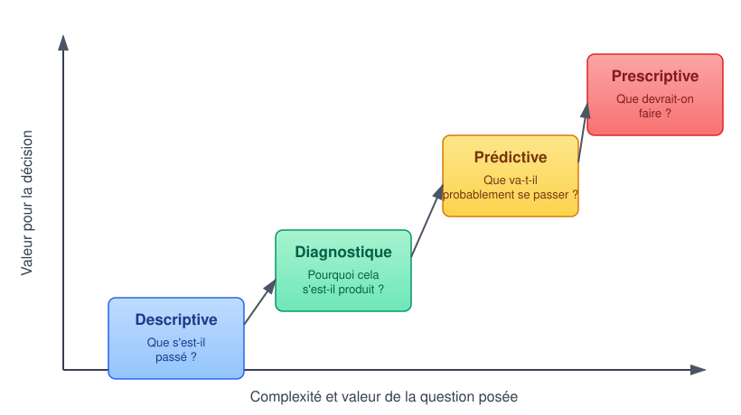
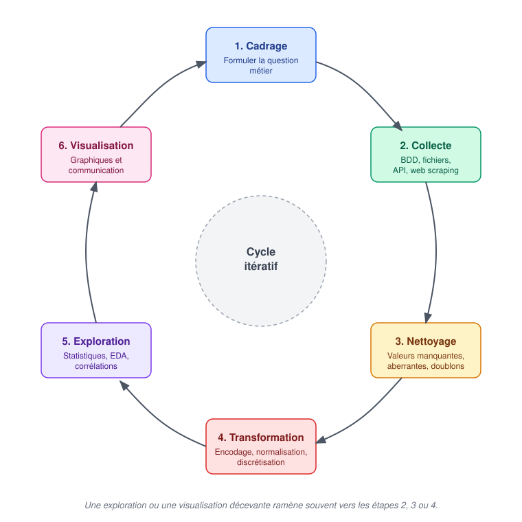

# Introduction à l'analyse de données

::: {.callout-tip title="Objectifs du chapitre"}
À la fin de ce chapitre introductif, l'étudiant sera capable de :

- **Définir** l'analyse de données et la **situer** par rapport à la Data Science, la Business Intelligence (BI) et le Machine Learning ;
- **Distinguer** les quatre types d'analyse : descriptive, diagnostique, prédictive et prescriptive ;
- **Identifier** les grandes étapes du cycle de vie d'un projet d'analyse de données ;
- **Identifier** les outils de base utilisés dans ce cours.
:::

## 1. Qu'est-ce que l'analyse de données ?

### Définition et Positionnement
L'**analyse de données** (*Data Analysis*) désigne l'ensemble des démarches permettant d'inspecter, de nettoyer, de transformer et de modéliser statistiquement des données, dans le but d'en extraire des informations utiles, de soutenir une décision ou de valider une hypothèse.

::: {.callout-tip}
## Analyse de données

::: {#def-analyse-donnees}
L'analyse de données consiste à transformer des données brutes, souvent volumineuses et désorganisées, en **informations exploitables**, à travers une succession d'étapes de collecte, de nettoyage, d'exploration et de représentation.
:::
:::

Contrairement à ce que l'on pense parfois, l'essentiel du travail d'un analyste ne consiste pas à produire des graphiques, mais à **comprendre les données** : d'où elles viennent, ce qu'elles représentent réellement, quelles sont leurs limites et leurs biais. La visualisation n'intervient qu'en bout de chaîne, pour communiquer un résultat déjà établi.

Il existe quatre domaines liés à l'analyse de données : Data Analysis, Data Science, Business Intelligence, et Machine Learning. Ces quatre termes sont souvent confondus. Ils partagent une matière première commune (la donnée) mais diffèrent par leurs objectifs et leurs méthodes.

| Domaine | Question typique | Résultat produit |
|:---|:---|:---|
| **Business Intelligence (BI)** | « Que s'est-il passé, et où en sommes-nous ? » | Tableaux de bord, indicateurs (KPI) suivis dans le temps |
| **Analyse de données (Data Analysis)** | « Pourquoi cela s'est-il produit ? Que peut-on en conclure ? » | Rapports, visualisations, recommandations argumentées |
| **Data Science** | « Que va-t-il probablement se passer ? » | Modèles statistiques et modèles de Machine Learning |
| **Machine Learning** | « Comment automatiser une prédiction ou une décision à grande échelle ? » | Un modèle entraîné, déployé en production |

: Quatre disciplines complémentaires autour de la donnée {#tbl-disciplines-donnees}

::: {.callout-warning title="Périmètre de ce cours"}
Ce module se concentre sur les deux premières colonnes de la @tbl-disciplines-donnees : la **préparation**, l'**exploration** et la **visualisation** des données. Les algorithmes de Machine Learning (régression, classification, clustering...) ne sont **pas traités ici** : ils font l'objet du cours [Machine Learning](https://iaousse.github.io/ml-course/). Une bonne partie du travail présenté dans ce cours reste néanmoins un prérequis indispensable à tout projet de Machine Learning.
:::

En pratique, ces frontières sont poreuses : un même professionnel peut, selon les entreprises, être appelé *Data Analyst* et exercer des missions de *Data Scientist*, ou inversement. Ce qui compte est de comprendre **la nature de la question posée** plutôt que le titre du poste.

### Les quatre types d'analyse de données

On distingue classiquement quatre niveaux d'analyse, de la simple observation du passé jusqu'à la recommandation d'action, chacun s'appuyant sur le précédent.

{#fig-types-analyse}

| Type d'analyse | Question posée | Exemple |
|:---|:---|:---|
| **Descriptive** | Que s'est-il passé ? | Le chiffre d'affaires du mois dernier par région |
| **Diagnostique** | Pourquoi cela s'est-il passé ? | Pourquoi les ventes ont-elles chuté en mars dans le nord ? |
| **Prédictive** | Que va-t-il probablement se passer ? | Quel sera le chiffre d'affaires du mois prochain ? |
| **Prescriptive** | Que devrait-on faire ? | Quelle action marketing maximiserait les ventes du trimestre ? |

: Les quatre types d'analyse de données {#tbl-types-analyse}

::: {.callout-tip title="Exemple : une chaîne de supermarchés marocaine"}
- **Descriptive** : « Les ventes de la région de Casablanca ont baissé de 12 % en mars par rapport à février. »
- **Diagnostique** : en croisant les ventes avec le calendrier et la météo, on découvre que la baisse coïncide avec des travaux routiers ayant réduit l'affluence dans deux magasins.
- **Prédictive** *(hors périmètre de ce cours, traité en Machine Learning)* : un modèle estime les ventes attendues pour le mois suivant compte tenu de la reprise du trafic.
- **Prescriptive** : sur la base du diagnostic, l'équipe décide de renforcer temporairement les promotions dans les magasins concernés.
:::

Ce cours se concentre principalement sur les analyses **descriptive** et **diagnostique** : elles reposent entièrement sur les techniques de préparation, d'exploration et de visualisation présentées dans les chapitres suivants, et ne nécessitent pas d'algorithme d'apprentissage automatique.

## 2. Cycle de vie et mise en pratique avec Python

### Le cycle de vie d'un projet d'analyse de données

Un projet d'analyse de données suit une succession d'étapes, rarement linéaire, que l'on peut résumer ainsi :

{#fig-cycle-vie-analyse}

1. **Cadrage** : formuler clairement la question métier à laquelle l'analyse doit répondre.
2. **Collecte** : rassembler les données nécessaires (bases de données, fichiers, API, web scraping...).
3. **Nettoyage** : traiter les valeurs manquantes, les valeurs aberrantes, les doublons et les incohérences. C'est l'étape la plus chronophage en pratique.
4. **Transformation** : encoder, normaliser, recalculer certaines variables pour les rendre exploitables.
5. **Exploration (EDA)** : décrire statistiquement les données, en dégager des tendances, des corrélations, des anomalies.
6. **Visualisation et communication** : représenter graphiquement les résultats et les traduire en recommandations compréhensibles par un public non technique.

::: {.callout-note title="Repère" collapse="true"}
Ce découpage est proche du cadre **OSEMN** (*Obtain, Scrub, Explore, Model, iNterpret*), popularisé par la communauté Data Science. Nous l'adaptons ici en retirant l'étape de modélisation prédictive (« Model »), hors périmètre de ce cours, et en insistant davantage sur la communication des résultats.
:::

Comme pour tout cycle de projet, ces étapes sont **itératives** : une exploration révélant un problème de qualité de données ramène généralement à l'étape de nettoyage, et une visualisation peu convaincante amène souvent à revisiter l'exploration.

### Écosystème d'outils Python pour l'analyse de données

#### Bibliothèques cœur

Comme pour le Machine Learning, Python s'impose comme langage principal pour l'analyse de données, grâce à la richesse de son écosystème scientifique et à la lisibilité de sa syntaxe.

| Bibliothèque | Rôle |
|:---|:---|
| `pandas` | Manipulation de tableaux de données (`DataFrame`) : lecture, nettoyage, agrégation |
| `numpy` | Calcul numérique et vectoriel sous-jacent à `pandas` |
| `matplotlib` | Bibliothèque de visualisation de référence, hautement personnalisable |
| `seaborn` | Visualisation statistique construite sur `matplotlib`, orientée exploration rapide |

: Bibliothèques Python cœur de ce cours {#tbl-bibliotheques-eda}

#### Environnements de travail

Comme dans le reste de la formation, nous privilégions les **notebooks Jupyter** (JupyterLab, Google Colab) pour l'exploration interactive et la visualisation immédiate cellule par cellule, et **Visual Studio Code** si l'etudiant voulais utiliser des fichier python ou ouvrir jupyter noebook dans cet environnement.

#### Gestion de projet avec `uv` {#sec-uv}

Un projet de *Machine Learning* ne dépend pas uniquement du code que nous écrivons. Il repose également sur un **environnement logiciel** : une version de Python, un ensemble de bibliothèques, des versions compatibles de ces bibliothèques et différents outils nécessaires à l'exécution du projet.

La gestion de cet environnement est importante dès qu'un projet doit être **reproduit, partagé, maintenu ou déployé**. Deux utilisateurs disposant du même code peuvent, par exemple, rencontrer des problèmes différents si leurs versions de Python ou de certaines dépendances ne sont pas les mêmes. La gestion des dépendances constitue ainsi une composante essentielle de la reproductibilité et de la maintenance d'un projet.

Dans ce cours, nous présenterons d'abord l'approche classique de l'écosystème Python, puis nous adopterons `uv` comme outil de gestion de nos projets.

##### L'approche classique : Python, `venv` et `pip`

L'écosystème Python fournit déjà les outils nécessaires pour créer un environnement isolé et installer les bibliothèques d'un projet. Le module [`venv`](https://docs.python.org/3/library/venv.html) est l'outil standard de Python pour créer des environnements virtuels. Ceux-ci permettent d'isoler les dépendances d'un projet de celles installées dans les autres projets ou dans l'installation générale de Python.

L'installation des bibliothèques s'effectue généralement avec [`pip`](https://pip.pypa.io/), l'installateur de paquets Python. Les bibliothèques sont notamment disponibles sur [`PyPI`](https://pypi.org/), le Python Package Index.

Une configuration classique peut donc être représentée de manière simplifiée par :

```bash
python -m venv .venv
```

puis, dans l'environnement virtuel :

```bash
python -m pip install numpy pandas scikit-learn
```

Les dépendances peuvent ensuite être consignées dans un fichier `requirements.txt`, par exemple :

```text
numpy
pandas
scikit-learn
```

Cette approche est parfaitement valable et reste largement utilisée. Le [Python Packaging User Guide](https://packaging.python.org/) présente d'ailleurs cette organisation ainsi que les pratiques modernes de gestion et de distribution des projets Python.

Elle présente cependant une certaine fragmentation : la création de l'environnement, la gestion des dépendances et leur installation sont assurées par des mécanismes distincts. Pour des projets plus structurés, il devient également utile de disposer d'une déclaration centralisée des dépendances et d'un mécanisme de verrouillage permettant de conserver une résolution précise de l'environnement.

##### Vers une gestion moderne du projet avec `pyproject.toml`

Les projets Python modernes utilisent notamment le fichier [`pyproject.toml`](https://packaging.python.org/en/latest/specifications/pyproject-toml/). Ce fichier permet de centraliser différentes informations relatives au projet, notamment ses métadonnées et ses dépendances.

Il constitue aujourd'hui un élément central de l'écosystème de *packaging* Python et est utilisé par de nombreux outils modernes.

Dans ce cours, nous allons nous appuyer sur [`uv`](https://docs.astral.sh/uv/), développé par Astral, pour gérer nos projets Python.

##### Pourquoi `uv` ?

`uv` est un gestionnaire de projets et de paquets Python qui regroupe dans un même outil plusieurs opérations auparavant réalisées avec différents outils. Il permet notamment de gérer les projets Python, les environnements virtuels, les versions de Python, les dépendances et leur résolution, ainsi que l'exécution des commandes dans l'environnement du projet.

La documentation officielle de [`uv` présente](https://docs.astral.sh/uv/getting-started/features/) notamment les fonctions suivantes :

* création d'un projet avec `uv init` ;
* ajout et suppression de dépendances ;
* gestion de l'environnement virtuel du projet ;
* synchronisation des dépendances ;
* création et mise à jour du fichier de verrouillage ;
* exécution de commandes dans l'environnement du projet ;
* gestion de projets plus complexes au moyen de *workspaces*.

L'intérêt de `uv` dans notre cours est donc moins de remplacer une commande particulière que de fournir une **organisation cohérente de l'ensemble du projet Python**.

##### `pyproject.toml`, `uv.lock` et `.venv`

Avec `uv`, trois éléments sont particulièrement importants.

Le fichier `pyproject.toml` décrit le projet et ses besoins, notamment les dépendances et la version de Python requise.

Le fichier `uv.lock` enregistre la résolution précise des dépendances du projet. Contrairement au fichier `pyproject.toml`, qui exprime les besoins du projet de manière générale, le fichier de verrouillage conserve les versions effectivement résolues. Il peut ainsi être versionné avec le projet afin de faciliter la reconstruction d'un environnement cohérent sur différentes machines. La documentation officielle de [`uv` décrit précisément le rôle de `uv.lock`](https://docs.astral.sh/uv/concepts/projects/layout/).

Enfin, `uv` utilise un environnement virtuel associé au projet, généralement situé dans `.venv`.

On peut donc représenter schématiquement l'organisation d'un projet ainsi :

```text
projet/
├── .venv/
├── pyproject.toml
├── uv.lock
└── ...
```

Le principe peut être résumé ainsi :

> **`pyproject.toml` décrit les besoins du projet ; `uv.lock` conserve leur résolution précise ; `.venv` contient l'environnement dans lequel le projet est exécuté.**

La synchronisation entre ces éléments est prise en charge par `uv`. La documentation officielle explique notamment que les opérations telles que [`uv sync` et `uv run`](https://docs.astral.sh/uv/concepts/projects/sync/) peuvent mettre à jour l'environnement à partir du fichier de verrouillage.

##### Pourquoi `uv` plutôt qu'Anaconda ou Conda ?

Il existe d'autres solutions parfaitement valables pour gérer les environnements Python. L'une des plus connues est l'écosystème [Conda](https://docs.conda.io/), qui permet notamment de créer, gérer, partager et supprimer des environnements contenant différentes versions de Python et de paquets.

Notre choix de `uv` dans ce cours ne signifie donc pas que Conda ou [Anaconda](https://www.anaconda.com/) sont inadaptés. Il s'agit d'un **choix pédagogique et technique** correspondant à l'organisation que nous souhaitons adopter.

Nous retenons `uv` principalement pour les raisons suivantes :

1. **Une approche directement centrée sur les projets Python.**
   `uv` s'intègre naturellement aux mécanismes modernes du *packaging* Python, notamment `pyproject.toml` et l'écosystème PyPI.

2. **Une gestion unifiée du projet.**
   Un même outil permet de gérer l'environnement, les dépendances, leur résolution, le verrouillage et l'exécution du projet.

3. **Une structure explicite et versionnable.**
   L'association de `pyproject.toml` et `uv.lock` fournit une description claire du projet et de son environnement de dépendances.

4. **Une bonne adéquation avec les projets du cours.**
   Les projets étudiés utiliseront principalement des bibliothèques de l'écosystème Python, telles que `numpy`, `pandas`, `matplotlib` et `scikit-learn`, ainsi que les outils Jupyter. `uv` fournit une organisation cohérente pour leur gestion dans un projet Python local.

5. **Une continuité entre expérimentation et développement.**
   Les étudiants pourront commencer par explorer les données et les modèles dans des notebooks, puis retrouver le même environnement de projet lorsqu'ils passeront à une organisation plus structurée du code Python.

Le choix de `uv` répond donc avant tout aux besoins de ce cours : disposer d'un environnement Python **isolé, explicite, reproductible et facile à partager**, tout en introduisant progressivement les pratiques modernes de gestion de projet.

#### Tendances récentes de l'écosystème

::: {.callout-important title="Zoom sur les tendances actuelles"}
L'écosystème de l'analyse de données évolue rapidement. Sans remplacer les outils historiques présentés ci-dessus, plusieurs bibliothèques récentes gagnent en popularité et méritent d'être connues :

- **[`Polars`](https://pola.rs)** : une alternative à `pandas`, écrite en Rust, offrant des performances nettement supérieures sur de gros volumes de données grâce à l'exécution parallèle et à l'évaluation paresseuse (*lazy evaluation*).
- **[`DuckDB`](https://duckdb.org)** : un moteur de base de données analytique embarqué, permettant d'exécuter des requêtes SQL directement sur des fichiers CSV ou Parquet, sans serveur, avec des performances proches d'un entrepôt de données.
- **Outils de profilage automatique** (`ydata-profiling`, `Sweetviz`) : génèrent en une commande un rapport exploratoire complet d'un jeu de données (statistiques, distributions, corrélations, valeurs manquantes).^[voir le chapitre sur l'exploration des données.]
- **Assistants d'analyse par IA générative** : des outils permettant d'interroger un `DataFrame` en langage naturel commencent à s'intégrer aux environnements de data analysis, sans se substituer à une compréhension rigoureuse des données par l'analyste (l'humain!!).

Ces outils ne sont pas obligatoires dans ce cours, mais seront mentionnés ponctuellement à titre de complément, car ils représentent une évolution significative des pratiques professionnelles actuelles.
:::

#### Les métiers de la donnée

| Métier | Mission principale | Compétences clés |
|:---|:---|:---|
| **Data Analyst** | Explorer, visualiser et interpréter les données pour éclairer une décision | SQL, `pandas`, visualisation, statistiques descriptives |
| **BI Analyst / BI Developer** | Construire et maintenir des tableaux de bord et indicateurs récurrents | SQL, outils de BI (Power BI, Tableau), modélisation de données |
| **Data Scientist** | Concevoir des modèles statistiques et prédictifs | Statistique inférentielle, Machine Learning, programmation |
| **Data Engineer** | Construire et fiabiliser les pipelines d'acquisition et de stockage des données | Bases de données, orchestration, ingénierie logicielle |

: Les principaux métiers autour de la donnée {#tbl-metiers-donnee}

Ce cours prépare avant tout au cœur du métier de **Data Analyst**, tout en posant des bases indispensables aux trois autres profils.

::: {.content-visible when-profile="teacher"}
::: {.callout-note title="Auto-évaluation" collapse="true"}
Avant de passer au chapitre suivant, assurez-vous de pouvoir répondre « oui » aux questions suivantes :

- [ ] Je peux expliquer la différence entre analyse de données, Data Science, BI et Machine Learning.
- [ ] Je peux citer et illustrer les quatre types d'analyse de données.
- [ ] Je peux énumérer, dans l'ordre, les étapes du cycle de vie d'un projet d'analyse de données.
- [ ] Je connais au moins deux outils récents qui complètent `pandas` et `matplotlib`.
:::
:::

## Exercices

::: {#exr-intro-ad-1}
### Vrai ou Faux

a. La Business Intelligence répond principalement à la question « pourquoi ? ».
b. Une analyse diagnostique s'appuie généralement sur une analyse descriptive préalable.
c. Le Machine Learning est un prérequis indispensable pour produire une analyse descriptive.
:::

::: {.content-visible when-profile="teacher"}
::: {.callout-tip collapse="true" title="Solution de l'exercice @exr-intro-ad-1"}
a. **Faux.** La BI répond surtout à « que s'est-il passé, et où en sommes-nous ? » (analyse descriptive) ; c'est l'analyse diagnostique qui répond au « pourquoi ».
b. **Vrai.** On ne peut expliquer une variation (diagnostic) sans l'avoir d'abord constatée et quantifiée (description).
c. **Faux.** L'analyse descriptive repose sur des statistiques et des visualisations ; aucun modèle prédictif n'est nécessaire.
:::
:::


::: {#exr-intro-ad-2}
### Classer les questions

Pour chacune des questions suivantes, indiquez le type d'analyse correspondant (descriptive, diagnostique, prédictive ou prescriptive) :

a. Combien de visiteurs le site web a-t-il reçus la semaine dernière ?
b. Pourquoi le taux d'abandon de panier a-t-il augmenté en juillet ?
c. Quelle campagne publicitaire faut-il privilégier pour la rentrée ?
:::

::: {.content-visible when-profile="teacher"}
::: {.callout-tip collapse="true" title="Solution de l'exercice @exr-intro-ad-2"}
a. **Descriptive** — simple constat chiffré.
b. **Diagnostique** — recherche d'une cause à une variation observée.
c. **Prescriptive** — recommandation d'action.
:::
:::

::: {#exr-intro-ad-3}
### Étude de cas courte

Une association marocaine de protection de l'environnement souhaite comprendre l'évolution du volume de déchets collectés dans trois villes sur les deux dernières années, puis identifier les facteurs expliquant les écarts entre villes.

a. Quelles étapes du cycle de vie présenté en @fig-cycle-vie-analyse cette association devra-t-elle suivre ?
b. À quel(s) type(s) d'analyse (@tbl-types-analyse) ce projet correspond-il ?
:::

::: {.content-visible when-profile="teacher"}
::: {.callout-tip collapse="true" title="Solution de l'exercice @exr-intro-ad-3"}
a. Cadrage de la question (comparer trois villes) → collecte des données de collecte de déchets → nettoyage (unités, doublons, données manquantes par ville/mois) → exploration statistique → visualisation comparative dans le temps et par ville.
b. **Descriptive** (évolution des volumes) puis **diagnostique** (recherche des facteurs expliquant les écarts entre villes).
:::
:::

::: {#exr-intro-ad-4}
### Choisir une analyse

Une responsable constate que les ventes sont plus faibles en août. Elle veut d'abord mesurer la baisse, puis comprendre si elle concerne seulement une région.

a. Quel type d'analyse répond à la première question ?
b. Quelle comparaison simple peut aider pour la seconde ?
c. Pourquoi faut-il éviter de conclure à une cause avant d'avoir comparé les données ?
:::

::: {.content-visible when-profile="teacher"}
::: {.callout-tip collapse="true" title="Solution de l'exercice @exr-intro-ad-4"}
a. Une analyse **descriptive** : comparer les ventes d'août à celles d'une période de référence.
b. Comparer les ventes par région et par mois, avec des effectifs, des totaux ou des moyennes.
c. Une baisse peut coïncider avec plusieurs facteurs ; une comparaison permet d'abord de vérifier si le phénomène est général ou localisé. Elle ne prouve pas à elle seule une causalité.
:::
:::
