# Exploration des données

::: {.callout-tip title="Objectifs du chapitre"}
À la fin de ce chapitre, l'étudiant sera capable de :

- **Structurer** une exploration en trois temps — univarié, bivarié, multivarié — et choisir le bon outil selon les types de variables en présence ;
- **Mesurer** et **interpréter** une relation entre deux variables quantitatives (covariance, corrélation de Pearson et de Spearman) ;
- **Comparer** une variable quantitative entre plusieurs groupes (analyse de variance, $\eta^2$) et **tester** l'association entre deux variables qualitatives ($\chi^2$, V de Cramér) ;
- **Reconnaître** les pièges classiques de l'analyse bivariée : le quartet d'Anscombe, le paradoxe de Simpson, la confusion entre corrélation et causalité, les tests multiples ;
- **Transformer** une variable très asymétrique (transformation logarithmique) et **diagnostiquer** sa distribution ;
- **Résumer** un jeu de données par groupe avec `groupby` et des tableaux croisés dynamiques (`pivot_table`) ;
- **Explorer** une série temporelle : tendance, saisonnalité, variation ;
- **Situer** l'apport d'un outil de profilage automatique (`ydata-profiling`, `sweetviz`).
:::

::: {.callout-note title="Ce que ce chapitre suppose déjà acquis"}
Le chapitre d'introduction vous a donné le vocabulaire de base pour décrire **une variable prise isolément** : types de variables, effectif, fréquence, variation relative, moyenne, médiane, quartiles, écart-type. Le chapitre suivant vous a montré comment obtenir un jeu de données **propre**. Ce chapitre part de ces deux acquis pour aller plus loin : il s'intéresse aux **relations entre variables**, sur un jeu de données déjà nettoyé — exactement l'étape « Exploration » du cycle de vie présenté en introduction.
:::

## 1. Structurer l'exploration : univariée, bivariée, multivariée

{#fig-demarche-entonnoir}

Une exploration désordonnée — un graphique après l'autre, sans plan — fait perdre du temps et laisse souvent passer l'essentiel. Il est plus efficace de progresser en entonnoir, comme le montre la @fig-demarche-entonnoir :

1. **Premier regard** : dimensions du tableau, types de colonnes, valeurs manquantes — un rappel de l'audit déjà pratiqué au chapitre précédent.
2. **Analyse univariée** : que vaut chaque variable prise seule ? (chapitre d'introduction, §3).
3. **Analyse bivariée** : deux variables évoluent-elles ensemble ? C'est le cœur de ce chapitre.
4. **Analyse multivariée** : une troisième variable change-t-elle la lecture d'une relation à deux variables ?
5. **Hypothèses et suites** : que retenir, que vérifier plus formellement, que documenter ?

::: {.callout-important title="Univarié, bivarié, multivarié : une question de nombre de variables"}
- **Univariée** : une seule variable à la fois (ex. la distribution des prix).
- **Bivariée** : deux variables croisées (ex. le prix *selon* la surface).
- **Multivariée** : trois variables ou plus étudiées conjointement (ex. le prix selon la surface, *en distinguant* les quartiers).
:::

### 1.1. Quel outil pour quelle paire de variables ?

Le choix de l'outil statistique dépend directement des **types** des deux variables étudiées — la typologie posée en introduction (qualitative/quantitative) refait surface ici, appliquée cette fois à une **paire** de variables.

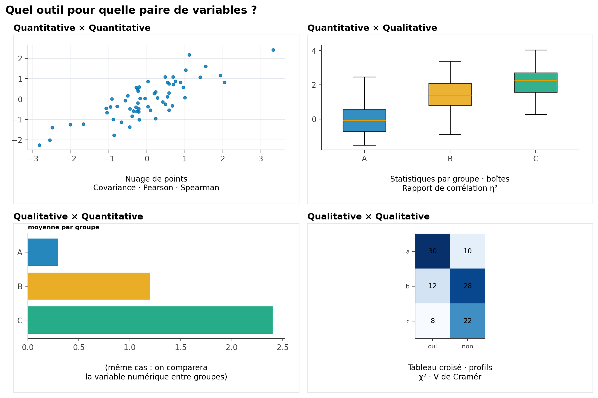{#fig-types-analyse-choix}

| Paire de variables | Question typique | Outils présentés dans ce chapitre |
|:---|:---|:---|
| Quantitative × Quantitative | Le prix augmente-t-il avec la surface ? | Nuage de points, covariance, corrélation de Pearson/Spearman (§2) |
| Quantitative × Qualitative | Le prix diffère-t-il selon le quartier ? | Statistiques par groupe, analyse de variance, $\eta^2$ (§3) |
| Qualitative × Qualitative | Le type de bien est-il lié à la présence d'un ascenseur ? | Tableau croisé, $\chi^2$, V de Cramér (§4) |

: Choisir un outil d'analyse bivariée selon les types de variables {#tbl-choix-outil-bivarie}

## 2. Relation entre deux variables quantitatives : la corrélation

### 2.1. De la covariance au coefficient de corrélation

La **covariance** mesure si deux variables varient dans le même sens :

$$
\operatorname{Cov}(X, Y) = \frac{1}{n}\sum_{i=1}^{n}(x_i - \bar{x})(y_i - \bar{y})
$$

- Positive : quand $x$ augmente, $y$ a tendance à augmenter aussi.
- Négative : quand $x$ augmente, $y$ a tendance à diminuer.
- Proche de zéro : pas de tendance linéaire claire.

::: {.callout-warning title="La covariance dépend des unités"}
La covariance entre une surface en $m^2$ et un prix en MAD n'est pas comparable à la covariance entre une surface en $\text{pieds}^2$ et un prix en euros : elle change avec les unités choisies. C'est pour cela qu'on lui préfère presque toujours une version **normalisée**, sans unité : le coefficient de corrélation.
:::

Le **coefficient de corrélation de Pearson** divise la covariance par le produit des écarts-types, ce qui le rend indépendant des unités et toujours compris entre $-1$ et $1$ :

$$
r = \frac{\operatorname{Cov}(X, Y)}{s_X \, s_Y}
= \frac{\displaystyle\sum_{i=1}^{n}(x_i - \bar{x})(y_i - \bar{y})}
       {\displaystyle\sqrt{\sum_{i=1}^{n}(x_i - \bar{x})^2}\sqrt{\sum_{i=1}^{n}(y_i - \bar{y})^2}}
$$ {#eq-pearson}

| Valeur de $r$ | Interprétation |
|:---:|:---|
| $r = 1$ | Relation linéaire positive parfaite |
| $r \approx 0{,}7$ à $0{,}9$ | Relation linéaire positive forte |
| $r \approx 0$ | Pas de relation **linéaire** détectable |
| $r \approx -0{,}7$ à $-0{,}9$ | Relation linéaire négative forte |
| $r = -1$ | Relation linéaire négative parfaite |

: Repères pour interpréter un coefficient de Pearson {#tbl-pearson-reperes}

```python
r = df["surface"].corr(df["prix"])          # Pearson, par défaut
matrice = df[["surface", "prix", "nombre_pieces", "age_bien"]].corr()
```

### 2.2. Ce que $r$ ne voit jamais : la galerie des cas particuliers

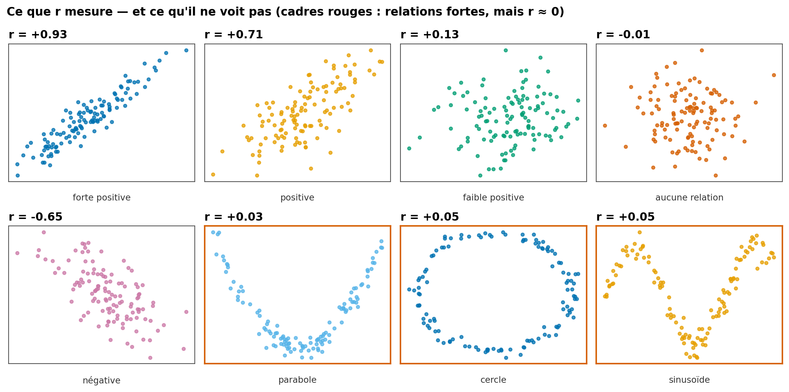{#fig-correlation-galerie}

La @fig-correlation-galerie affiche huit nuages de points très différents. Les trois premiers illustrent une échelle de relations linéaires ($r$ de fort à nul) — c'est le cas pour lequel $r$ a été conçu. Les trois panneaux encadrés en rouge sont plus instructifs : une **parabole**, un **cercle** et une **sinusoïde** peuvent chacun cacher une relation parfaitement déterministe — connaître $x$ suffirait à connaître $y$ exactement — tout en affichant un $r$ proche de zéro.

::: {.callout-important title="À retenir"}
Le coefficient de Pearson ne mesure qu'une chose : à quel point le nuage de points se rapproche d'une **droite**. Une relation forte mais non linéaire (courbe, cyclique, en U) peut très bien produire un $r$ proche de zéro. **Toujours regarder le nuage de points avant de se fier au chiffre.**
:::

### 2.3. Matrice de corrélation

Pour explorer simultanément les relations entre plusieurs variables numériques, on affiche la matrice de corrélation sous forme de *heatmap* :

```python
import seaborn as sns
import matplotlib.pyplot as plt

matrice = df[["prix", "surface", "nombre_pieces", "age_bien", "etage"]].corr()
sns.heatmap(matrice, annot=True, fmt=".2f", cmap="RdBu_r", vmin=-1, vmax=1)
plt.title("Matrice de corrélation")
plt.show()
```

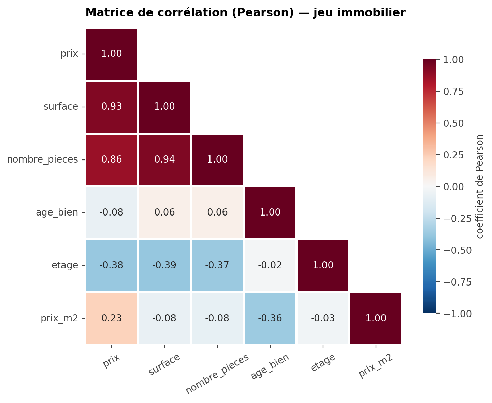{#fig-correlation-heatmap}

La diagonale vaut toujours 1 (une variable est parfaitement corrélée à elle-même) ; la matrice est symétrique, ce qui justifie de n'afficher que la moitié inférieure comme sur la @fig-correlation-heatmap.

### 2.4. Le quartet d'Anscombe

Quatre jeux de données peuvent avoir exactement la **même** moyenne, la **même** variance et le **même** $r$, tout en étant radicalement différents une fois représentés graphiquement.

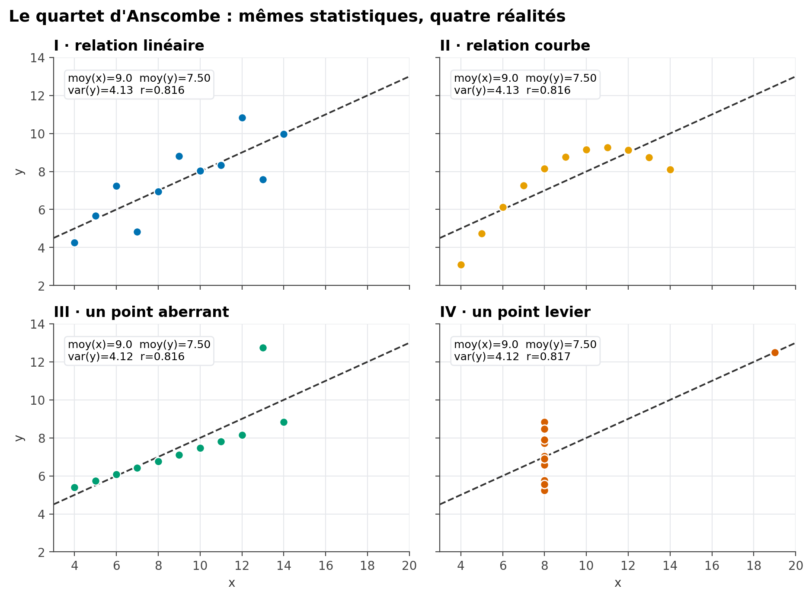{#fig-anscombe}

::: {.callout-important title="La leçon du quartet d'Anscombe"}
Le panneau I montre une véritable relation linéaire ; le panneau II, une relation courbe que $r$ interprète (à tort) comme « linéaire modérée » ; le panneau III, une relation linéaire quasi parfaite perturbée par un seul point ; le panneau IV, une absence totale de relation, sinon pour un unique point extrême qui, à lui seul, crée artificiellement toute la corrélation mesurée. **Aucune statistique résumée, aussi complète soit-elle, ne remplace un graphique.**
:::

### 2.5. Pearson ou Spearman ?

Le coefficient de **Spearman** ($\rho$, *rho*) applique la formule de Pearson non pas aux valeurs brutes, mais à leurs **rangs**. Il mesure une relation **monotone** (qui va toujours dans le même sens), pas nécessairement linéaire, et se révèle bien plus robuste aux valeurs extrêmes.

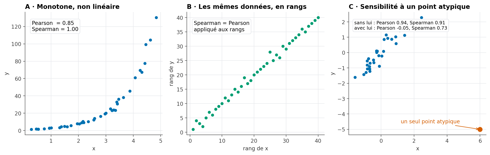{#fig-pearson-spearman}

```python
from scipy import stats

r_pearson, _ = stats.pearsonr(df["surface"], df["prix"])
r_spearman, _ = stats.spearmanr(df["surface"], df["prix"])
```

| Critère | Pearson | Spearman |
|:---|:---|:---|
| Type de relation détectée | Linéaire | Monotone (croissante ou décroissante, pas forcément en ligne droite) |
| Sensibilité aux valeurs extrêmes | Élevée | Faible (les rangs limitent l'effet d'un point isolé) |
| Nature des données | Quantitatives | Quantitatives ou ordinales |

: Quand préférer Spearman à Pearson {#tbl-pearson-spearman}

::: {.callout-tip title="Règle pratique"}
En cas de doute, ou en présence de valeurs extrêmes visibles sur le nuage de points, calculez les deux : un écart important entre $r$ de Pearson et $\rho$ de Spearman est lui-même une information — il signale une relation probablement non linéaire ou fortement influencée par quelques points.
:::

## 3. Comparer une variable quantitative entre groupes

Lorsque la seconde variable est **qualitative** (ex. le quartier) plutôt que quantitative, la question change de nature : il ne s'agit plus de mesurer une corrélation, mais de comparer la distribution d'une variable numérique **entre plusieurs groupes**.

### 3.1. Statistiques par groupe

```python
df.groupby("quartier")["prix_m2"].agg(["count", "mean", "median", "std"])
```

Un premier réflexe — déjà pratiqué en introduction — consiste à comparer moyennes et médianes par groupe. Mais une différence de moyennes observée sur l'échantillon reflète-t-elle une **vraie** différence entre groupes, ou peut-elle s'expliquer par le simple hasard de l'échantillonnage ? L'**analyse de variance** formalise cette question.

### 3.2. Décomposer la variance : l'idée de l'ANOVA

L'idée de l'analyse de variance (ANOVA) est de décomposer la variabilité totale d'une variable en deux parts : celle qui s'explique par la différence **entre** les groupes, et celle qui reste **à l'intérieur** de chaque groupe.

$$
\underbrace{\sum_{i}(y_i - \bar y)^2}_{SST\ (\text{variabilité totale})}
=
\underbrace{\sum_{g} n_g(\bar y_g - \bar y)^2}_{SSB\ (\text{inter-groupes})}
+
\underbrace{\sum_{g}\sum_{i \in g}(y_i - \bar y_g)^2}_{SSW\ (\text{intra-groupe})}
$$

où $\bar y$ est la moyenne générale, $\bar y_g$ la moyenne du groupe $g$, et $n_g$ son effectif.

Le **rapport de corrélation** $\eta^2$ (*eta carré*) résume cette décomposition en un seul indicateur, entre 0 et 1 :

$$
\eta^2 = \frac{SSB}{SST}
$$ {#eq-eta2}

$\eta^2$ s'interprète comme la **proportion de la variance totale expliquée par l'appartenance au groupe** — un rôle proche de celui du $R^2$ que vous retrouverez dans un contexte de modélisation.

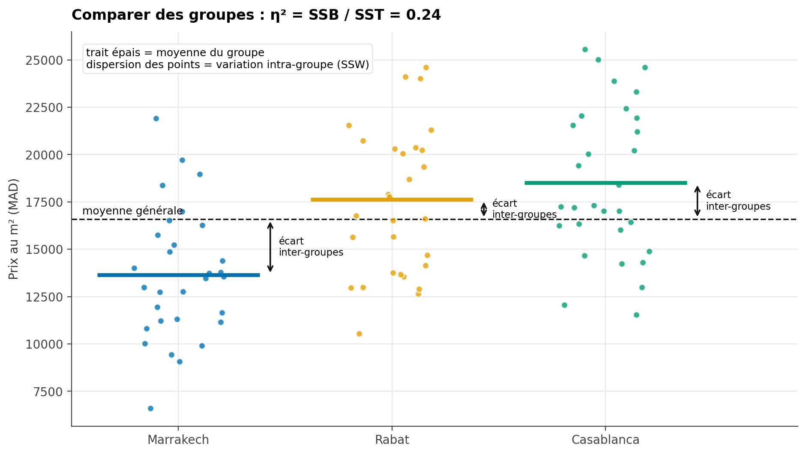{#fig-anova-variance}

Sur la @fig-anova-variance, le trait épais de chaque groupe représente sa moyenne ; la dispersion verticale des points autour de ce trait illustre la variabilité intra-groupe ($SSW$), tandis que l'écart entre chaque moyenne de groupe et la moyenne générale (ligne pointillée) illustre la variabilité inter-groupes ($SSB$).

```python
import statsmodels.api as sm
from statsmodels.formula.api import ols

modele = ols("prix_m2 ~ C(ville)", data=df).fit()
table_anova = sm.stats.anova_lm(modele, typ=2)
print(table_anova)

ssb = table_anova.loc["C(ville)", "sum_sq"]
sst = ssb + table_anova.loc["Residual", "sum_sq"]
eta2 = ssb / sst
```

::: {.callout-note title="Repères pour interpréter $\\eta^2$"}
Des seuils indicatifs, proposés par Cohen (1988) : $\eta^2 \approx 0{,}01$ = effet faible, $\approx 0{,}06$ = effet moyen, $\approx 0{,}14$ = effet fort. Ces repères doivent toujours être pondérés par le contexte métier — un effet « faible » au sens statistique peut rester important en pratique.
:::
### 3.3. Interpréter le test et vérifier ses conditions

L'ANOVA à un facteur compare les moyennes de \(k\) groupes indépendants. Elle teste les hypothèses suivantes :

$$
H_0 : \mu_1 = \mu_2 = \cdots = \mu_k
\qquad\text{contre}\qquad
H_1 : \text{au moins deux moyennes de groupe sont différentes}.
$$

L'hypothèse alternative ne signifie pas que toutes les moyennes sont différentes : le test indique seulement qu'au moins une différence existe, sans dire immédiatement entre quels groupes.

À partir des sommes de carrés déjà définies, la statistique de test est :

$$
F_{\text{obs}} =
\frac{SSB/(k-1)}{SSW/(N-k)},
$$

où \(SSB\) mesure la variabilité entre les groupes, \(SSW\) la variabilité à l'intérieur des groupes, \(k\) est le nombre de groupes et \(N\) le nombre total d'observations utilisées. Sous \(H_0\), et si les conditions du modèle sont satisfaites, cette statistique suit une loi de Fisher à \(k-1\) et \(N-k\) degrés de liberté. Une valeur de \(F_{\text{obs}}\) élevée signifie que l'écart entre les moyennes de groupe est grand par rapport à la dispersion observée à l'intérieur des groupes.

Le tableau produit par `anova_lm` affiche la statistique \(F\) dans la colonne `F` et la p-valeur dans `PR(>F)`. La p-valeur est, **en supposant \(H_0\) vraie et les conditions du test satisfaites**, la probabilité d'obtenir une statistique \(F\) au moins aussi grande que celle observée. Elle n'est **pas** la probabilité que \(H_0\) soit vraie.

On fixe avant l'analyse un seuil \(\alpha\), souvent 0,05 pour un exercice introductif :

- si \(p < \alpha\), on rejette \(H_0\) : les données fournissent un indice statistique qu'au moins une moyenne diffère ;
- si \(p \geq \alpha\), on ne rejette pas \(H_0\) : les données ne suffisent pas à établir une différence de moyennes. Cela ne prouve pas que les moyennes sont identiques.

La p-valeur ne mesure ni l'importance pratique de la différence ni sa taille. Il faut la lire avec les moyennes par groupe, leurs effectifs, un intervalle d'incertitude si disponible et la taille d'effet \(\eta^2\) présentée plus haut. Un résultat statistiquement significatif peut correspondre à un effet très faible ; un résultat non significatif peut aussi manquer de puissance lorsque les groupes sont petits.

#### Conditions à examiner

1. **Indépendance des observations.** Chaque observation doit contribuer à un seul groupe et ne pas être une répétition dépendante d'une autre observation. Cette condition se justifie d'abord par la façon dont les données ont été collectées ; un graphique ou un test ne peut pas la garantir. Pour des mesures répétées sur les mêmes personnes, l'ANOVA à un facteur ordinaire n'est pas le bon modèle.
2. **Résidus approximativement normaux dans chaque groupe.** On examine les résidus du modèle, surtout lorsque les effectifs sont petits. Une légère déviation est souvent moins problématique avec des groupes assez grands et équilibrés, mais une forte asymétrie ou quelques valeurs extrêmes peuvent rendre la comparaison des moyennes fragile.
3. **Variances comparables entre groupes (homoscédasticité).** L'ANOVA classique suppose que la dispersion est similaire dans les groupes. Des tailles de groupe très inégales combinées à des variances très différentes sont particulièrement préoccupantes.
4. **Variable étudiée quantitative et groupes pertinents.** Les observations doivent mesurer la même grandeur et utiliser la même unité ; les catégories comparées doivent correspondre à la question posée.

#### Contrôles pratiques avec Python

Le graphique Q-Q des résidus sert à examiner leur forme. Le test de Levene évalue si les variances des groupes sont compatibles entre elles ; avec `center="median"`, il est moins sensible à une distribution non normale qu'une version centrée sur la moyenne.

```python
import matplotlib.pyplot as plt
from scipy import stats

df_anova = df.dropna(subset=["prix_m2", "ville"])
groupes_par_ville = list(df_anova.groupby("ville", observed=True))
groupes = [
    groupe["prix_m2"].to_numpy()
    for _, groupe in groupes_par_ville
]
effectifs = df_anova.groupby("ville", observed=True)["prix_m2"].count()
print("Effectifs par ville :")
print(effectifs)

fig, axes = plt.subplots(
    1,
    len(groupes_par_ville),
    figsize=(5 * len(groupes_par_ville), 4),
    squeeze=False,
)
for (ville, groupe), ax in zip(groupes_par_ville, axes.ravel()):
    stats.probplot(modele.resid.loc[groupe.index], dist="norm", plot=ax)
    ax.set_title(f"Résidus — {ville}")
plt.tight_layout()
plt.show()

stat_levene, p_levene = stats.levene(*groupes, center="median")
print(f"Test de Levene : statistique={stat_levene:.3f}, p-valeur={p_levene:.4g}")
```

Le Q-Q plot s'interprète visuellement : des points globalement proches de la droite sont compatibles avec une normalité approximative ; des courbures marquées ou des points extrêmes appellent à la prudence. Pour Levene, une p-valeur inférieure à \(\alpha\) signale des éléments contre l'égalité des variances. Une p-valeur supérieure ou égale à \(\alpha\) ne prouve pas que les variances sont égales : on vérifie aussi leur taille et les effectifs par groupe.

#### Que faire si une condition est mal respectée ?

- Si les variances sont nettement différentes, utiliser l'ANOVA de Welch, qui ne suppose pas leur égalité :

```python
from statsmodels.stats.oneway import anova_oneway

resultat_welch = anova_oneway(
    data=df_anova["prix_m2"],
    groups=df_anova["ville"],
    use_var="unequal",
)
print(resultat_welch)
```

- Si la variable est très asymétrique, contient des valeurs extrêmes influentes ou si les petits groupes rendent l'hypothèse de normalité peu crédible, examiner les données et envisager un test de Kruskal-Wallis :

```python
stat_kruskal, p_kruskal = stats.kruskal(*groupes)
print(f"Kruskal-Wallis : statistique={stat_kruskal:.3f}, p-valeur={p_kruskal:.4g}")
```

Kruskal-Wallis est un test fondé sur les rangs : il ne teste pas directement l'égalité des moyennes et ne doit pas être décrit automatiquement comme un « test des médianes », sauf hypothèses supplémentaires sur la forme des distributions.

Enfin, si le test global indique une différence, il faut réaliser une comparaison post-hoc pour savoir quels groupes diffèrent, en corrigeant les comparaisons multiples. Pour une ANOVA classique lorsque l'hypothèse de variances égales est raisonnable, le test de Tukey compare les paires de groupes tout en contrôlant le risque d'erreur familial :

```python
from statsmodels.stats.multicomp import pairwise_tukeyhsd

comparaisons = pairwise_tukeyhsd(
    endog=df_anova["prix_m2"],
    groups=df_anova["ville"],
    alpha=0.05,
)
print(comparaisons)
```

Après l'ANOVA de Welch, choisir une comparaison post-hoc compatible avec des variances inégales (par exemple Games-Howell). Après Kruskal-Wallis, utiliser une comparaison fondée sur les rangs et corriger les p-valeurs des comparaisons multiples. Il ne faut pas appliquer automatiquement Tukey après n'importe quel test global.

Une ANOVA ou un test post-hoc décrit une association entre groupe et mesure dans les données analysées ; il ne démontre pas, à lui seul, que l'appartenance au groupe cause la différence observée.

## 4. Relation entre deux variables qualitatives

### 4.1. Le tableau croisé, observé contre théorique

Le **tableau croisé** (déjà rencontré au chapitre précédent) croise les effectifs de deux variables qualitatives. Pour savoir si les deux variables sont réellement **liées**, on le compare à un tableau **théorique**, celui que l'on obtiendrait si les deux variables étaient parfaitement indépendantes.

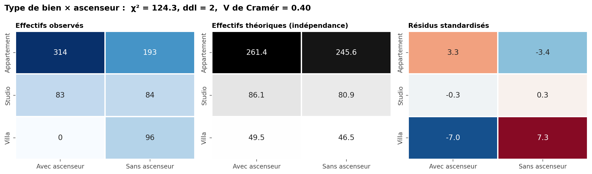{#fig-crosstab}

L'effectif théorique d'une cellule se calcule ainsi :

$$
E_{ij} = \frac{(\text{total de la ligne } i) \times (\text{total de la colonne } j)}{\text{effectif total}}
$$

Le test du **$\chi^2$ d'indépendance** additionne, sur toutes les cellules, l'écart relatif entre observé et théorique :

$$
\chi^2 = \sum_{i,j} \frac{(O_{ij} - E_{ij})^2}{E_{ij}}
$$

Plus les effectifs observés s'écartent des effectifs théoriques, plus $\chi^2$ est grand — signe d'une association entre les deux variables. Le troisième panneau de la @fig-crosstab affiche les **résidus standardisés** $\dfrac{O_{ij}-E_{ij}}{\sqrt{E_{ij}}}$ : ils indiquent, cellule par cellule, où se concentre l'écart à l'indépendance.

### 4.2. Le V de Cramér : une taille d'effet

Comme le $\chi^2$ augmente mécaniquement avec la taille de l'échantillon, il ne mesure pas à lui seul la **force** de l'association. Le **V de Cramér** normalise le $\chi^2$ entre 0 (aucune association) et 1 (association parfaite) :

$$
V = \sqrt{\frac{\chi^2}{n \times (\min(r, c) - 1)}}
$$

où $n$ est l'effectif total, $r$ le nombre de lignes et $c$ le nombre de colonnes du tableau croisé.

```python
from scipy.stats import chi2_contingency

tableau = pd.crosstab(df["type_bien"], df["ascenseur"])
chi2, p_valeur, ddl, theorique = chi2_contingency(tableau)

n = tableau.values.sum()
v_cramer = (chi2 / (n * (min(tableau.shape) - 1))) ** 0.5
```

::: {.callout-note title="Repères pour interpréter le V de Cramér"}
$V \approx 0{,}1$ = association faible, $\approx 0{,}3$ = modérée, $\approx 0{,}5$ et plus = forte. Sur la @fig-crosstab, un V proche de 0,4 confirme visuellement ce que les résidus suggéraient déjà : le type de bien et la présence d'un ascenseur ne sont pas indépendants.
:::

## 5. Pièges de l'analyse bivariée et multivariée

Les outils précédents sont puissants, mais chacun peut induire en erreur s'il est utilisé sans esprit critique. Cette section rassemble quatre pièges classiques.

### 5.1. Le paradoxe de Simpson

Une relation peut s'**inverser** selon que l'on regarde les données globalement ou séparément par sous-groupe.

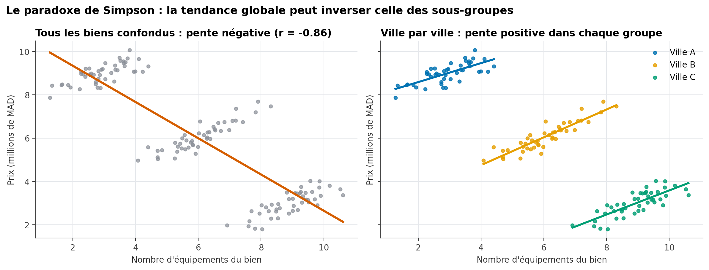{#fig-simpson}

Sur la @fig-simpson, la tendance globale (à gauche) suggère qu'un bien avec plus d'équipements se vend **moins cher** — une conclusion absurde en apparence. En réalité, chaque ville (à droite) affiche une relation **positive** entre équipements et prix ; c'est seulement parce que les villes les moins chères concentrent les biens les mieux équipés que la tendance globale s'inverse. La variable `ville` est ici une **variable confondante** : elle influence à la fois le nombre d'équipements et le prix.

::: {.callout-important title="À retenir"}
Avant de conclure sur une relation entre deux variables, demandez-vous toujours s'il existe une **troisième variable**, non prise en compte, susceptible d'expliquer — ou d'inverser — la relation observée. C'est précisément le rôle de l'analyse **multivariée**.
:::

### 5.2. Corrélation n'est pas causalité

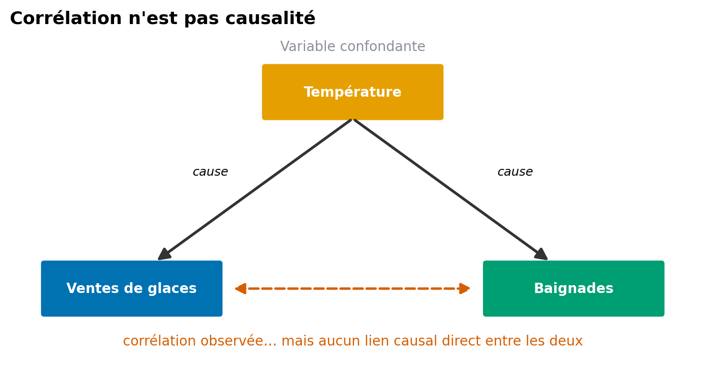{#fig-confusion-causalite}

L'exemple classique : les ventes de glaces et la fréquentation des piscines sont fortement corrélées, sans qu'aucune ne cause l'autre — les deux sont conjointement causées par la température (@fig-confusion-causalite). Établir un lien de causalité nécessite un dispositif que la seule observation ne fournit pas : une expérience randomisée (test A/B), ou des méthodes statistiques spécifiques dédiées à l'inférence causale, hors du cadre de ce cours.

### 5.3. Un point invisible seul, flagrant à deux

Une observation peut sembler parfaitement normale sur **chacune** des deux variables prises séparément, tout en étant nettement atypique une fois les deux considérées **ensemble**.

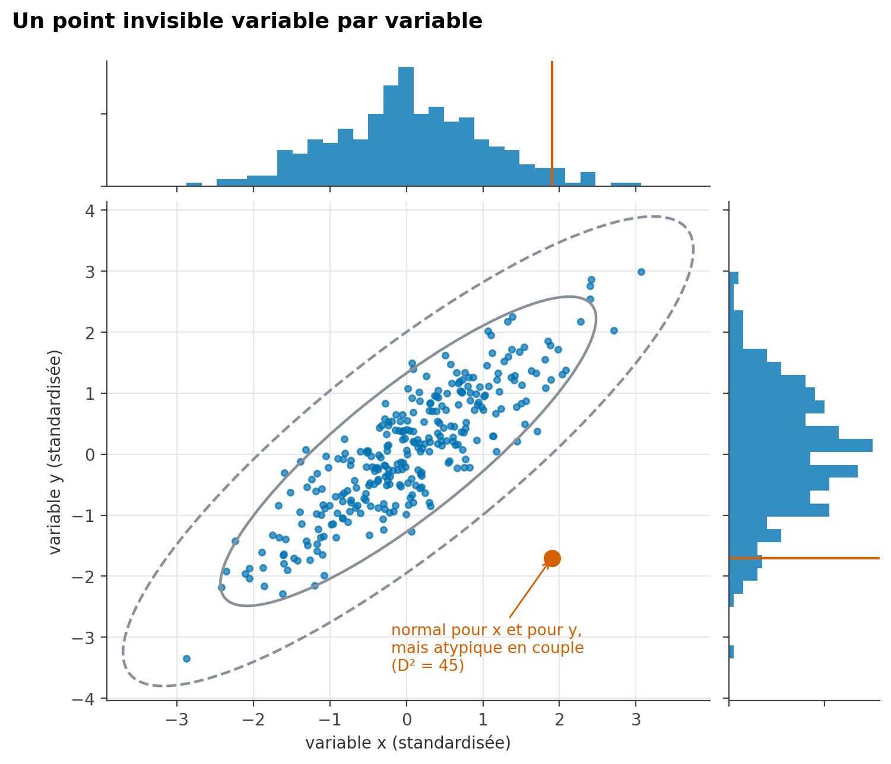{#fig-atypique-bivarie}

Sur la @fig-atypique-bivarie, le point rouge se situe dans la plage normale de $x$ et dans la plage normale de $y$ (histogrammes du haut et de droite), mais s'écarte nettement du nuage principal, car la combinaison des deux valeurs rompt la relation habituelle entre $x$ et $y$. Une détection d'outliers univariée (chapitre précédent, méthode de l'IQR) ne le repérerait jamais.

### 5.4. Le piège des tests multiples

Plus on teste de relations entre variables, plus on a de chances d'en trouver une « significative » par pur hasard.

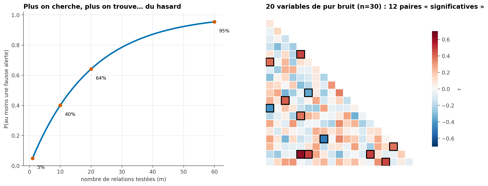{#fig-tests-multiples}

Avec un seuil habituel de 5 % de risque d'erreur par test, la probabilité d'obtenir **au moins une** fausse alerte parmi $m$ relations testées vaut approximativement $1 - 0{,}95^m$ — déjà 64 % pour seulement 20 tests indépendants. Le panneau de droite de la @fig-tests-multiples le démontre sur des données **entièrement aléatoires** : parmi 20 variables de pur bruit, plusieurs paires affichent une corrélation dépassant le seuil de significativité, sans qu'aucune relation réelle n'existe.

::: {.callout-warning title="À retenir"}
Explorer un grand nombre de relations avant de choisir de ne commenter que les plus « intéressantes » (*data dredging*, ou pêche aux corrélations) fabrique artificiellement des résultats. Une relation repérée par exploration doit toujours être formulée comme une **hypothèse à vérifier**, plutôt que comme une conclusion déjà établie.
:::

## 6. Distributions asymétriques : la transformation logarithmique

De nombreuses variables économiques (prix, revenus, population) présentent une distribution fortement asymétrique à droite : la majorité des observations sont regroupées sur de faibles valeurs, avec une longue traîne de valeurs élevées.

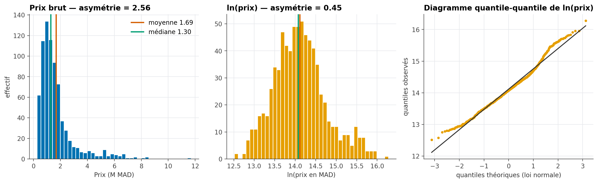{#fig-transformation-log}

La **transformation logarithmique** $x \mapsto \ln(x)$ compresse les grandes valeurs et étale les petites, ce qui rapproche souvent la distribution d'une forme symétrique — visible sur la @fig-transformation-log, où l'asymétrie passe de 2,36 (prix brut) à une valeur beaucoup plus proche de zéro (log du prix).

```python
df["log_prix"] = np.log(df["prix"])
```

Le troisième panneau de la @fig-transformation-log est un **diagramme quantile-quantile** (QQ-plot) : il compare les quantiles observés de `log_prix` aux quantiles théoriques d'une loi normale. Plus les points suivent la droite rouge, plus la distribution se rapproche d'une loi normale.

::: {.callout-tip title="Quand transformer ?"}
La transformation logarithmique est utile pour mieux visualiser une distribution étalée, faciliter la lecture de certains graphiques (chapitre suivant), ou satisfaire une hypothèse de normalité requise par certaines méthodes statistiques. Elle ne s'applique qu'à des valeurs **strictement positives** ; en présence de zéros, on utilise parfois $\ln(x+1)$.
:::

## 7. Résumer par groupe : `groupby` et tableaux croisés dynamiques

### 7.1. Le principe *split-apply-combine*

`groupby` répond à un très grand nombre de questions d'analyse en trois étapes systématiques : **découper** le tableau selon une ou plusieurs variables, **appliquer** une fonction (moyenne, somme, effectif...) à chaque sous-tableau, puis **recombiner** les résultats en un tableau de synthèse.

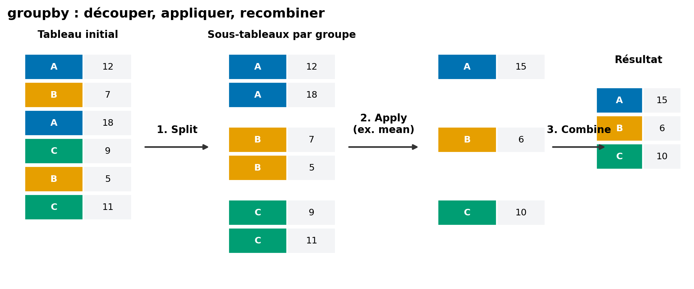{#fig-groupby-schema}

```python
synthese = (
    df.groupby("quartier")
    .agg(
        effectif=("prix", "count"),
        prix_moyen=("prix", "mean"),
        prix_median=("prix", "median"),
        surface_moyenne=("surface", "mean"),
    )
    .sort_values("prix_moyen", ascending=False)
)
```

::: {.callout-tip title="Toujours accompagner un agrégat de son effectif"}
Une moyenne calculée sur 3 observations n'a pas la même fiabilité qu'une moyenne calculée sur 3 000. La colonne `effectif` (via `count`) doit systématiquement accompagner toute statistique agrégée — c'est elle qui permet au lecteur de juger si une moyenne mérite d'être prise au sérieux.
:::

### 7.2. Le tableau croisé dynamique (`pivot_table`)

Lorsque l'on souhaite croiser **deux** variables catégorielles pour résumer une troisième variable numérique, `pivot_table` construit directement le tableau à deux dimensions :

```python
pivot = pd.pivot_table(
    df, values="prix_m2", index="quartier", columns="type_bien", aggfunc="median",
)
```

{#fig-pivot-heatmap}

Représenté sous forme de *heatmap* (@fig-pivot-heatmap — la même géométrie qu'au chapitre suivant, consacré à la visualisation), un tel tableau croisé dynamique révèle en un coup d'œil les combinaisons quartier/type de bien les plus chères, sans avoir à lire un tableau de chiffres ligne par ligne.

## 8. Explorer une série temporelle

Lorsque les observations sont datées, l'exploration gagne à mobiliser des outils spécifiques à la dimension temporelle, au-delà du simple calcul de variation relative déjà vu en introduction.

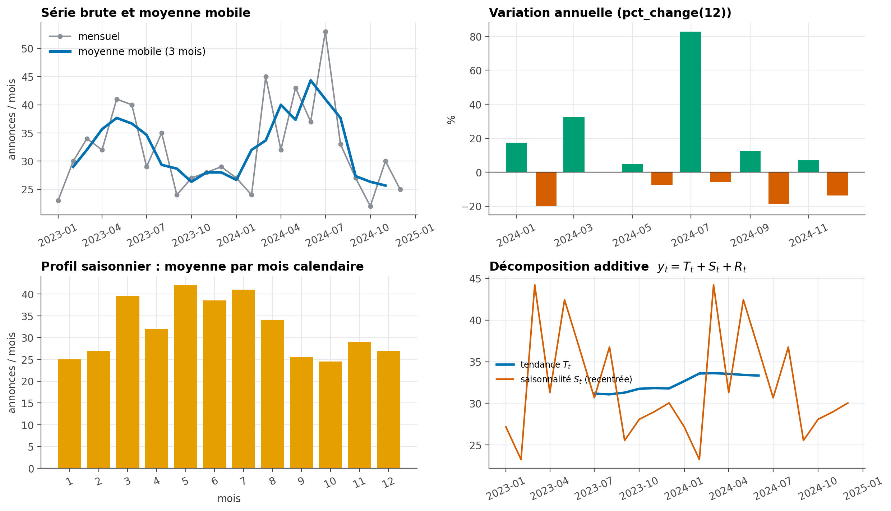{#fig-temporel}

```python
mensuel = df.set_index("date_annonce").resample("MS").size()   # effectif par mois

moyenne_mobile = mensuel.rolling(window=3, center=True).mean()  # lisse le bruit
variation_annuelle = mensuel.pct_change(periods=12) * 100        # comparaison à 12 mois d'écart
profil_saisonnier = mensuel.groupby(mensuel.index.month).mean()  # moyenne par mois calendaire
```

La **moyenne mobile** (panneau supérieur gauche de la @fig-temporel) lisse les fluctuations de court terme pour révéler la tendance de fond. La **décomposition saisonnière**, disponible dans `statsmodels`, va plus loin en séparant explicitement une série $y_t$ en trois composantes :

$$
y_t = T_t + S_t + R_t
$$

où $T_t$ est la tendance de long terme, $S_t$ la saisonnalité (un motif qui se répète, ici chaque année) et $R_t$ le résidu, c'est-à-dire tout ce que la tendance et la saisonnalité n'expliquent pas.

```python
from statsmodels.tsa.seasonal import seasonal_decompose

decomposition = seasonal_decompose(mensuel, model="additive", period=12)
decomposition.trend
decomposition.seasonal
decomposition.resid
```

::: {.callout-warning title="Un pic n'a pas de cause évidente"}
Un pic ou un creux ponctuel dans une série temporelle peut correspondre à un événement réel, à une erreur de collecte, ou à un changement dans le système qui produit la donnée. Comme au chapitre précédent (@fig-crosstab et §5), ne l'expliquez jamais sans une source complémentaire pour l'étayer.
:::

## 9. Automatiser un premier diagnostic : le profilage de données

Toutes les statistiques univariées et bivariées présentées dans ce chapitre et le précédent peuvent être produites en une seule commande grâce à des bibliothèques de **profilage automatique** :

- **[`ydata-profiling`](https://docs.profiling.ydata.ai/)** (anciennement `pandas-profiling`) génère un rapport HTML complet : distributions, valeurs manquantes, corrélations, alertes de qualité ;
- **[`sweetviz`](https://github.com/fbdesignpro/sweetviz)** produit un rapport similaire, avec un accent sur la comparaison entre deux jeux de données (par exemple, train et test).

```python
from ydata_profiling import ProfileReport

rapport = ProfileReport(df, title="Rapport d'exploration — annonces immobilières")
rapport.to_file("rapport_exploration.html")
```

::: {.callout-warning title="Un point de départ, jamais un point d'arrivée"}
Un rapport automatique est un excellent point de départ pour une première prise de contact avec un nouveau jeu de données : il détecte rapidement des problèmes évidents (fort taux de valeurs manquantes, corrélations élevées, colonnes constantes). Il ne remplace en rien le raisonnement mené dans ce chapitre : il ne connaît ni votre question métier, ni le sens réel de vos variables, ni les pièges comme le paradoxe de Simpson.
:::

::: {.content-visible when-profile="teacher"}
::: {.callout-note title="Auto-évaluation" collapse="true"}
- [ ] Je sais structurer une exploration en univariée, bivariée et multivariée, et choisir l'outil adapté à une paire de variables.
- [ ] Je sais calculer une covariance et un coefficient de corrélation de Pearson, et j'en connais les limites (quartet d'Anscombe).
- [ ] Je sais dans quel cas préférer Spearman à Pearson.
- [ ] Je sais décomposer la variance d'une variable entre groupes et interpréter $\eta^2$.
- [ ] Je sais construire un tableau croisé, calculer un $\chi^2$ et interpréter un V de Cramér.
- [ ] Je sais expliquer le paradoxe de Simpson et pourquoi corrélation n'implique pas causalité.
- [ ] Je sais pourquoi tester un grand nombre de relations augmente le risque de fausses découvertes.
- [ ] Je sais quand appliquer une transformation logarithmique et lire un diagramme quantile-quantile.
- [ ] Je sais utiliser `groupby().agg()` et `pivot_table` pour résumer des données par groupe.
- [ ] Je sais décomposer une série temporelle en tendance, saisonnalité et résidu.
:::
:::

## Exercices

::: {#exr-eda-1}
### Choisir le bon coefficient de corrélation

Pour chacune des situations suivantes, indiquez si vous calculeriez plutôt un coefficient de Pearson ou de Spearman.

a. Le lien entre la taille d'un logement et son prix, sur un jeu de données sans valeur extrême.
b. Le lien entre l'ancienneté d'un employé (en rangs de séniorité) et sa satisfaction (échelle de 1 à 5).
c. Le lien entre le revenu d'un ménage et ses dépenses, sur un échantillon comportant deux ménages extrêmement riches.
:::

::: {.content-visible when-profile="teacher"}
::: {.callout-tip collapse="true" title="Solution de l'exercice @exr-eda-1"}
a. **Pearson**, adapté à une relation linéaire sans valeur extrême.
b. **Spearman**, car il s'agit de variables ordinales, pour lesquelles seul l'ordre (le rang) a un sens.
c. **Spearman**, plus robuste face aux deux ménages extrêmement riches, qui domineraient artificiellement un coefficient de Pearson.
:::
:::

::: {#exr-eda-2}
### Corrélation et causalité

Un journal affirme : « Les villes qui comptent le plus de pharmacies ont aussi le plus de cas de maladies — les pharmacies rendraient-elles malade ? »

a. Cette conclusion est-elle valide ?
b. Proposez une variable confondante plausible.
:::

::: {.content-visible when-profile="teacher"}
::: {.callout-tip collapse="true" title="Solution de l'exercice @exr-eda-2"}
a. Non : c'est une confusion classique entre corrélation et causalité (§5.2).
b. La **population** de la ville : une ville plus peuplée compte mécaniquement plus de pharmacies **et** plus de cas de maladies, sans qu'aucun des deux ne cause l'autre.
:::
:::

::: {#exr-eda-3}
### Construire un plan d'exploration

Vous disposez d'un jeu de données de commandes en ligne avec les colonnes : `montant` (quantitative), `region` (qualitative), `moyen_paiement` (qualitative), `date` (temporelle), `age_client` (quantitative).

a. Proposez une question univariée, une question bivariée et une question multivariée que l'on pourrait explorer avec ce jeu de données.
b. Pour votre question bivariée, précisez l'outil que vous utiliseriez (@tbl-choix-outil-bivarie).
:::

::: {.content-visible when-profile="teacher"}
::: {.callout-tip collapse="true" title="Solution de l'exercice @exr-eda-3"}
a. Univariée : « Quelle est la distribution des montants de commande ? ». Bivariée : « Le montant moyen diffère-t-il selon la région ? ». Multivariée : « Le montant diffère-t-il selon la région, une fois le moyen de paiement pris en compte ? ».
b. Quantitative (`montant`) × qualitative (`region`) : comparaison de moyennes/médianes par groupe, analyse de variance et $\eta^2$ (§3).
:::
:::

::: {#exr-eda-4}
### Interpréter un tableau agrégé

Le tableau suivant croise région et nombre moyen de commandes :

| Région | Nombre de commandes | Montant moyen (MAD) |
|:---|---:|---:|
| Nord | 1 240 | 410 |
| Sud | 38 | 1 850 |
| Est | 690 | 395 |

a. Pourquoi faut-il se méfier du montant moyen de la région Sud ?
b. Quelle information supplémentaire demanderiez-vous avant toute conclusion ?
:::

::: {.content-visible when-profile="teacher"}
::: {.callout-tip collapse="true" title="Solution de l'exercice @exr-eda-4"}
a. L'effectif de la région Sud (38) est beaucoup plus faible que celui des deux autres régions : sa moyenne est donc statistiquement beaucoup plus instable, et potentiellement dominée par quelques commandes extrêmes (§7.1).
b. La dispersion (écart-type) de chaque groupe, et éventuellement la liste des commandes individuelles de la région Sud, pour vérifier l'absence de valeurs aberrantes.
:::
:::

::: {#exr-eda-5}
### Lire une décomposition de variance

Pour une variable `note_satisfaction` comparée entre trois agences, on obtient $SST = 420$, $SSB = 92$.

a. Calculez $SSW$.
b. Calculez $\eta^2$ et interprétez-le à l'aide des repères du §3.2.
:::

::: {.content-visible when-profile="teacher"}
::: {.callout-tip collapse="true" title="Solution de l'exercice @exr-eda-5"}
a. $SSW = SST - SSB = 420 - 92 = 328$.
b. $\eta^2 = 92/420 \approx 0{,}22$. Selon les repères de Cohen, il s'agit d'un effet **fort** : l'appartenance à une agence explique une part substantielle de la variabilité des notes de satisfaction.
:::
:::

::: {#exr-eda-6}
### Association entre deux variables qualitatives

Un tableau croisé entre `canal_publicitaire` (3 catégories) et `a_achete` (oui/non) donne $\chi^2 = 18{,}4$ sur un échantillon de $n=400$.

a. Calculez le V de Cramér (le tableau a 3 lignes et 2 colonnes).
b. L'association vous semble-t-elle faible, modérée ou forte (repères du §4.2) ?
:::

::: {.content-visible when-profile="teacher"}
::: {.callout-tip collapse="true" title="Solution de l'exercice @exr-eda-6"}
a. $\min(r,c) - 1 = \min(3,2) - 1 = 1$, donc $V = \sqrt{18{,}4 / (400 \times 1)} = \sqrt{0{,}046} \approx 0{,}21$.
b. Une association **modérée**, plus proche de faible que de forte.
:::
:::

::: {#exr-eda-7}
### Simpson en pratique

Une entreprise observe que le taux de satisfaction global de son service client a **baissé** cette année, alors que chacune de ses trois équipes affiche individuellement une **hausse** de satisfaction.

a. Ce résultat est-il contradictoire ?
b. Quelle variable faudrait-il examiner pour l'expliquer ?
:::

::: {.content-visible when-profile="teacher"}
::: {.callout-tip collapse="true" title="Solution de l'exercice @exr-eda-7"}
a. Non, c'est un exemple typique du paradoxe de Simpson (§5.1) : la composition du volume de dossiers traités par chaque équipe a probablement changé.
b. La **répartition du volume de dossiers entre les trois équipes** : si l'équipe la moins performante traite une part croissante des dossiers cette année, la moyenne globale peut baisser même si chaque équipe individuellement progresse.
:::
:::

::: {#exr-eda-8}
### Transformation logarithmique

Une variable `capital_social` d'entreprises varie de 10 000 MAD à 50 000 000 MAD, avec une asymétrie de 4,8.

a. Recommanderiez-vous une transformation logarithmique ? Pourquoi ?
b. Un histogramme de `log(capital_social)` serait-il plus facile à lire qu'un histogramme de `capital_social` ? Justifiez à l'aide de la @fig-transformation-log.
:::

::: {.content-visible when-profile="teacher"}
::: {.callout-tip collapse="true" title="Solution de l'exercice @exr-eda-8"}
a. Oui : une asymétrie de 4,8 et un rapport de 5 000 entre le minimum et le maximum sont des signes typiques d'une distribution qu'une transformation logarithmique rapproche d'une forme symétrique.
b. Oui, très probablement : comme sur la @fig-transformation-log, l'histogramme brut serait écrasé par les quelques très grandes entreprises, alors que le log étale la variable sur une échelle beaucoup plus lisible.
:::
:::

::: {#exr-eda-9}
### `groupby` et `pivot_table`

Vous disposez d'un jeu de données `ventes` avec les colonnes `region`, `canal` (magasin/en ligne) et `montant`.

a. Écrivez l'instruction `groupby` qui calcule le montant moyen et l'effectif par région.
b. Écrivez l'instruction `pivot_table` qui croise région et canal pour afficher le montant total.
:::

::: {.content-visible when-profile="teacher"}
::: {.callout-tip collapse="true" title="Solution de l'exercice @exr-eda-9"}
a. `ventes.groupby("region").agg(montant_moyen=("montant", "mean"), effectif=("montant", "count"))`
b. `pd.pivot_table(ventes, values="montant", index="region", columns="canal", aggfunc="sum")`
:::
:::

::: {#exr-eda-10}
### Lire une série temporelle décomposée

Une décomposition additive d'une série de ventes mensuelles donne, pour le mois de décembre : tendance $T = 1200$, saisonnalité $S = +350$, résidu $R = -40$.

a. Calculez la valeur observée $y$ pour ce mois.
b. Que signifie une saisonnalité positive de 350 pour décembre ?
:::

::: {.content-visible when-profile="teacher"}
::: {.callout-tip collapse="true" title="Solution de l'exercice @exr-eda-10"}
a. $y = T + S + R = 1200 + 350 - 40 = 1510$.
b. Décembre affiche, en moyenne sur les années observées, des ventes supérieures de 350 unités à la tendance de fond — un effet saisonnier positif plausible (achats de fin d'année).
:::
:::
