# Visualisation des données

::: {.callout-tip title="Objectifs du chapitre"}
À la fin de ce chapitre, l'étudiant sera capable de :

- **Expliquer** pourquoi la visualisation est indispensable, même après une exploration statistique complète ;
- **Décomposer** n'importe quel graphique selon la grammaire des graphiques, et **hiérarchiser** les variables visuelles (position, longueur, angle, aire, couleur) selon leur précision de lecture ;
- **Choisir** le graphique adapté à une question donnée (distribution, comparaison, relation, évolution, composition) et **distinguer sans confusion possible** un histogramme d'un diagramme en barres ;
- **Construire**, avec `matplotlib` et `seaborn`, l'ensemble des graphiques essentiels : histogramme, densité, boîte à moustaches et violon, barres (simples, groupées, empilées), camembert, nuage de points, courbe, *heatmap* ;
- **Représenter** des données géographiques : carte choroplèthe, carte de points, cartogramme, et connaître les pièges spécifiques à la cartographie ;
- **Mobiliser** des graphiques plus avancés lorsqu'ils sont réellement justifiés : petits multiples, coordonnées parallèles, réseaux, Gantt, tableaux de bord ;
- **Distinguer** une bibliothèque de visualisation statique d'une bibliothèque interactive, et savoir quand recourir à chacune ;
- **Identifier** les pièges les plus courants d'un graphique trompeur et **appliquer** les principes de base du *data storytelling* et de l'accessibilité.
:::

Les chapitres précédents ont permis de préparer un jeu de données puis de l'explorer statistiquement. La **visualisation des données** (*data visualization*) en constitue le prolongement naturel : elle traduit ces résultats sous une forme que l'œil humain interprète beaucoup plus vite qu'un tableau de chiffres, et qu'un public non technique peut comprendre en quelques secondes.

## 1. Pourquoi visualiser des données ?

### 1.1. Ce que les statistiques seules ne montrent pas

Deux jeux de données peuvent partager exactement les mêmes statistiques descriptives — moyenne, variance, corrélation — tout en ayant des formes radicalement différentes. C'est ce qu'illustre le célèbre **quartet d'Anscombe** (1973), déjà présenté au chapitre précédent (@fig-anscombe) : quatre jeux de données de onze points chacun, ayant tous la même moyenne, la même variance et le même coefficient de corrélation de Pearson ($r \approx 0{,}82$), mais dont les nuages de points révèlent des situations totalement distinctes.

::: {.callout-important title="La leçon du quartet d'Anscombe"}
Aucune statistique résumée, aussi complète soit-elle, ne remplace un graphique. C'est pourquoi l'exploration statistique (chapitre précédent) et la visualisation (ce chapitre) doivent toujours être menées ensemble, et non l'une après l'autre.
:::

### 1.2. Le rôle de la visualisation dans le cycle d'un projet

La visualisation intervient à deux moments distincts d'un projet d'analyse de données :

- pendant l'**exploration**, comme outil de travail personnel de l'analyste, pour repérer rapidement une distribution, une anomalie ou une relation ;
- au moment de la **communication**, comme outil destiné à un public (décideur, client, grand public), pour transmettre un message clair et argumenté.

Ces deux usages appellent des exigences différentes : un graphique d'exploration peut rester brut et rapide à produire, tandis qu'un graphique de communication doit être soigné, annoté et pensé pour son destinataire — nous y reviendrons en fin de chapitre (§9).

## 2. La grammaire des graphiques

Un graphique statistique, quel que soit son type, se construit à partir des mêmes briques élémentaires. Cette idée, formalisée par Leland Wilkinson sous le nom de **grammaire des graphiques** (*grammar of graphics*), popularisée ensuite par `ggplot2` en R, permet de décrire n'importe quel graphique comme la combinaison de quelques éléments simples.

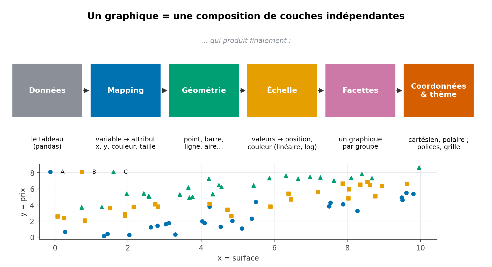{#fig-grammaire}

| Élément | Rôle | Exemple |
|:---|:---|:---|
| **Données** | Le jeu de données représenté | Le tableau des ventes mensuelles |
| **Mapping (*aesthetics*)** | L'association entre une variable et un attribut visuel | `mois` → axe des x, `ventes` → axe des y |
| **Géométrie** | La forme visuelle utilisée pour représenter chaque observation | Points, barres, lignes |
| **Échelle** | La façon dont les valeurs sont converties en position, taille ou couleur | Échelle linéaire, logarithmique, catégorielle |
| **Facette** | Le découpage du graphique en sous-graphiques répétés | Un graphique par région |
| **Coordonnées & thème** | Le système de repères et l'habillage visuel | Cartésien, polaire ; polices, grille, couleurs |

: Les composantes de la grammaire des graphiques {#tbl-grammaire-graphiques}

::: {.callout-note title="Repère" collapse="true"}
En Python, `seaborn` et la bibliothèque `plotnine` (portage de `ggplot2`) implémentent explicitement cette grammaire. `matplotlib`, plus bas niveau, ne l'impose pas mais permet de construire n'importe laquelle de ces briques manuellement.
:::

Comprendre cette grammaire aide à répondre à la question centrale de ce chapitre : **quelle géométrie choisir pour quelle question ?**

### 2.1. Anatomie d'une figure `matplotlib`

Avant de construire le moindre graphique, il faut connaître le vocabulaire de `matplotlib`, car il conditionne toutes les commandes du chapitre.

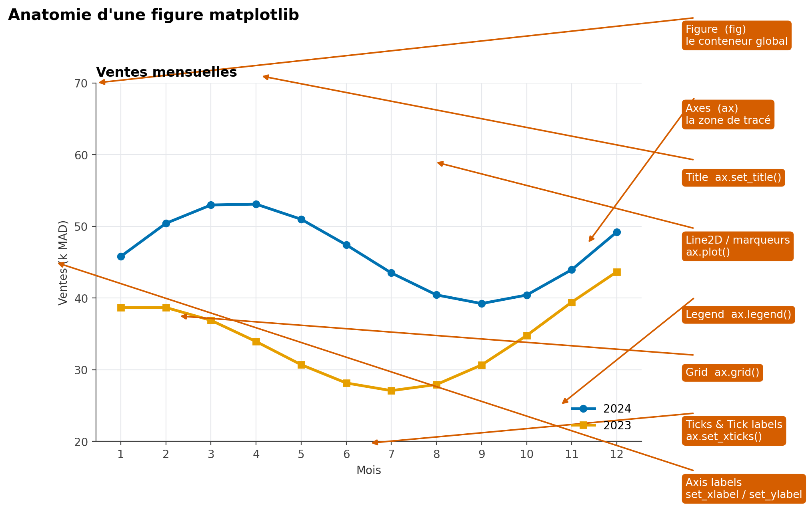{#fig-matplotlib-anatomie}

```python
fig, ax = plt.subplots(figsize=(8, 5))   # fig = le conteneur ; ax = la zone de tracé
ax.plot(x, y)
ax.set_title("Titre")
ax.set_xlabel("Axe des x")
ax.set_ylabel("Axe des y")
fig.savefig("figure.png", dpi=150, bbox_inches="tight")
```

::: {.callout-important title="`fig` et `ax` : ne pas confondre"}
La **figure** (`fig`) est le conteneur global — elle peut contenir plusieurs graphiques. Les **axes** (`ax`) désignent chaque zone de tracé individuelle, avec son propre titre, ses propres axes x/y et sa propre légende. Cette distinction devient indispensable dès qu'on assemble plusieurs graphiques dans une même figure (`plt.subplots(nrows=2, ncols=2)`), comme nous le ferons à plusieurs reprises dans ce chapitre.
:::

### 2.2. Toutes les variables visuelles ne se valent pas

Un même nombre peut être encodé visuellement de multiples façons — une position, une longueur, un angle, une aire, une couleur. Ces encodages ne sont pas équivalents : l'œil humain les compare avec des précisions très différentes, un résultat établi par les travaux de William Cleveland et Robert McGill (1984).

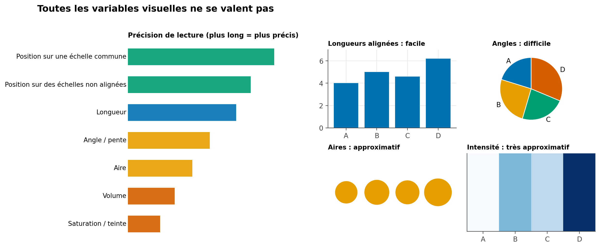{#fig-variables-visuelles}

::: {.callout-important title="Hiérarchie de précision (Cleveland & McGill)"}
Du plus précis au moins précis pour comparer des valeurs : **position sur une échelle commune** > position sur des échelles non alignées > **longueur** > angle/pente > **aire** > volume > **couleur** (teinte, saturation). Cette hiérarchie, illustrée par la @fig-variables-visuelles, explique à elle seule pourquoi le diagramme en barres (fondé sur la longueur) surpasse presque toujours le camembert (fondé sur l'angle) pour une tâche de comparaison — nous y reviendrons en détail au §4.3.
:::

## 3. Choisir le bon graphique selon la question posée

Avant d'écrire la moindre ligne de code, il faut se demander quelle **question** le graphique doit permettre de répondre. Cinq grandes familles de questions couvrent l'essentiel des besoins d'un Data Analyst :

| Type de question | Exemple de question | Graphiques adaptés |
|:---|:---|:---|
| **Distribution** | Comment se répartissent les valeurs d'une variable ? | Histogramme, densité, boîte à moustaches, violon |
| **Comparaison** | Comment se comparent plusieurs catégories ? | Diagramme en barres, lollipop |
| **Relation** | Deux variables évoluent-elles ensemble ? | Nuage de points, *heatmap* de corrélation |
| **Évolution** | Comment une valeur change-t-elle dans le temps ? | Courbe, aire empilée |
| **Composition** | Quelle est la part de chaque catégorie dans un total ? | Barres empilées à 100 %, camembert (avec prudence), treemap |

: Cinq familles de questions et leurs graphiques adaptés {#tbl-familles-questions}

::: {.callout-warning title="Un graphique ne doit répondre qu'à une seule question à la fois"}
Un graphique qui tente de répondre simultanément à une question de distribution, de comparaison et d'évolution devient généralement illisible. Mieux vaut produire plusieurs graphiques simples qu'un seul graphique surchargé.
:::

## 4. Les distributions : histogramme, densité, boîte à moustaches

### 4.1. L'histogramme

L'**histogramme** répartit une variable numérique **continue** en intervalles contigus (*bins*) et affiche le nombre d'observations dans chacun. C'est le graphique de référence pour observer la **forme** d'une distribution (symétrique, asymétrique, bimodale).

```python
import matplotlib.pyplot as plt
import seaborn as sns

sns.histplot(data=df, x="prix", bins=30)
plt.title("Distribution des prix de vente")
plt.xlabel("Prix (MAD)")
plt.ylabel("Nombre de biens")
plt.show()
```

### 4.2. Histogramme et diagramme en barres : deux graphiques que l'on confond trop souvent

Un histogramme et un diagramme en barres se *ressemblent* — tous deux affichent des rectangles verticaux — mais ils répondent à des questions fondamentalement différentes et ne doivent **jamais** être confondus, ni dans leur lecture, ni dans leur construction.

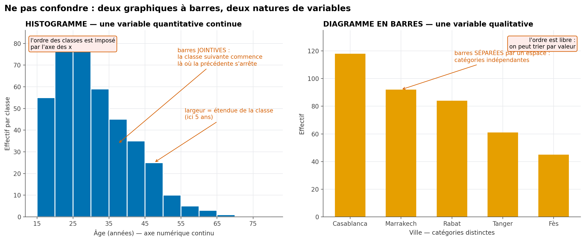{#fig-histogramme-vs-barres}

::: {.callout-important title="La différence essentielle"}
| | Histogramme | Diagramme en barres |
|:---|:---|:---|
| Variable représentée | **Quantitative continue**, découpée en classes | **Qualitative**, catégories déjà distinctes |
| Axe des x | Numérique et continu | Catégoriel, sans valeur intermédiaire |
| Espace entre les barres | **Aucun** — les classes sont contiguës | **Un espace visible** entre chaque catégorie |
| Ordre des barres | Imposé par l'axe numérique | Libre — on peut trier par valeur |
| Ce que mesure la hauteur | Effectif (ou densité) d'une **classe de valeurs** | Effectif (ou une autre mesure) d'une **catégorie** |

: Histogramme contre diagramme en barres {#tbl-histogramme-barres}
:::

Sur la @fig-histogramme-vs-barres, l'absence d'espace entre les barres de l'histogramme (à gauche) signale visuellement que la classe « 35-40 ans » se termine exactement là où commence la classe « 40-45 ans » : il s'agit d'un découpage continu d'une seule variable. À l'inverse, l'espace entre chaque barre du diagramme (à droite) signale que « Casablanca » et « Marrakech » sont des catégories indépendantes, sans continuité entre elles — les réordonner ne change le sens d'aucune donnée.

```python
# HISTOGRAMME : variable numérique continue, bins contigus
sns.histplot(data=df, x="age_bien", bins=15)

# DIAGRAMME EN BARRES : variable catégorielle, barres espacées
effectifs = df["ville"].value_counts()
sns.barplot(x=effectifs.index, y=effectifs.values)
```

### 4.3. Le choix du nombre de classes

Le nombre d'intervalles (`bins`) change radicalement la lecture d'un histogramme, pour un même échantillon.

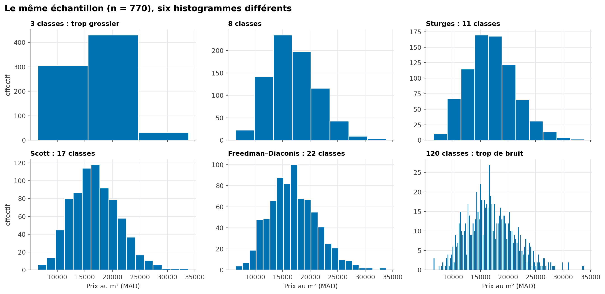{#fig-histogramme-bins}

::: {.callout-warning title="Trop peu, trop, ou juste assez de classes"}
Trop peu d'intervalles (en haut à gauche de la @fig-histogramme-bins) masquent la forme réelle de la distribution ; trop d'intervalles (en bas à droite) font apparaître du bruit statistique sans signification. Plusieurs règles empiriques proposent un nombre de classes raisonnable à partir de la taille de l'échantillon $n$ :

- **règle de Sturges** : $k = \lceil \log_2(n) + 1 \rceil$, adaptée aux distributions proches de la loi normale ;
- **règle de Scott** : largeur de classe $h = 3{,}49\, s\, n^{-1/3}$, où $s$ est l'écart-type ;
- **règle de Freedman-Diaconis** : largeur de classe $h = 2\, IQR\, n^{-1/3}$, plus robuste aux valeurs extrêmes car fondée sur l'IQR plutôt que sur l'écart-type.

```python
import numpy as np
sns.histplot(data=df, x="prix", bins="sturges")   # ou "scott", "fd" (Freedman-Diaconis)
```

Ces règles donnent un **point de départ raisonnable** ; il reste toujours utile de tester plusieurs valeurs de `bins` avant de retenir un graphique définitif.
:::

### 4.4. Classes de largeurs inégales : effectif ou densité ?

Lorsque les classes d'un histogramme n'ont pas toutes la même largeur (par exemple des tranches de revenus définies par des seuils métier), afficher l'**effectif** en hauteur devient trompeur.

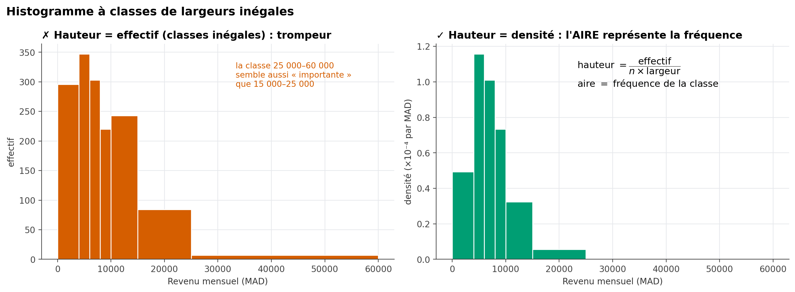{#fig-histogramme-densite}

::: {.callout-important title="La bonne pratique : afficher une densité"}
La hauteur d'une classe doit représenter sa **densité**, définie par
$$
\text{densité} = \frac{\text{effectif de la classe}}{n \times \text{largeur de la classe}},
$$
de sorte que ce soit **l'aire** de chaque rectangle — et non sa seule hauteur — qui représente fidèlement la fréquence de la classe (@fig-histogramme-densite, panneau de droite). `seaborn` applique cette correction automatiquement si l'argument `stat="density"` est précisé :

```python
sns.histplot(data=df, x="revenu_mensuel", bins=[0, 4000, 6000, 8000, 10000, 15000, 25000, 60000], stat="density")
```
:::

### 4.5. L'estimation de densité par noyau (KDE)

Plutôt que de découper une variable en classes discrètes, l'**estimation de densité par noyau** (*Kernel Density Estimation*, KDE) trace une courbe lisse en superposant une petite « cloche » (le noyau) sur chaque observation, puis en les additionnant.

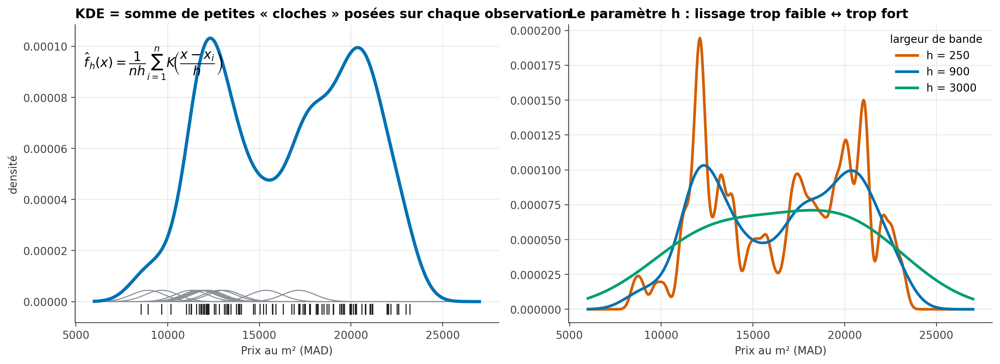{#fig-kde}

La formule générale d'un estimateur à noyau gaussien s'écrit :

$$
\hat f_h(x) = \frac{1}{nh}\sum_{i=1}^{n} K\!\left(\frac{x - x_i}{h}\right)
$$

où $K$ est une fonction noyau (souvent gaussienne) et $h$ la **largeur de bande** (*bandwidth*), qui contrôle le lissage : trop petite, la courbe devient bruitée et reproduit chaque observation individuellement (panneau de droite de la @fig-kde, courbe rouge) ; trop grande, elle masque une éventuelle bimodalité (courbe verte).

```python
sns.kdeplot(data=df, x="prix_m2", fill=True)
sns.kdeplot(data=df, x="prix_m2", bw_adjust=0.3)   # lissage plus fin
```

### 4.6. La fonction de répartition empirique (ECDF)

L'**ECDF** (*Empirical Cumulative Distribution Function*) affiche, pour chaque valeur $x$, la proportion d'observations inférieures ou égales à $x$. Contrairement à l'histogramme, elle ne nécessite **aucun choix de classes**, et permet de lire directement médiane et quartiles sur le graphique.

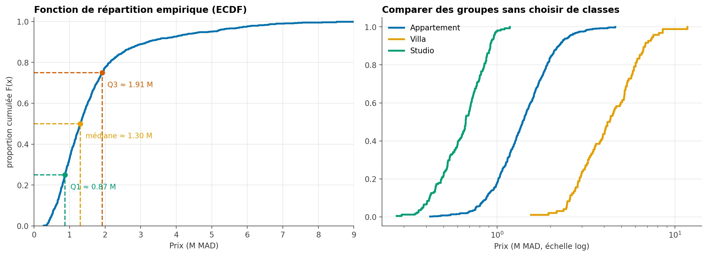{#fig-ecdf}

```python
sns.ecdfplot(data=df, x="prix")
sns.ecdfplot(data=df, x="prix", hue="type_bien")   # comparer plusieurs groupes sans choisir de classes
```

::: {.callout-tip title="Quand préférer l'ECDF ?"}
L'ECDF est particulièrement utile pour **comparer plusieurs groupes** (panneau droit de la @fig-ecdf) : contrairement à des histogrammes superposés, les courbes ECDF restent lisibles même avec de nombreux groupes, et ne dépendent d'aucun choix de nombre de classes.
:::

### 4.7. La boîte à moustaches (*boxplot*)

La **boîte à moustaches**, déjà mentionnée au chapitre 1 (chapitre commun) pour la détection des valeurs aberrantes, résume une distribution en cinq repères construits à partir des quartiles.

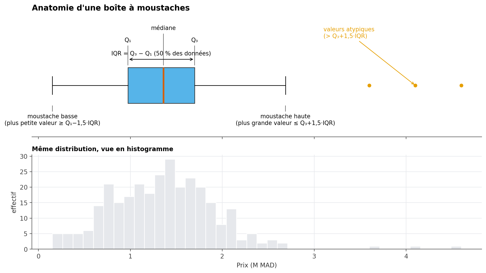{#fig-boxplot-anatomie}

```python
sns.boxplot(data=df, x="quartier", y="prix")
```

::: {.callout-important title="Lire une boîte à moustaches"}
- la **boîte** s'étend de $Q_1$ à $Q_3$ (50 % des observations) ;
- le **trait central** marque la médiane ;
- les **moustaches** s'étendent jusqu'à la valeur la plus extrême encore **à l'intérieur** de $[\,Q_1-1{,}5\,IQR,\ Q_3+1{,}5\,IQR\,]$ (chapitre commun, §3.2) ;
- les **points isolés** au-delà des moustaches sont des valeurs potentiellement atypiques.
:::

::: {.callout-warning title="Ce qu'une boîte à moustaches ne montre jamais"}
Une boîte à moustaches ne révèle **pas** si une distribution est bimodale : deux groupes de valeurs distincts peuvent produire une boîte parfaitement banale, l'information étant résumée par des quantiles qui ne « voient » pas les creux entre les modes. C'est précisément ce que montre la section suivante.
:::

### 4.8. Une même distribution, six représentations

Le choix entre histogramme, densité, boîte à moustaches ou violon n'est jamais neutre : chacun révèle — ou cache — des aspects différents de la même distribution.

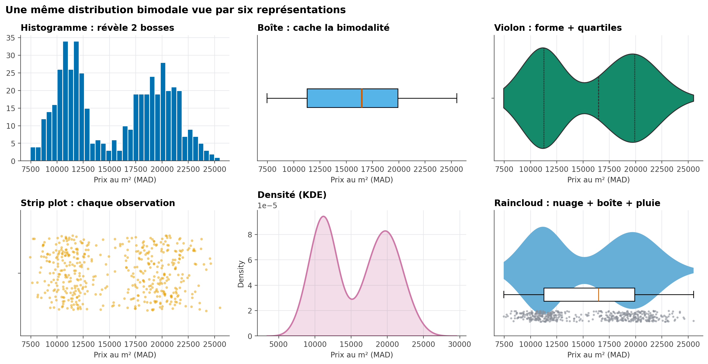{#fig-distribution-famille}

Sur la @fig-distribution-famille, une distribution comportant deux « bosses » distinctes (par exemple, deux quartiers aux prix très différents mélangés dans une même variable) est clairement visible sur l'histogramme, le violon, le KDE et le *strip plot* (chaque observation individuelle) — mais **invisible** sur la simple boîte à moustaches, qui ne renvoie qu'une boîte centrale d'apparence banale.

```python
sns.violinplot(data=df, x="prix_m2", inner="quartile")   # combine boîte et densité
sns.stripplot(data=df, x="prix_m2", alpha=.5, jitter=.3)  # chaque observation individuelle
```

Le dernier panneau, appelé *raincloud plot* (« nuage de pluie »), combine délibérément un demi-violon, une boîte à moustaches et un nuage de points individuels : il cumule les avantages des trois représentations, au prix d'une construction plus élaborée.

::: {.callout-tip title="Règle pratique"}
En exploration personnelle, préférez systématiquement un histogramme ou un KDE à une simple boîte à moustaches dès que vous soupçonnez une distribution complexe. Réservez la boîte à moustaches à la **comparaison rapide** de plusieurs groupes (§4.7), où sa compacité devient un avantage plutôt qu'une limite.
:::

### 4.9. Le diagramme quantile-quantile (QQ-plot)

Pour vérifier si une variable suit approximativement une loi normale — une hypothèse requise par certaines méthodes statistiques —, le diagramme quantile-quantile compare ses quantiles observés aux quantiles théoriques d'une loi normale.

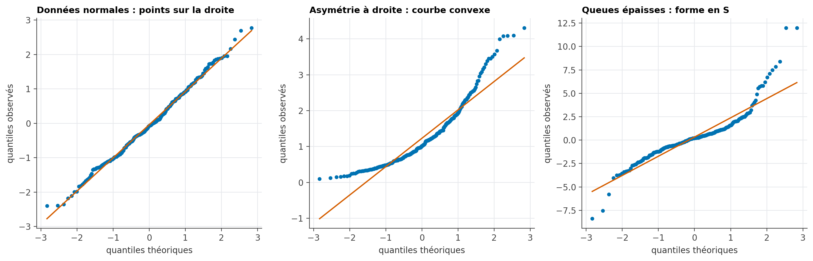{#fig-qqplot}

```python
from scipy import stats
stats.probplot(df["log_prix"], dist="norm", plot=plt.gca())
```

Comme le montre la @fig-qqplot, des points parfaitement alignés sur la droite rouge indiquent une distribution proche de la normale ; une courbe convexe signale une asymétrie ; une forme en S signale des « queues » plus épaisses que la loi normale (davantage de valeurs extrêmes).

## 5. Comparaisons : le diagramme en barres et ses variantes

### 5.1. Le diagramme en barres

Le **diagramme en barres** compare un indicateur (effectif, somme, moyenne...) entre plusieurs catégories. C'est le graphique le plus fiable pour une **comparaison**, car — la @fig-variables-visuelles le rappelle — l'œil humain estime beaucoup mieux des longueurs alignées sur une base commune que des surfaces ou des angles.

```python
ventes_par_region = df.groupby("region")["montant"].sum().sort_values(ascending=False)

sns.barplot(x=ventes_par_region.index, y=ventes_par_region.values)
plt.title("Chiffre d'affaires total par région — 2025")
plt.ylabel("Chiffre d'affaires (MAD)")
plt.xlabel("")
plt.show()
```

::: {.callout-tip title="Bonne pratique"}
Trier les barres par ordre décroissant de valeur (plutôt que par ordre alphabétique) facilite immédiatement la lecture des catégories les plus importantes.
:::

### 5.2. Six variantes du diagramme en barres

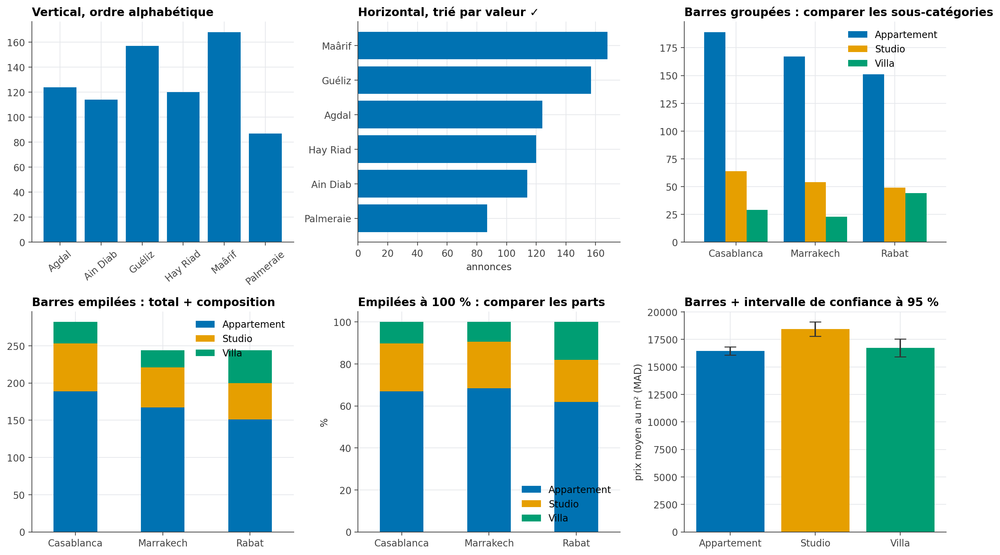{#fig-barres-variantes}

| Variante | Usage | Fonction |
|:---|:---|:---|
| Vertical | Peu de catégories, libellés courts | `sns.barplot(x=..., y=...)` |
| **Horizontal, trié** | Libellés longs ou nombreux — la variante à privilégier par défaut | `sns.barplot(y=..., x=...)` |
| Groupé | Comparer une sous-catégorie supplémentaire | `df.plot(kind="bar")` sur un tableau croisé |
| Empilé | Total **et** composition en une seule barre | `.plot(kind="bar", stacked=True)` |
| Empilé à 100 % | Comparer des **parts** plutôt que des valeurs absolues | Diviser chaque barre par son total avant de tracer |
| Avec intervalle de confiance | Signaler l'incertitude d'une moyenne estimée | `plt.bar(..., yerr=...)` |

: Variantes du diagramme en barres {#tbl-barres-variantes}

```python
tableau = pd.crosstab(df["ville"], df["type_bien"])
tableau.plot(kind="bar", stacked=True)                       # empilé
(tableau.div(tableau.sum(axis=1), axis=0) * 100).plot(kind="bar", stacked=True)  # empilé à 100 %
```

### 5.3. Lollipop et *dot plot* : des barres allégées

Lorsque les barres sont très longues et peu informatives (l'œil ne regarde en réalité que leur extrémité), deux variantes réduisent l'encre du graphique sans perdre en précision de lecture.

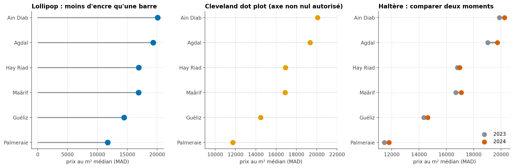{#fig-lollipop}

```python
r = df.groupby("quartier")["prix_m2"].median().sort_values()
plt.hlines(r.index, 0, r.values, color="gray")
plt.plot(r.values, r.index, "o")
```

Le **diagramme en haltère** (*dumbbell chart*, panneau de droite) est particulièrement adapté pour comparer une même catégorie à **deux moments** ou selon **deux conditions** — ici, l'évolution du prix médian par quartier entre deux années.

::: {.callout-note title="Le *dot plot* de Cleveland autorise un axe non nul"}
Contrairement à un diagramme en barres classique (§6.2), un *dot plot* peut légitimement démarrer son axe ailleurs qu'à zéro : la position du point, et non la longueur d'une barre, porte l'information — aucune barre tronquée ne vient exagérer visuellement les écarts.
:::

## 6. Le diagramme circulaire (camembert) — et ses limites {#sec-camembert}

Le **camembert** (*pie chart*) représente la part de chaque catégorie dans un total, sous forme d'angles.

```python
parts = df["categorie_produit"].value_counts()

plt.pie(parts.values, labels=parts.index, autopct="%1.0f%%")
plt.title("Répartition des ventes par catégorie de produit")
plt.show()
```

### 6.1. Camembert contre barres triées : une comparaison directe

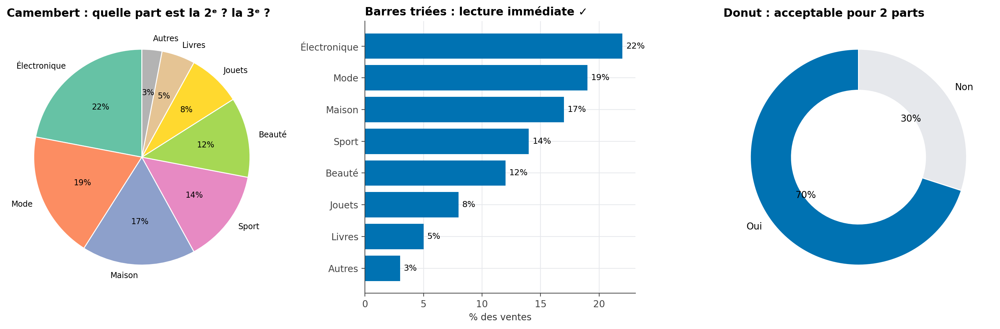{#fig-camembert-vs-barres}

::: {.callout-important title="Zoom sur les tendances : pourquoi éviter le camembert"}
Le camembert est l'un des graphiques les plus critiqués par la communauté de la visualisation de données, pour la raison énoncée dès le §2.2 : l'œil humain compare beaucoup moins bien des **angles** ou des **surfaces** que des **longueurs alignées**. Essayez, sur le panneau de gauche de la @fig-camembert-vs-barres, de répondre rapidement à la question « quelle est la 2ᵉ catégorie la plus vendue, et de combien dépasse-t-elle la 3ᵉ ? » — puis comparez avec la même question posée sur le panneau central.

Dès que l'on dépasse 4 ou 5 catégories, ou que deux parts sont proches en taille, un camembert devient difficile à lire correctement. Dans la quasi-totalité des cas, un **diagramme en barres trié** transmet la même information plus clairement.
:::

### 6.2. Quand un camembert reste défendable

Le camembert reste acceptable dans un cas précis, illustré par le panneau de droite de la @fig-camembert-vs-barres : une composition très simple, **deux à trois catégories**, avec des écarts marqués — par exemple pour illustrer une proportion unique (« 70 % oui / 30 % non »). Sa variante en **donut** (anneau) est parfois préférée pour cet usage, car le centre vide permet d'y afficher directement le chiffre clé.

```python
plt.pie([70, 30], labels=["Oui", "Non"], autopct="%1.0f%%",
        wedgeprops=dict(width=0.4))   # width < 1 transforme le camembert en donut
```

## 7. Relations entre variables : nuage de points et *heatmap*

### 7.1. Le nuage de points (*scatter plot*)

Le **nuage de points** affiche chaque observation comme un point positionné selon deux variables numériques. C'est le graphique de référence pour étudier une **relation** entre deux variables, en complément direct des coefficients de corrélation vus au chapitre précédent.

```python
sns.scatterplot(data=df, x="surface", y="prix", hue="quartier")
plt.title("Prix en fonction de la surface, par quartier")
plt.xlabel("Surface (m²)")
plt.ylabel("Prix (MAD)")
plt.show()
```

### 7.2. Au-delà de deux dimensions : mapper des variables supplémentaires

Un nuage de points peut encoder simultanément jusqu'à quatre variables, en combinant position, couleur et taille — une application directe de la grammaire des graphiques (§2).

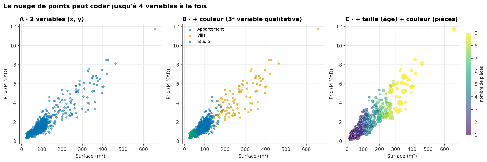{#fig-scatter-mappings}

```python
sns.scatterplot(
    data=df, x="surface", y="prix",
    hue="nombre_pieces",      # 3ᵉ variable : couleur
    size="age_bien",          # 4ᵉ variable : taille des points
)
```

::: {.callout-note title="Le *bubble chart*"}
Une variante à la **taille des points** proportionnelle à une troisième variable numérique (plutôt qu'à une couleur catégorielle) est parfois appelée *bubble chart*.
:::

### 7.3. Le problème de la surimpression (*overplotting*)

Avec plusieurs milliers de points, un nuage de points devient une « bouillie » de couleur où la densité réelle des observations disparaît sous les superpositions.

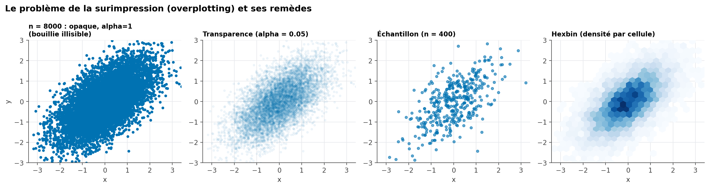{#fig-overplotting}

| Remède | Principe | Code |
|:---|:---|:---|
| Transparence | Chaque point devient semi-transparent ; les zones denses apparaissent plus foncées | `alpha=0.05` |
| Échantillonnage | N'afficher qu'un sous-ensemble aléatoire des observations | `df.sample(n=500, random_state=42)` |
| *Hexbin* | Découper le plan en hexagones et colorer selon le nombre de points par cellule | `plt.hexbin(x, y, gridsize=30)` |

: Remèdes à la surimpression {#tbl-overplotting}

### 7.4. La *heatmap* (carte de chaleur)

La **heatmap** représente une matrice de valeurs à l'aide d'une échelle de couleurs. Son usage le plus fréquent en analyse de données est la visualisation d'une **matrice de corrélation** (chapitre précédent, @fig-correlation-heatmap) ou d'un **tableau croisé dynamique** (chapitre précédent, @fig-pivot-heatmap) entre plusieurs variables.

```python
matrice_correlation = df[["surface", "prix", "nombre_pieces", "age_bien"]].corr()

sns.heatmap(matrice_correlation, annot=True, cmap="coolwarm", center=0)
plt.title("Matrice de corrélation")
plt.show()
```

Une heatmap peut également représenter une activité dans le temps (par exemple le nombre de commandes par jour de la semaine et par heure), auquel cas on parle parfois de *calendar heatmap*.

::: {.callout-tip title="Récapitulatif des graphiques essentiels"}

| Graphique | Question | Type(s) de variable |
|:---|:---|:---|
| Histogramme / KDE / ECDF | Distribution | 1 quantitative |
| Barres / lollipop | Comparaison | 1 qualitative + 1 quantitative |
| Camembert / donut | Composition (avec prudence) | 1 qualitative |
| Nuage de points | Relation | 2 quantitatives (+ 1-2 en couleur/taille) |
| Courbe | Évolution | 1 temporelle + 1 quantitative |
| Boîte à moustaches / violon | Distribution par catégorie | 1 qualitative + 1 quantitative |
| Heatmap | Relation entre plusieurs variables | Plusieurs quantitatives, ou 2 qualitatives (tableau croisé) |

: Synthèse des graphiques essentiels {#tbl-recap-graphiques}
:::

## 8. Évolution : courbes et variantes temporelles

### 8.1. La courbe (*line chart*)

La **courbe** relie des points ordonnés dans le temps. C'est le graphique de référence pour une **évolution**, une tendance ou une saisonnalité.

```python
ventes_mensuelles = df.groupby("mois")["montant"].sum()

plt.plot(ventes_mensuelles.index, ventes_mensuelles.values, marker="o")
plt.title("Évolution mensuelle du chiffre d'affaires — 2025")
plt.xlabel("Mois")
plt.ylabel("Chiffre d'affaires (MAD)")
plt.show()
```

::: {.callout-warning title="Ne jamais relier des catégories sans ordre naturel"}
Une courbe suppose un ordre implicite entre les points (le temps, le plus souvent). Relier par une ligne des catégories sans ordre — des villes, des produits — suggère une progression qui n'existe pas et induit le lecteur en erreur.
:::

### 8.2. Visualiser une courbe décomposée

Le chapitre précédent (§8) a montré comment **calculer** la décomposition d'une série temporelle en tendance, saisonnalité et résidu. Voici comment la **lire** sous forme de graphique superposé :

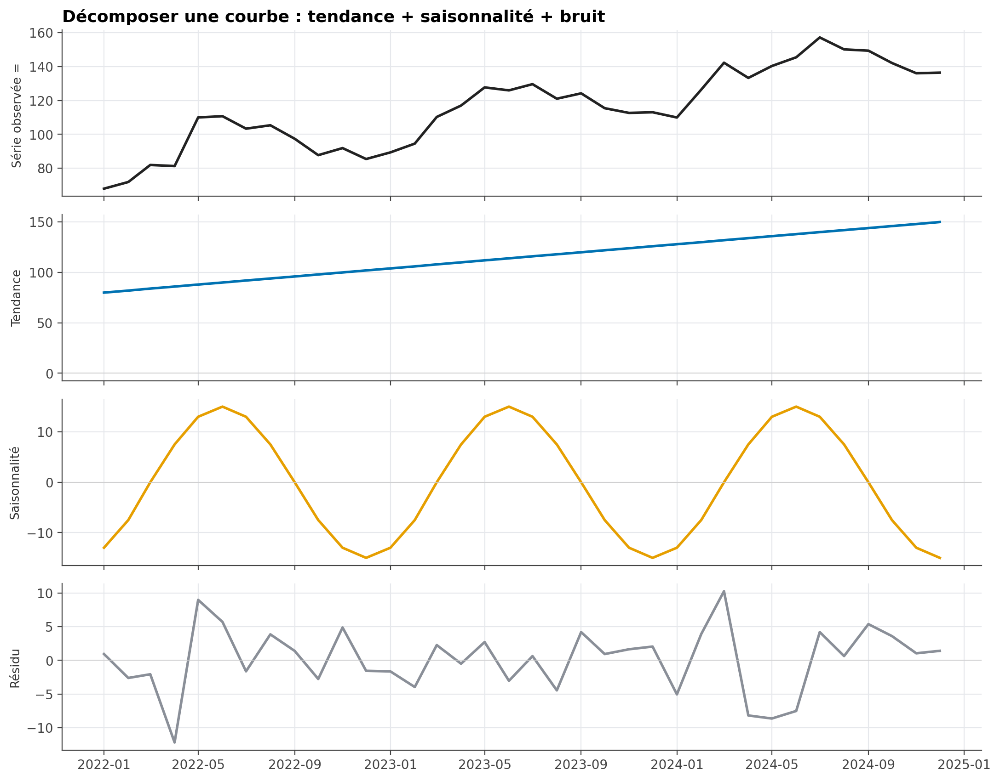{#fig-courbe-composants}

```python
fig, axes = plt.subplots(4, 1, figsize=(10, 8), sharex=True)
axes[0].plot(serie.index, serie.values); axes[0].set_ylabel("Observée")
axes[1].plot(decomposition.trend); axes[1].set_ylabel("Tendance")
axes[2].plot(decomposition.seasonal); axes[2].set_ylabel("Saisonnalité")
axes[3].plot(decomposition.resid); axes[3].set_ylabel("Résidu")
```

Empiler les quatre panneaux sur un même axe des x (temps partagé, `sharex=True`) permet de vérifier visuellement que la somme des trois composantes du bas reconstitue bien la série observée du haut.

### 8.3. Aire empilée et *streamgraph*

Lorsqu'il faut représenter à la fois un **volume total** dans le temps et sa **composition**, l'aire empilée prolonge naturellement la courbe simple.

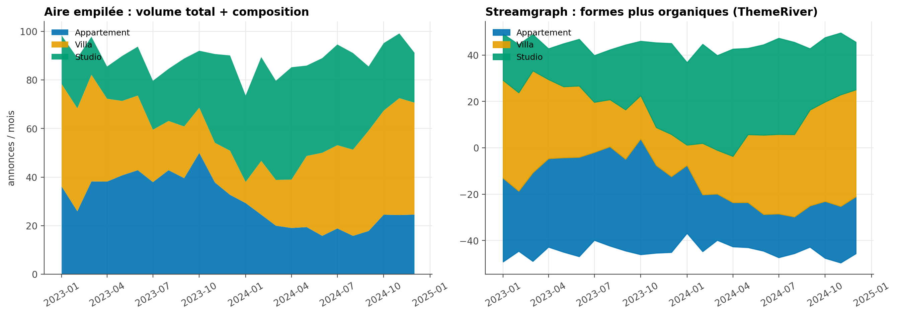{#fig-aire-streamgraph}

```python
plt.stackplot(mois, tableau.T, labels=tableau.columns)
plt.legend(loc="upper left")
```

Le **streamgraph** (panneau de droite) centre les aires empilées autour d'une ligne médiane plutôt qu'une base à zéro, ce qui produit des formes plus organiques et évite qu'une catégorie placée tout en bas de la pile paraisse visuellement écrasée.

### 8.4. Le *slopegraph* et le nuage de points connecté

Pour comparer un petit nombre de séries à **deux instants précis** (plutôt qu'une évolution continue), le *slopegraph* offre une alternative très lisible à la courbe classique.

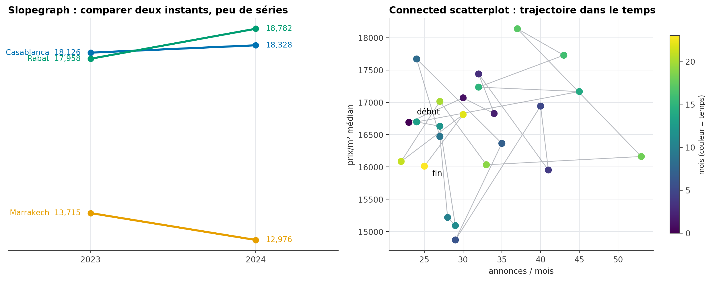{#fig-slope-connected}

```python
for ville in prix_2023.index:
    plt.plot([0, 1], [prix_2023[ville], prix_2024[ville]], marker="o")
plt.xticks([0, 1], ["2023", "2024"])
```

Le **nuage de points connecté** (*connected scatterplot*, panneau de droite) relie dans l'ordre chronologique des points positionnés selon deux variables numériques — ici, le volume mensuel d'annonces et le prix médian — révélant la **trajectoire** conjointe des deux variables plutôt que leur seule évolution séparée.

## 9. Cartographie : représenter une dimension géographique

Lorsqu'une variable est associée à un territoire (un pays, une région, une ville), la représenter sur une carte exploite une capacité de lecture spatiale qu'aucun graphique classique ne peut offrir. Python manipule les données géographiques via `geopandas`, qui étend `pandas` avec une colonne spéciale `geometry` contenant les contours (points, lignes ou polygones).

```python
import geopandas as gpd

regions = gpd.read_file("regions_maroc.geojson")   # un GeoDataFrame, comme un DataFrame + geometry
regions.plot()                                        # tracé minimal
```

### 9.1. La carte choroplèthe

La **carte choroplèthe** colore chaque zone géographique (région, pays, quartier) selon la valeur d'un indicateur — c'est l'équivalent cartographique d'une *heatmap*.

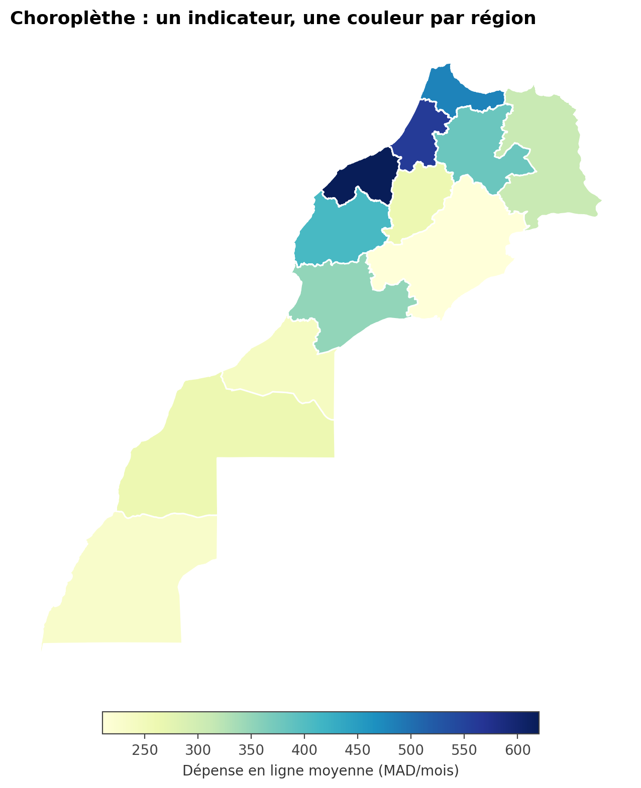{#fig-choroplethe}

```python
fig, ax = plt.subplots(figsize=(8, 8))
regions.plot(column="depense_moyenne", cmap="YlGnBu", linewidth=0.8,
             edgecolor="white", legend=True, ax=ax)
ax.set_axis_off()
ax.set_title("Dépense en ligne moyenne par région")
```

### 9.2. Le piège classique : la surface n'est pas l'importance

Une carte choroplèthe encode une valeur par une **couleur**, mais chaque zone occupe aussi une **surface** très inégale — un immense territoire faiblement peuplé attire visuellement l'œil bien plus qu'une petite région densément peuplée, même si cette dernière pèse davantage dans l'indicateur étudié.

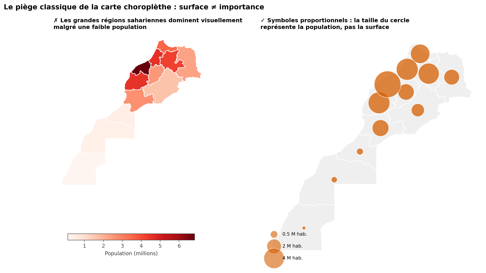{#fig-piege-surface}

::: {.callout-important title="À retenir"}
Ce piège n'est qu'un cas particulier du principe posé au §2.2 (@fig-variables-visuelles) : la **surface** est un encodage visuel peu précis. Deux solutions courantes : représenter l'indicateur avec des **symboles proportionnels** plutôt qu'un remplissage de zone (panneau de droite de la @fig-piege-surface, §9.3), ou déformer délibérément la carte selon la valeur étudiée (le **cartogramme**, §9.4).
:::

### 9.3. La carte de points géolocalisés

Lorsque les données correspondent à des points précis (villes, magasins, capteurs) plutôt qu'à des zones, la carte de points, éventuellement combinée à une taille et une couleur proportionnelles à un indicateur, évite justement le piège de la surface.

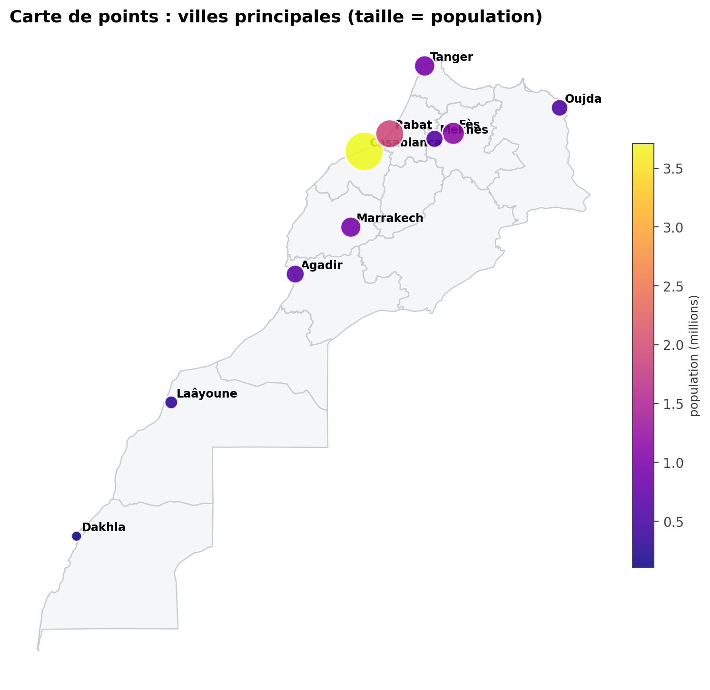{#fig-carto-points}

```python
fig, ax = plt.subplots(figsize=(8, 8))
regions.plot(color="#F4F6F8", edgecolor="#CCCCCC", ax=ax)      # fond de carte
ax.scatter(villes["lon"], villes["lat"], s=villes["population"] * 100,
           c=villes["population"], cmap="plasma", alpha=0.85)
```

### 9.4. Le cartogramme

Un **cartogramme** pousse la logique du symbole proportionnel plus loin : il déforme la carte elle-même — ou la remplace par des formes simples (cercles, carrés) — dont la **taille**, et non plus la position géographique exacte, représente la valeur étudiée.

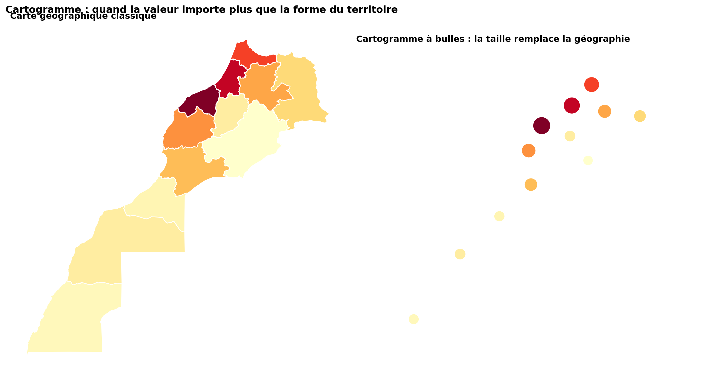{#fig-cartogramme}

::: {.callout-tip title="Quand utiliser un cartogramme ?"}
Le cartogramme est particulièrement efficace pour des indicateurs de **population** ou d'**activité économique**, où la forme géographique réelle importe moins que la comparaison des valeurs. Il perd en revanche la capacité à situer précisément un lieu sur une carte — un compromis à peser selon l'objectif du graphique.
:::

### 9.5. Un mot sur les projections

La Terre est une sphère ; un écran est plat. Toute carte implique donc une **projection**, qui déforme inévitablement soit les surfaces, soit les angles, soit les distances.

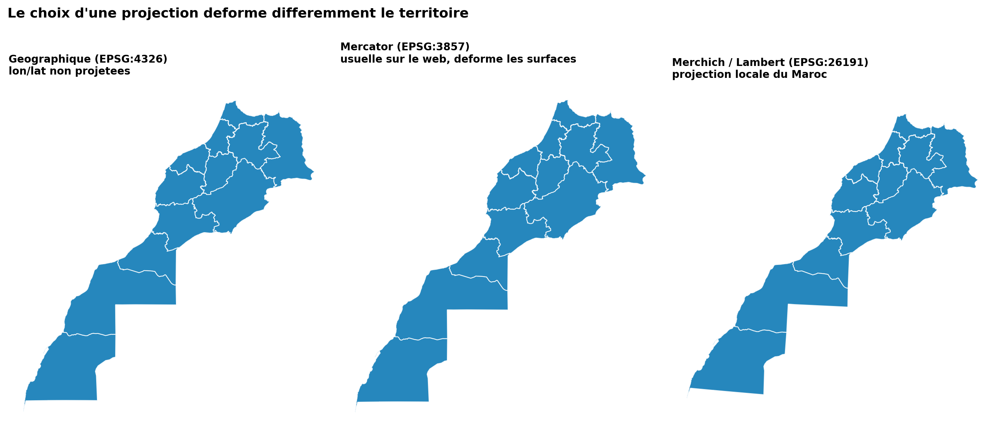{#fig-projections}

```python
regions.crs                        # système de coordonnées actuel (souvent EPSG:4326 — longitude/latitude)
regions_web = regions.to_crs("EPSG:3857")   # projection Web Mercator, usuelle sur le web
```

::: {.callout-note title="Repère"}
Le choix de la projection compte surtout pour des cartes à grande échelle (un continent, le monde) ou des calculs de surfaces/distances précis ; pour une carte régionale ou nationale comme celles de ce chapitre, l'effet reste modeste. Retenez simplement qu'une carte n'est jamais une représentation neutre du territoire, mais toujours le produit d'un choix de projection.
:::

## 10. Graphiques avancés — à réserver aux cas qui le justifient

Les graphiques suivants sortent de la boîte à outils essentielle (§4 à §9). Ils apportent une réelle valeur ajoutée dans des situations précises, mais leur usage abusif nuit presque toujours à la lisibilité : à manier avec discernement.

### 10.1. Petits multiples (facettes)

Plutôt que de surcharger un seul graphique avec de nombreuses catégories, les **petits multiples** répètent le même graphique simple, une fois par catégorie — une application directe de la facette, cinquième composante de la grammaire des graphiques (§2).

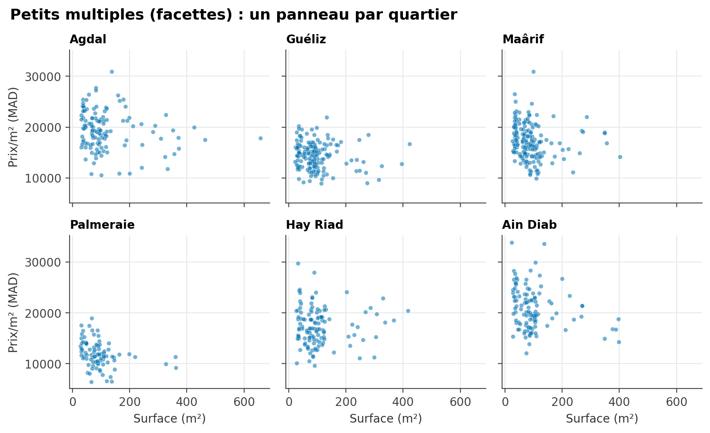{#fig-facettes}

```python
g = sns.FacetGrid(df, col="quartier", col_wrap=3, height=2.5)
g.map_dataframe(sns.scatterplot, x="surface", y="prix_m2")
```

::: {.callout-tip title="Pourquoi ça fonctionne bien"}
Les petits multiples exploitent une capacité de comparaison très naturelle chez l'humain (repérer un panneau qui « sort du lot » parmi des panneaux similaires), tout en évitant la surimpression (§7.3) qu'un unique graphique combinant toutes les catégories en couleur produirait.
:::

### 10.2. Radar et coordonnées parallèles

Pour comparer plusieurs **profils** décrits chacun par plusieurs variables numériques (par exemple, quatre quartiers décrits par leur prix, leur surface, leur âge et leur nombre de pièces médians), deux graphiques permettent une lecture simultanée de toutes les dimensions.

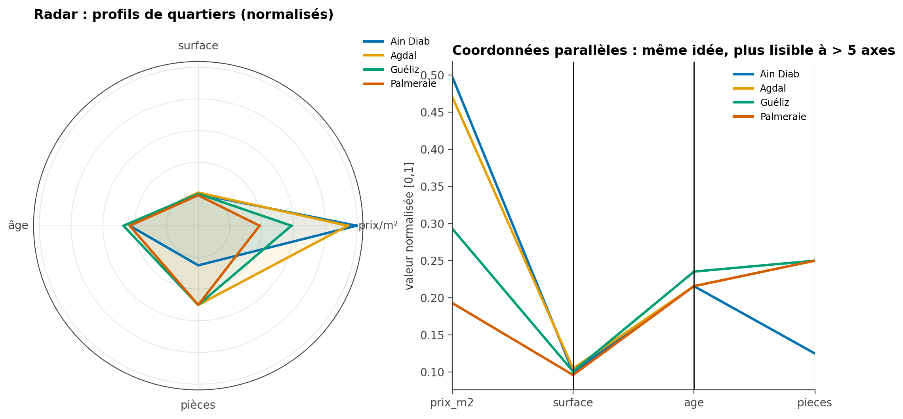{#fig-radar-parallel}

```python
# Radar (diagramme polaire)
ax = plt.subplot(projection="polar")
ax.plot(angles, valeurs_normalisees)
ax.fill(angles, valeurs_normalisees, alpha=0.1)

# Coordonnées parallèles
from pandas.plotting import parallel_coordinates
parallel_coordinates(tableau_normalise, class_column="quartier")
```

::: {.callout-warning title="Une lecture à manier avec prudence"}
Le radar encode les valeurs par une **position sur des axes radiaux**, ce qui reste, selon la hiérarchie du §2.2, moins précis qu'une position sur des axes alignés. Les **coordonnées parallèles**, illustrées à droite de la @fig-radar-parallel, communiquent en général la même information plus fidèlement dès que le nombre de variables dépasse 4 ou 5 — et se lisent naturellement de gauche à droite, sans déformation angulaire. Les deux graphiques exigent, avant tout tracé, une **normalisation préalable** des variables (chapitre commun, §5), faute de quoi une variable à grande échelle écraserait visuellement les autres.
:::

### 10.3. Représenter un réseau

Lorsque les données décrivent des **relations** entre entités (des agences qui traitent conjointement un même dossier, des pages web qui se citent, des comptes qui échangent), un graphe de réseau représente chaque entité comme un nœud et chaque relation comme une arête.

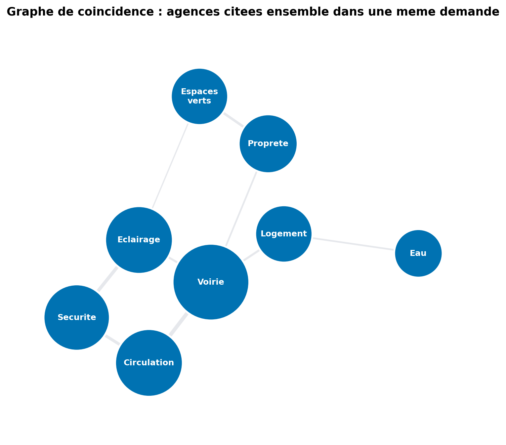{#fig-reseau}

```python
import networkx as nx

G = nx.Graph()
G.add_edges_from(paires_agences, weight=...)
pos = nx.spring_layout(G)   # positionne les nœuds pour minimiser les croisements d'arêtes
nx.draw(G, pos, with_labels=True, node_size=tailles, width=epaisseurs)
```

Sur la @fig-reseau, la **taille** de chaque nœud encode son degré d'implication global (le nombre de co-occurrences pondérées), et l'**épaisseur** de chaque arête encode la force du lien entre deux agences précises — deux mappings supplémentaires, dans le droit fil de la grammaire des graphiques.

### 10.4. Le diagramme de Gantt

Pour planifier ou présenter les étapes d'un projet dans le temps, le **diagramme de Gantt** représente chaque tâche comme une barre horizontale, positionnée selon sa date de début et sa durée.

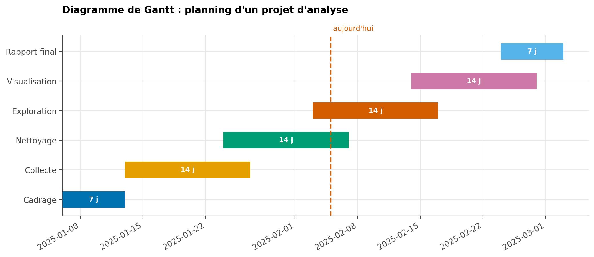{#fig-gantt}

```python
for i, (tache, debut, fin) in enumerate(taches):
    plt.barh(tache, (fin - debut).days, left=debut)
plt.axvline(pd.Timestamp.today(), color="red", linestyle="--")   # repère "aujourd'hui"
```

### 10.5. Treemap et *waffle chart* : d'autres façons de montrer une composition

Au-delà des barres empilées à 100 % (§5.2) et du camembert (§6), deux graphiques représentent une composition par des **surfaces** plutôt que par des angles ou des longueurs.

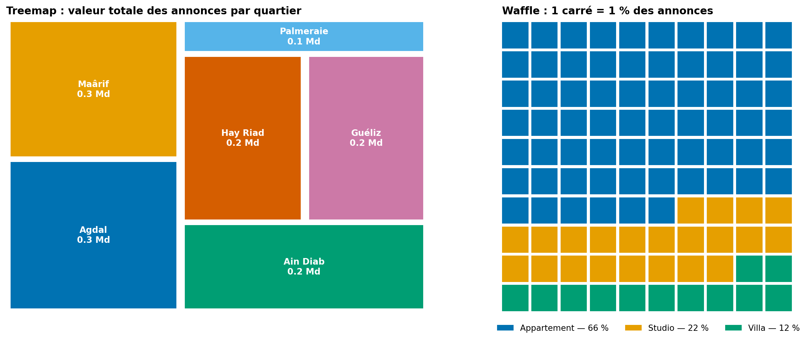{#fig-treemap-waffle}

```python
import squarify
squarify.plot(sizes=valeurs, label=categories, pad=True)
plt.axis("off")
```

Le **treemap** (à gauche) découpe un rectangle en zones proportionnelles à chaque catégorie — utile pour une composition à deux niveaux hiérarchiques (ex. quartier puis type de bien). Le **waffle chart** (à droite), une grille de petits carrés où chaque carré représente 1 % du total, offre une alternative au camembert qui reste fondée sur le comptage d'unités discrètes plutôt que sur un angle — plus proche, dans la hiérarchie du §2.2, d'un encodage par position que par angle.

### 10.6. Éléments de tableau de bord : cartes indicateurs et jauges

Un tableau de bord (approfondi dans un cours dédié à la Business Intelligence) combine souvent plusieurs graphiques de ce chapitre avec des éléments plus synthétiques, pensés pour une lecture en quelques secondes.

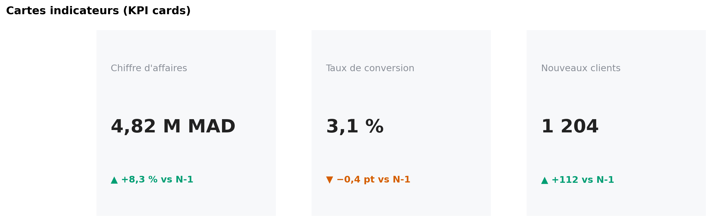{#fig-kpi-cards}

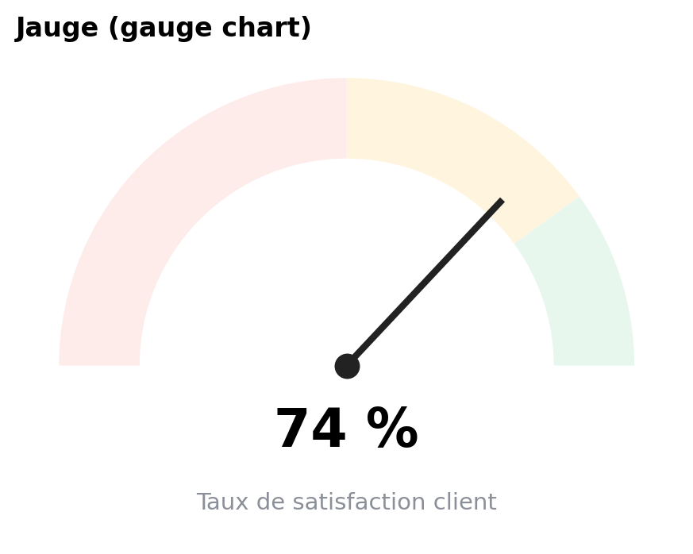{#fig-jauge}

::: {.callout-note title="KPI card et jauge : deux briques complémentaires"}
La **carte indicateur** (*KPI card*) affiche une valeur unique, sa tendance et une flèche de variation — le résumé le plus condensé possible d'un indicateur. La **jauge** (@fig-jauge) positionne une valeur unique sur une échelle bornée, souvent divisée en zones de couleur (ex. rouge/orange/vert), pour signaler immédiatement si un indicateur se situe dans une zone satisfaisante. Ces deux éléments ne remplacent jamais un graphique détaillé : ils orientent le regard avant d'inviter, si nécessaire, à consulter un graphique plus complet.
:::

## 11. Bibliothèques Python pour la visualisation

### 11.1. `matplotlib` : la bibliothèque de référence

`matplotlib` est la bibliothèque de visualisation historique de Python. Bas niveau et hautement personnalisable, elle repose sur les objets `fig`/`ax` présentés au §2.1 :

```python
fig, ax = plt.subplots(figsize=(8, 5))
ax.plot(ventes_mensuelles.index, ventes_mensuelles.values)
ax.set_title("Évolution du chiffre d'affaires")
ax.set_xlabel("Mois")
ax.set_ylabel("Chiffre d'affaires (MAD)")
fig.savefig("evolution_ca.png", dpi=150, bbox_inches="tight")
```

Cette approche orientée objet (`fig`, `ax`) est particulièrement utile pour construire des figures composées de plusieurs sous-graphiques (`plt.subplots(nrows=2, ncols=2)`), comme la plupart des figures de ce chapitre.

### 11.2. `seaborn` : la visualisation statistique simplifiée

`seaborn` s'appuie sur `matplotlib` mais propose une interface de plus haut niveau, pensée directement pour des `DataFrame` `pandas` et pour les besoins statistiques courants (distributions, relations entre catégories, matrices de corrélation). C'est la bibliothèque à privilégier pour l'exploration rapide présentée dans ce chapitre, tandis que `matplotlib` reste utile pour un contrôle fin de la mise en forme finale.

### 11.3. `geopandas` : pour la cartographie

Comme introduit au §9, `geopandas` étend `pandas` d'une colonne `geometry` et s'appuie sur `shapely` (géométrie) et `pyproj` (projections). Il s'intègre naturellement à `matplotlib` (`.plot()`) pour produire des cartes statiques.

### 11.4. Vers l'interactivité

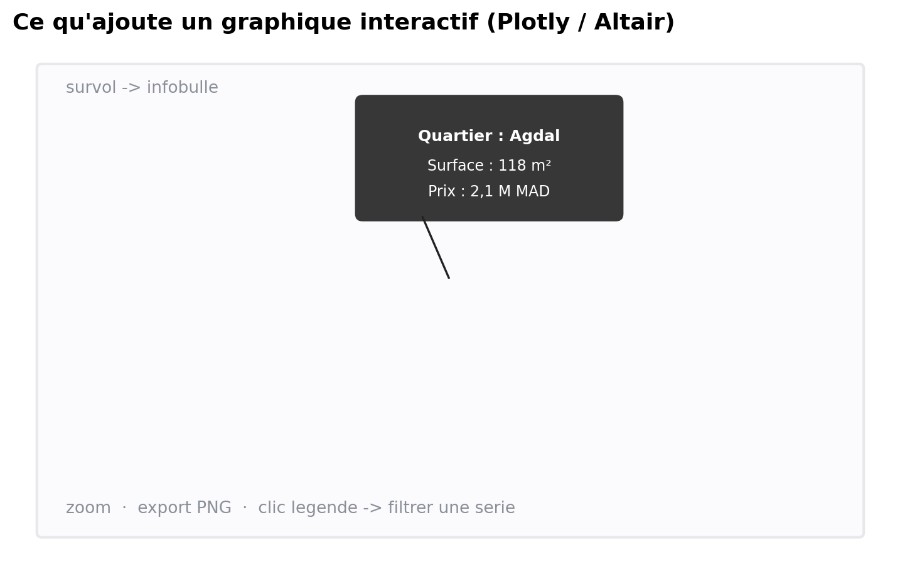{#fig-interactif}

::: {.callout-important title="Zoom sur les tendances : la visualisation interactive"}
`matplotlib` et `seaborn` produisent des images **statiques**. Pour un public qui consulte un graphique dans un navigateur, plusieurs bibliothèques Python permettent de produire des graphiques **interactifs** (zoom, infobulles au survol, filtres dynamiques) — résumés par la @fig-interactif :

- **[`Plotly`](https://plotly.com/python/)** : très populaire, produit des graphiques interactifs exportables en HTML autonome, avec une syntaxe proche de `seaborn` via son module `plotly.express` ;
- **[`Altair`](https://altair-viz.github.io/)** : implémente directement la grammaire des graphiques (via la spécification `Vega-Lite`), avec une syntaxe déclarative concise ;
- **[`Bokeh`](https://bokeh.org/)** : orienté vers les tableaux de bord interactifs et les grands volumes de données.

```python
import plotly.express as px

fig = px.scatter(df, x="surface", y="prix", color="quartier",
                  hover_data=["type_bien"], title="Prix en fonction de la surface")
fig.show()
```

Ces bibliothèques ne remplacent pas `matplotlib`/`seaborn` pour l'exploration rapide ou pour un rapport imprimé, mais deviennent précieuses dès que le graphique est destiné à être consulté à l'écran par plusieurs personnes, ou intégré à un tableau de bord — sujet approfondi au chapitre consacré à la Business Intelligence avec Power BI et Taipy.
:::

## 12. Communiquer les résultats et rendre les graphiques accessibles

Un graphique de communication n'est pas seulement un graphique techniquement correct. Il doit aider un public déterminé à comprendre un résultat sans lui demander de deviner la question, la période ou la signification des couleurs. Le *data storytelling* consiste à organiser les données et les annotations autour d'un message vérifiable, et non à décorer un graphique ou à lui faire dire davantage que les données ne permettent.

### 12.1. Partir du public et de la décision

Avant de choisir un graphique, répondre à quatre questions :

1. **À qui s'adresse-t-il ?** Un analyste peut lire une matrice détaillée ; un responsable peut avoir besoin de quelques indicateurs et d'une explication immédiate.
2. **Quelle question le lecteur doit-il pouvoir résoudre ?** Par exemple : « Quel type de demande est le plus fréquent en janvier ? »
3. **Quelle action ou conclusion le résultat peut-il éclairer ?** Préciser si le graphique décrit un constat, suggère une hypothèse ou soutient une décision.
4. **Quelles sont les limites des données ?** Indiquer la population, la période, la source, les exclusions et les valeurs manquantes qui affectent la lecture.

Un graphique ne doit pas accumuler plusieurs messages concurrents. Si la comparaison, l'évolution et la distribution sont toutes importantes, plusieurs graphiques simples avec des titres cohérents sont souvent plus efficaces qu'une figure surchargée.

### 12.2. Construire un message honnête et lisible

#### Un titre qui exprime le constat

Un titre-thème nomme le sujet (« Demandes 311 par type »). Un titre-message annonce le constat que les données permettent de vérifier (« Le bruit est le type de demande le plus fréquent en janvier »). Le titre-message doit rester proportionné aux preuves : remplacer « cause », « provoque » ou « explique » par « est associé à » lorsque l'analyse n'établit pas de causalité.

Un sous-titre ou une annotation peut préciser la période, la population ou le chiffre important. Éviter les titres qui présentent une interprétation comme un fait si l'échantillon est limité ou si les données ne couvrent qu'un sous-groupe.

#### Donner le contexte nécessaire

Un graphique de communication doit permettre de savoir :

- ce que représentent les axes, avec leur unité ;
- quelle période et quelle population sont incluses ;
- le dénominateur d'un taux ou d'un pourcentage ;
- la source et, si nécessaire, la date d'extraction ou de mise à jour ;
- si une échelle est logarithmique, si un axe est tronqué ou si des valeurs ont été regroupées ;
- combien d'observations sont concernées, surtout lorsque l'effectif est faible.

Les valeurs manquantes ou exclusions susceptibles de changer la conclusion doivent être signalées. Par exemple, une distribution de délais calculée uniquement sur les demandes clôturées ne décrit pas les demandes encore ouvertes. Une moyenne sans effectif peut masquer un groupe très petit et instable.

#### Choisir une forme adaptée et préserver l'échelle

Choisir le graphique selon la question, comme dans les sections précédentes : barres pour comparer des catégories, courbe pour une évolution ordonnée dans le temps, histogramme ou boîte à moustaches pour examiner une distribution, nuage de points pour une relation entre mesures. Trier les catégories lorsque cela facilite la comparaison.

Pour un diagramme en barres, faire partir l'axe des valeurs de zéro : sinon, la longueur des barres exagère les différences. Une autre représentation, comme un graphique de points, peut utiliser un axe resserré si ce choix est indiqué clairement et ne transforme pas visuellement une petite différence en écart spectaculaire. Ne jamais cacher une partie des observations sans le dire ; si l'affichage est limité à un quantile, l'indiquer dans le titre ou la légende et conserver les données complètes dans les calculs.

#### Utiliser couleur et annotations avec retenue

La couleur doit avoir une fonction : distinguer des catégories, signaler une série ou attirer l'attention sur un résultat. Garder une palette limitée et réutiliser les mêmes couleurs pour la même catégorie dans l'ensemble du rapport. Une annotation directe sur la barre ou le point important est souvent plus facile à lire qu'une légende éloignée. Toute annotation doit cependant rester vérifiable à partir des données.

```python
import matplotlib.pyplot as plt

# Valeurs illustratives : les remplacer par les résultats réellement calculés.
categories = ["Autres", "Eau", "Bruit"]
valeurs = [200, 420, 820]

fig, ax = plt.subplots(figsize=(8, 4.5))
barres = ax.barh(categories, valeurs, color="#0072B2")
ax.bar_label(barres, padding=4, fmt="%.0f")
ax.set_xlim(0, max(valeurs) * 1.18)
ax.set_xlabel("Nombre de demandes")
ax.set_ylabel("")
ax.set_title("En janvier 2025, le bruit est le premier motif de demande")
ax.grid(axis="x", color="#D9D9D9", linewidth=0.7)
ax.set_axisbelow(True)
fig.text(
    0.01,
    0.01,
    "Source : NYC 311 — janvier 2025. Valeurs illustratives à remplacer.",
    fontsize=8,
    color="#404040",
)
fig.tight_layout(rect=(0, 0.06, 1, 1))
plt.show()
```

Dans cet exemple, la comparaison ne dépend pas de couleurs différentes : chaque valeur est directement inscrite sur sa barre, l'axe commence à zéro et la période ainsi que la source sont précisées. Dans un rapport réel, remplacer les valeurs illustratives, vérifier le titre à partir des résultats et annoter les limites propres au jeu de données.

### 12.3. Accessibilité : ne pas transmettre l'information par la couleur seule

Certains lecteurs distinguent moins facilement certaines couleurs ; d'autres impriment le document en niveaux de gris ou consultent une figure avec un écran de qualité réduite. L'information essentielle doit donc rester compréhensible sans identifier une couleur particulière.

Bonnes pratiques :

- éviter de distinguer deux catégories uniquement par rouge et vert ; employer aussi des libellés, des motifs, des formes ou des traits différents ;
- choisir des palettes lisibles par les personnes daltoniennes, par exemple la palette `colorblind` de Seaborn, et vérifier le contraste du texte avec son fond ;
- pour une heatmap, choisir une palette séquentielle pour des valeurs allant de faible à forte, et une palette divergente avec un centre explicite pour des valeurs positives et négatives ; conserver une barre de couleur étiquetée ;
- ne pas coder simultanément de nombreuses catégories avec des couleurs proches ; regrouper ou séparer les catégories lorsque la légende devient difficile à suivre ;
- utiliser une taille de texte lisible, des marqueurs assez grands et des traits suffisamment épais ; éviter les libellés inclinés ou superposés quand une disposition horizontale ou une figure plus grande résout le problème ;
- ne pas utiliser une couleur seule pour indiquer une alerte : ajouter un mot, une forme ou un symbole ayant aussi un sens explicite.


Remplacer le chemin et les valeurs par ceux du graphique effectivement publié. Éviter de répéter mot pour mot la légende : décrire plutôt la comparaison, la tendance ou le point important. Pour le PDF imprimé, le texte alternatif n'étant pas toujours perceptible dans la page, accompagner le graphique d'une phrase de lecture ou d'un tableau lorsque l'information ne doit pas être perdue.

### 12.5. Vérification avant diffusion

Avant de publier une figure, vérifier les points suivants :

- [ ] Le graphique répond à une question définie et son titre annonce un constat fidèle.
- [ ] Les unités, la période, la population et le dénominateur sont compréhensibles.
- [ ] L'échelle ne grossit pas artificiellement l'effet présenté ; tout axe tronqué ou transformation est signalé.
- [ ] La source, les filtres importants et les limites pertinentes sont indiqués.
- [ ] Les couleurs ne sont pas le seul moyen de distinguer les groupes.
- [ ] Les textes, marqueurs, légendes et annotations restent lisibles dans la page HTML et après impression.
- [ ] Un lecteur qui ne voit pas l'image dispose d'une description textuelle et, si nécessaire, d'un tableau.
- [ ] Les chiffres et annotations ont été vérifiés à partir des données, et la conclusion ne prétend pas démontrer une causalité non étudiée.
