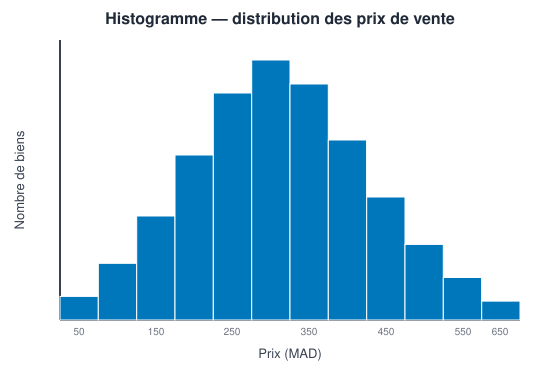
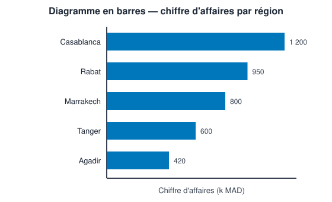
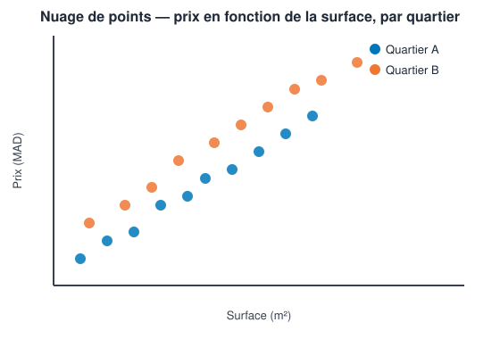
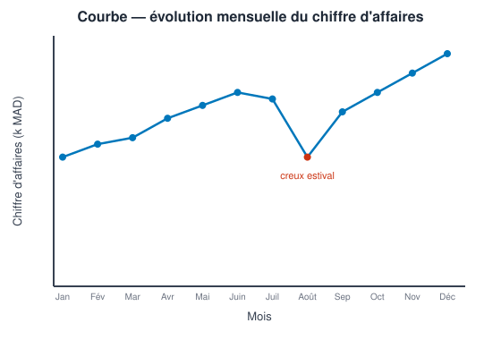
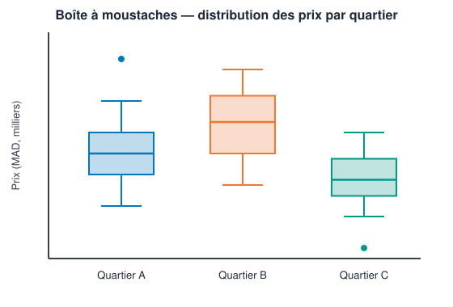
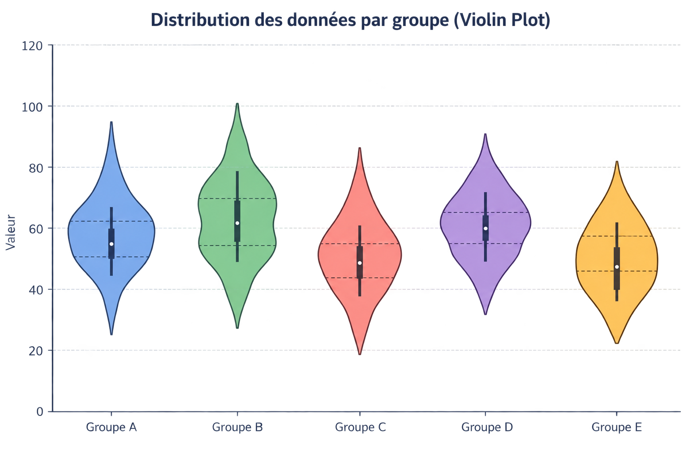
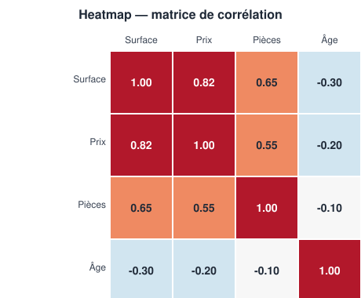

# Visualisation des données

::: {.callout-tip title="Objectifs du chapitre"}
À la fin de ce chapitre, l'étudiant sera capable de :

- **Expliquer** pourquoi la visualisation est indispensable, même après une exploration statistique complète ;
- **Choisir** le graphique adapté à une question donnée (comparaison, distribution, relation, évolution, composition) ;
- **Construire** les graphiques essentiels (histogramme, barres, camembert, nuage de points, courbe, heatmap, boîte à moustaches) avec `matplotlib` et `seaborn` ;
- **Distinguer** une bibliothèque de visualisation statique d'une bibliothèque interactive, et savoir quand recourir à chacune ;
- **Identifier** les pièges les plus courants d'un graphique trompeur et appliquer les principes de base du *data storytelling*.
:::

Les chapitres précédents ont permis de préparer un jeu de données puis de l'explorer statistiquement. La **visualisation des données** (*data visualization*) en constitue le prolongement naturel : elle traduit ces résultats sous une forme que l'œil humain interprète beaucoup plus vite qu'un tableau de chiffres, et qu'un public non technique peut comprendre en quelques secondes.

## 1. Pourquoi visualiser des données ?

### 1.1. Ce que les statistiques seules ne montrent pas

Deux jeux de données peuvent partager exactement les mêmes statistiques descriptives — moyenne, variance, corrélation — tout en ayant des formes radicalement différentes. C'est ce qu'illustre le célèbre **quartet d'Anscombe** (1973) : quatre jeux de données de onze points chacun, ayant tous la même moyenne, la même variance et le même coefficient de corrélation de Pearson ($r \approx 0{,}82$), mais dont les nuages de points révèlent des situations totalement distinctes : une relation linéaire nette, une relation courbe, une relation linéaire perturbée par un seul point aberrant, et un nuage sans relation réelle dominé par une valeur extrême.

::: {.callout-important title="La leçon du quartet d'Anscombe"}
Aucune statistique résumée, aussi complète soit-elle, ne remplace un graphique. C'est pourquoi l'exploration statistique (chapitre précédent) et la visualisation (ce chapitre) doivent toujours être menées ensemble, et non l'une après l'autre.
:::

### 1.2. Le rôle de la visualisation dans le cycle d'un projet

La visualisation intervient à deux moments distincts d'un projet d'analyse de données :

- pendant l'**exploration**, comme outil de travail personnel de l'analyste, pour repérer rapidement une distribution, une anomalie ou une relation ;
- au moment de la **communication**, comme outil destiné à un public (décideur, client, grand public), pour transmettre un message clair et argumenté.

Ces deux usages appellent des exigences différentes : un graphique d'exploration peut rester brut et rapide à produire, tandis qu'un graphique de communication doit être soigné, annoté et pensé pour son destinataire — nous y reviendrons en fin de chapitre.

## 2. La grammaire des graphiques

Un graphique statistique, quel que soit son type, se construit à partir des mêmes briques élémentaires. Cette idée, formalisée par Leland Wilkinson sous le nom de **grammaire des graphiques** (*grammar of graphics*), popularisée ensuite par `ggplot2` en R, permet de décrire n'importe quel graphique comme la combinaison de quelques éléments simples.

| Élément | Rôle | Exemple |
|:---|:---|:---|
| **Données** | Le jeu de données représenté | Le tableau des ventes mensuelles |
| **Mapping (*aesthetics*)** | L'association entre une variable et un attribut visuel | `mois` → axe des x, `ventes` → axe des y |
| **Géométrie** | La forme visuelle utilisée pour représenter chaque observation | Points, barres, lignes |
| **Échelle** | La façon dont les valeurs sont converties en position, taille ou couleur | Échelle linéaire, logarithmique, catégorielle |
| **Facette** | Le découpage du graphique en sous-graphiques répétés | Un graphique par région |

: Les composantes de la grammaire des graphiques {#tbl-grammaire-graphiques}

::: {.callout-note title="Repère" collapse="true"}
En Python, `seaborn` et la bibliothèque `plotnine` (portage de `ggplot2`) implémentent explicitement cette grammaire. `matplotlib`, plus bas niveau, ne l'impose pas mais permet de construire n'importe laquelle de ces briques manuellement.
:::

Comprendre cette grammaire aide à répondre à la question centrale de ce chapitre : **quelle géométrie choisir pour quelle question ?**

## 3. Choisir le bon graphique selon la question posée

Avant d'écrire la moindre ligne de code, il faut se demander quelle **question** le graphique doit permettre de répondre. Cinq grandes familles de questions couvrent l'essentiel des besoins d'un Data Analyst :

| Type de question | Exemple de question | Graphiques adaptés |
|:---|:---|:---|
| **Distribution** | Comment se répartissent les valeurs d'une variable ? | Histogramme, boîte à moustaches, violin plot |
| **Comparaison** | Comment se comparent plusieurs catégories ? | Diagramme en barres |
| **Relation** | Deux variables évoluent-elles ensemble ? | Nuage de points, heatmap de corrélation |
| **Évolution** | Comment une valeur change-t-elle dans le temps ? | Courbe |
| **Composition** | Quelle est la part de chaque catégorie dans un total ? | Camembert (avec prudence), barres empilées à 100 % |

: Cinq familles de questions et leurs graphiques adaptés {#tbl-familles-questions}

::: {.callout-warning title="Un graphique ne doit répondre qu'à une seule question à la fois"}
Un graphique qui tente de répondre simultanément à une question de distribution, de comparaison et d'évolution devient généralement illisible. Mieux vaut produire plusieurs graphiques simples qu'un seul graphique surchargé.
:::

## 4. Les graphiques essentiels

Pour chaque graphique, nous précisons la question à laquelle il répond, le code de base avec `matplotlib`/`seaborn`, et les pièges à éviter.

### 4.1. L'histogramme

L'**histogramme** répartit une variable numérique en intervalles (*bins*) et affiche le nombre d'observations dans chacun. C'est le graphique de référence pour observer la **forme** d'une distribution (symétrique, asymétrique, bimodale).

```python
import matplotlib.pyplot as plt
import seaborn as sns

sns.histplot(data=df, x="prix", bins=30)
plt.title("Distribution des prix de vente")
plt.xlabel("Prix (MAD)")
plt.ylabel("Nombre de biens")
plt.show()
```

{#fig-histogramme}

::: {.callout-warning title="Le choix du nombre d'intervalles change tout"}
Trop peu d'intervalles masquent la forme réelle de la distribution ; trop d'intervalles font apparaître du bruit statistique sans signification. Il est recommandé de tester plusieurs valeurs de `bins` avant de retenir un graphique définitif.
:::

### 4.2. Le diagramme en barres

Le **diagramme en barres** compare un indicateur (effectif, somme, moyenne...) entre plusieurs catégories. C'est le graphique le plus fiable pour une **comparaison**, car l'œil humain estime beaucoup mieux des longueurs alignées sur une base commune que des surfaces ou des angles.

```python
ventes_par_region = df.groupby("region")["montant"].sum().sort_values(ascending=False)

sns.barplot(x=ventes_par_region.index, y=ventes_par_region.values)
plt.title("Chiffre d'affaires total par région — 2025")
plt.ylabel("Chiffre d'affaires (MAD)")
plt.xlabel("")
plt.show()
```

Deux variantes utiles :

- les **barres horizontales** (`sns.barplot(y=..., x=...)`), préférables lorsque les libellés des catégories sont longs ;
- les **barres groupées ou empilées**, pour comparer une sous-catégorie supplémentaire (ex. les ventes par région **et** par année).

::: {.callout-tip title="Bonne pratique"}
Trier les barres par ordre décroissant de valeur (plutôt que par ordre alphabétique) facilite immédiatement la lecture des catégories les plus importantes.
:::

### 4.3. Le diagramme circulaire (camembert) — et ses limites {#sec-camembert}

Le **camembert** (*pie chart*) représente la part de chaque catégorie dans un total, sous forme d'angles.

```python
parts = df["categorie_produit"].value_counts()

plt.pie(parts.values, labels=parts.index, autopct="%1.0f%%")
plt.title("Répartition des ventes par catégorie de produit")
plt.show()
```

{#fig-barres}

::: {.callout-important title="Zoom sur les tendances : pourquoi éviter le camembert"}
Le camembert est l'un des graphiques les plus critiqués par la communauté de la visualisation de données, pour une raison précise : l'œil humain compare beaucoup moins bien des **angles** ou des **surfaces** que des **longueurs alignées**. Dès que l'on dépasse 4 ou 5 catégories, ou que deux parts sont proches en taille, un camembert devient difficile à lire correctement.

Dans la quasi-totalité des cas, un **diagramme en barres trié** transmet la même information plus clairement. Le camembert reste défendable uniquement pour une composition très simple (2 à 3 catégories, avec des écarts marqués), par exemple pour illustrer une proportion unique (« 70 % oui / 30 % non »).
:::

### 4.4. Le nuage de points (*scatter plot*)

Le **nuage de points** affiche chaque observation comme un point positionné selon deux variables numériques. C'est le graphique de référence pour étudier une **relation** entre deux variables, en complément direct du coefficient de corrélation vu au chapitre précédent.

```python
sns.scatterplot(data=df, x="surface", y="prix", hue="quartier")
plt.title("Prix en fonction de la surface, par quartier")
plt.xlabel("Surface (m²)")
plt.ylabel("Prix (MAD)")
plt.show()
```

{#fig-nuage-points}


L'ajout d'une troisième dimension par la couleur (`hue`) ou par la taille des points (`size`) permet de passer à une analyse multivariée sans changer de type de graphique — c'est l'une des façons les plus simples d'exploiter la grammaire des graphiques présentée plus haut. Une variante à la **taille des points** proportionnelle à une troisième variable est parfois appelée *bubble chart*.

### 4.5. La courbe (*line chart*)

La **courbe** relie des points ordonnés dans le temps. C'est le graphique de référence pour une **évolution**, une tendance ou une saisonnalité.

```python
ventes_mensuelles = df.groupby("mois")["montant"].sum()

plt.plot(ventes_mensuelles.index, ventes_mensuelles.values, marker="o")
plt.title("Évolution mensuelle du chiffre d'affaires — 2025")
plt.xlabel("Mois")
plt.ylabel("Chiffre d'affaires (MAD)")
plt.show()
```
{#fig-courbe-evolution}

::: {.callout-warning title="Ne jamais relier des catégories sans ordre naturel"}
Une courbe suppose un ordre implicite entre les points (le temps, le plus souvent). Relier par une ligne des catégories sans ordre — des villes, des produits — suggère une progression qui n'existe pas et induit le lecteur en erreur.
:::

### 4.6. La boîte à moustaches et le *violin plot*

La **boîte à moustaches** (*boxplot*), déjà mentionnée au chapitre 1 pour la détection des valeurs aberrantes, résume une distribution en cinq chiffres : minimum, $Q_1$, médiane, $Q_3$, maximum (hors valeurs atypiques, représentées par des points isolés).

```python
sns.boxplot(data=df, x="quartier", y="prix")
plt.title("Distribution des prix par quartier")
plt.show()
```
{#fig-boite-moustaches}


Le **violin plot** combine la boîte à moustaches avec une estimation de la densité de la distribution, ce qui permet de voir à la fois le résumé statistique et la forme complète (notamment une éventuelle bimodalité, invisible sur un simple boxplot) :

```python
sns.violinplot(data=df, x="quartier", y="prix")
```
{#fig-violin-plot}

### 4.7. La *heatmap* (carte de chaleur)

La **heatmap** représente une matrice de valeurs à l'aide d'une échelle de couleurs. Son usage le plus fréquent en analyse de données est la visualisation d'une **matrice de corrélation** entre plusieurs variables numériques :

```python
matrice_correlation = df[["surface", "prix", "nombre_pieces", "age_bien"]].corr()

sns.heatmap(matrice_correlation, annot=True, cmap="coolwarm", center=0)
plt.title("Matrice de corrélation")
plt.show()
```

{#fig-heatmap}

Une heatmap peut également représenter une activité dans le temps (par exemple le nombre de commandes par jour de la semaine et par heure), auquel cas on parle parfois de *calendar heatmap*.

::: {.callout-tip title="Récapitulatif des graphiques essentiels"}

| Graphique | Question | Type(s) de variable |
|:---|:---|:---|
| Histogramme | Distribution | 1 quantitative |
| Barres | Comparaison | 1 qualitative + 1 quantitative |
| Camembert | Composition (avec prudence) | 1 qualitative |
| Nuage de points | Relation | 2 quantitatives (+ 1 qualitative en couleur) |
| Courbe | Évolution | 1 temporelle + 1 quantitative |
| Boîte à moustaches / violon | Distribution par catégorie | 1 qualitative + 1 quantitative |
| Heatmap | Relation entre plusieurs variables | Plusieurs quantitatives |

: Synthèse des graphiques essentiels {#tbl-recap-graphiques}
:::

## 5. Bibliothèques Python pour la visualisation

### 5.1. `matplotlib` : la bibliothèque de référence

`matplotlib` est la bibliothèque de visualisation historique de Python. Bas niveau et hautement personnalisable, elle repose sur deux objets centraux : la **figure** (la zone globale) et les **axes** (chaque graphique individuel) :

```python
fig, ax = plt.subplots(figsize=(8, 5))
ax.plot(ventes_mensuelles.index, ventes_mensuelles.values)
ax.set_title("Évolution du chiffre d'affaires")
ax.set_xlabel("Mois")
ax.set_ylabel("Chiffre d'affaires (MAD)")
fig.savefig("evolution_ca.png", dpi=150, bbox_inches="tight")
```

Cette approche orientée objet (`fig`, `ax`) est particulièrement utile pour construire des figures composées de plusieurs sous-graphiques (`plt.subplots(nrows=2, ncols=2)`).

### 5.2. `seaborn` : la visualisation statistique simplifiée

`seaborn` s'appuie sur `matplotlib` mais propose une interface de plus haut niveau, pensée directement pour des `DataFrame` `pandas` et pour les besoins statistiques courants (distributions, relations entre catégories, matrices de corrélation). C'est la bibliothèque à privilégier pour l'exploration rapide présentée dans ce chapitre, tandis que `matplotlib` reste utile pour un contrôle fin de la mise en forme finale.

### 5.3. Vers l'interactivité

::: {.callout-important title="Zoom sur les tendances : la visualisation interactive"}
`matplotlib` et `seaborn` produisent des images **statiques**. Pour un public qui consulte un graphique dans un navigateur, plusieurs bibliothèques Python permettent de produire des graphiques **interactifs** (zoom, infobulles au survol, filtres dynamiques) :

- **[`Plotly`](https://plotly.com/python/)** : très populaire, produit des graphiques interactifs exportables en HTML autonome, avec une syntaxe proche de `seaborn` via son module `plotly.express` ;
- **[`Altair`](https://altair-viz.github.io/)** : implémente directement la grammaire des graphiques (via la spécification `Vega-Lite`), avec une syntaxe déclarative concise ;
- **[`Bokeh`](https://bokeh.org/)** : orienté vers les tableaux de bord interactifs et les grands volumes de données.

```python
import plotly.express as px

fig = px.scatter(df, x="surface", y="prix", color="quartier",
                  hover_data=["type_bien"], title="Prix en fonction de la surface")
fig.show()
```

Ces bibliothèques ne remplacent pas `matplotlib`/`seaborn` pour l'exploration rapide ou pour un rapport imprimé, mais deviennent précieuses dès que le graphique est destiné à être consulté à l'écran par plusieurs personnes, ou intégré à un tableau de bord — sujet approfondi au chapitre consacré à la Business Intelligence avec Power BI et Taipy.
:::

## 6. Bonnes pratiques et *data storytelling*

### 6.1. Anatomie d'un bon graphique

Un graphique destiné à être communiqué doit toujours comporter :

- un **titre** qui énonce le message, pas seulement le nom des variables (« Les ventes ont chuté de 12 % en mars », plutôt que « Ventes par mois ») ;
- des **axes lisibles**, avec leur unité ;
- une **légende** si plusieurs séries ou catégories sont représentées ;
- la **source** et la **période** des données, en petit texte ;
- éventuellement, une **annotation** directe sur le point ou la zone la plus importante du graphique.

### 6.2. Graphiques trompeurs : les pièges les plus courants

| Piège | Description | Conséquence |
|:---|:---|:---|
| **Axe des ordonnées tronqué** | Un axe qui ne commence pas à zéro sur un diagramme en barres | Exagère visuellement une différence réelle |
| **Échelles doubles mal alignées** | Deux axes y avec des échelles différentes sur un même graphique | Suggère une corrélation qui peut être artificielle |
| **Effets 3D inutiles** | Un camembert ou des barres en relief 3D | Déforme la perception des proportions réelles |
| **Trop de catégories sur un camembert** | Plus de 5-6 parts sur un même camembert | Rend la comparaison des parts impossible |
| **Couleurs non cohérentes** | Une même catégorie représentée par des couleurs différentes selon les graphiques d'un même rapport | Ralentit et complique la lecture |

: Pièges courants menant à des graphiques trompeurs {#tbl-graphiques-trompeurs}

::: {.callout-warning title="Exemple classique : l'axe tronqué"}
Un diagramme en barres dont l'axe des ordonnées commence à 90 (au lieu de 0) peut faire paraître une hausse de 2 % aussi spectaculaire visuellement qu'une hausse de 50 %. Sauf cas très spécifique et clairement indiqué au lecteur, un diagramme en barres doit toujours démarrer à zéro ; seule une courbe, où l'on s'intéresse à la variation plutôt qu'au niveau absolu, tolère parfois un axe tronqué.
:::

### 6.3. Accessibilité et choix des couleurs

Environ 1 homme sur 12 présente une forme de daltonisme. Quelques principes simples réduisent fortement le risque d'exclure une partie du public :

- privilégier des palettes de couleurs conçues pour rester distinguables en cas de daltonisme (par exemple les palettes `colorblind` de `seaborn`, ou les palettes de [ColorBrewer](https://colorbrewer2.org)) ;
- ne jamais coder une information **uniquement** par la couleur : ajouter aussi une différence de forme, de texture ou une étiquette texte ;
- vérifier un contraste suffisant entre le texte et l'arrière-plan.

```python
sns.set_palette("colorblind")
```

### 6.4. Le *data storytelling*

Le *data storytelling* — la mise en récit des données — consiste à organiser une visualisation ou une série de visualisations autour d'un **message central**, plutôt que d'exposer toutes les données disponibles sans hiérarchie. Trois principes reviennent systématiquement dans la littérature sur le sujet (voir notamment *Storytelling with Data* de Cole Nussbaumer Knaflic, cité en préface) :

1. **Connaître son public** : un comité de direction et une équipe technique n'ont pas besoin du même niveau de détail ni du même vocabulaire.
2. **Choisir un message, pas un sujet** : un bon titre de graphique répond à la question « et alors ? » — il énonce une conclusion, pas seulement un thème.
3. **Réduire le bruit visuel** : supprimer les quadrillages superflus, les bordures inutiles et les décorations qui ne portent pas d'information, pour que l'œil se concentre immédiatement sur l'élément important.

::: {.callout-tip title="Exercice mental avant tout rapport"}
Avant de finaliser un ensemble de graphiques, il est utile de se demander : « Si mon lecteur ne retient qu'**une seule phrase** de ce rapport, laquelle doit-ce être — et quel graphique la démontre le plus directement ? »
:::

::: {.content-visible when-profile="teacher"}
::: {.callout-note title="Auto-évaluation" collapse="true"}
Avant de passer au chapitre suivant, assurez-vous de pouvoir répondre « oui » aux questions suivantes :

- [ ] Je sais expliquer, à l'aide du quartet d'Anscombe, pourquoi les statistiques seules ne suffisent pas.
- [ ] Je sais associer chacune des cinq familles de questions (distribution, comparaison, relation, évolution, composition) à un graphique adapté.
- [ ] Je sais pourquoi le diagramme en barres est généralement préférable au camembert.
- [ ] Je sais citer au moins un piège menant à un graphique trompeur, et comment l'éviter.
- [ ] Je sais citer une bibliothèque Python de visualisation interactive et dans quel cas l'utiliser plutôt que `matplotlib`/`seaborn`.
:::
:::

## Exercices

::: {#exr-viz-1}
### Choisir le bon graphique

Associez chaque besoin à un graphique : histogramme, courbe, barres, boîte à moustaches ou nuage de points.

a. Comparer le chiffre d'affaires de quatre régions.
b. Observer le nombre de commandes chaque mois.
c. Repérer des valeurs extrêmes dans les salaires.
d. Étudier le lien entre surface et prix d'un logement.
:::

::: {.content-visible when-profile="teacher"}
::: {.callout-tip collapse="true" title="Solution de l'exercice @exr-viz-1"}
a. **Barres** ; b. **Courbe** ; c. **Boîte à moustaches** ; d. **Nuage de points**. Un histogramme serait adapté pour la répartition d'une seule variable numérique.
:::
:::

::: {#exr-viz-2}
### Critiquer un graphique

Un rapport interne présente un diagramme en barres 3D comparant les ventes de trois produits, avec un axe des ordonnées commençant à 800 alors que les valeurs varient entre 820 et 900.

a. Identifiez deux problèmes dans ce graphique, en vous appuyant sur la @tbl-graphiques-trompeurs.
b. Proposez une version corrigée (type de graphique, axe).
:::

::: {.content-visible when-profile="teacher"}
::: {.callout-tip collapse="true" title="Solution de l'exercice @exr-viz-2"}
a. L'effet 3D déforme la perception des hauteurs de barres ; l'axe tronqué (commençant à 800 plutôt qu'à 0) exagère fortement les écarts réels entre les trois produits.
b. Un diagramme en barres classique (2D), avec un axe des ordonnées démarrant à 0, ou éventuellement l'ajout d'une annotation précisant les valeurs exactes si l'écart réel doit tout de même être mis en évidence.
:::
:::

::: {#exr-viz-3}
### Camembert ou barres ?

Un directeur commercial souhaite présenter la répartition des ventes entre huit catégories de produits, dont les parts varient entre 3 % et 22 %.

a. Un camembert est-il adapté ? Justifiez à l'aide du principe vu en @sec-camembert.
b. Quelle alternative proposeriez-vous ?
:::

::: {.content-visible when-profile="teacher"}
::: {.callout-tip collapse="true" title="Solution de l'exercice @exr-viz-3"}
a. Non : avec huit catégories et des parts proches (par exemple 12 % et 14 %), il devient très difficile de comparer les angles avec précision.
b. Un **diagramme en barres horizontales, trié par ordre décroissant**, permet de comparer immédiatement les huit catégories grâce à l'alignement des longueurs.
:::
:::

::: {#exr-viz-4}
### Associer variable et graphique

Pour chacune des variables suivantes, proposez un graphique adapté à l'exploration de sa distribution : `age_client` (quantitative continue), `region` (qualitative nominale, 6 catégories), `date_commande` combinée à `montant` (évolution).
:::

::: {.content-visible when-profile="teacher"}
::: {.callout-tip collapse="true" title="Solution de l'exercice @exr-viz-4"}
`age_client` → **histogramme** (ou boîte à moustaches) ; `region` → **diagramme en barres** des effectifs par région ; `date_commande` et `montant` → **courbe** du montant total agrégé par période.
:::
:::

::: {#exr-viz-5}
### Choisir statique ou interactif

Pour chacune des situations suivantes, indiquez s'il est plus pertinent d'utiliser `matplotlib`/`seaborn` (statique) ou `Plotly`/`Altair` (interactif) :

a. Un graphique inséré dans un rapport PDF imprimé pour une réunion.
b. Un tableau de bord web consulté quotidiennement par une équipe commerciale, qui doit pouvoir filtrer par région.
c. Une exploration rapide et personnelle d'un nouveau jeu de données dans un notebook.
:::

::: {.content-visible when-profile="teacher"}
::: {.callout-tip collapse="true" title="Solution de l'exercice @exr-viz-5"}
a. **Statique** (`matplotlib`/`seaborn`) : un document imprimé n'offre aucune interactivité.
b. **Interactif** (`Plotly`, ou une véritable solution de BI comme Power BI) : le filtrage dynamique est précisément l'usage pour lequel l'interactivité apporte une valeur réelle.
c. **Statique**, généralement plus rapide à produire pour un usage exploratoire personnel ; `seaborn` reste le choix par défaut le plus efficace à ce stade.
:::
:::

::: {#exr-viz-6}
### Construire un message

Une analyse montre que le taux d'abandon de panier d'un site e-commerce est passé de 68 % à 74 % en un trimestre, principalement chez les clients mobiles.

a. Proposez un titre de graphique qui énonce un message plutôt qu'un simple thème.
b. Quel type de graphique représenterait le mieux cette évolution ?
c. Quelle dimension supplémentaire pourrait être ajoutée au graphique pour mettre en évidence l'effet « mobile » ?
:::

::: {.content-visible when-profile="teacher"}
::: {.callout-tip collapse="true" title="Solution de l'exercice @exr-viz-6"}
a. Par exemple : « Le taux d'abandon de panier a bondi de 6 points ce trimestre, tiré par le mobile ».
b. Une **courbe** de l'évolution du taux d'abandon dans le temps.
c. Deux courbes distinctes (mobile vs. desktop), via une couleur (`hue`), pour montrer que la hausse est concentrée sur un seul canal.
:::
:::
