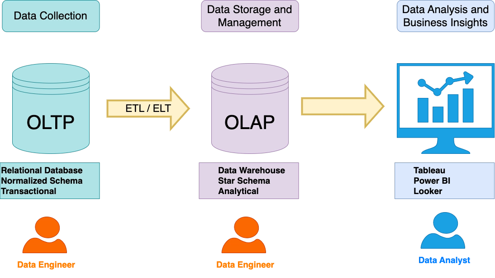
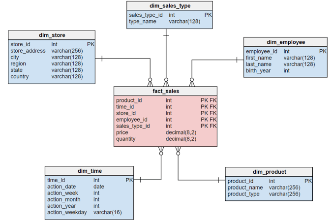
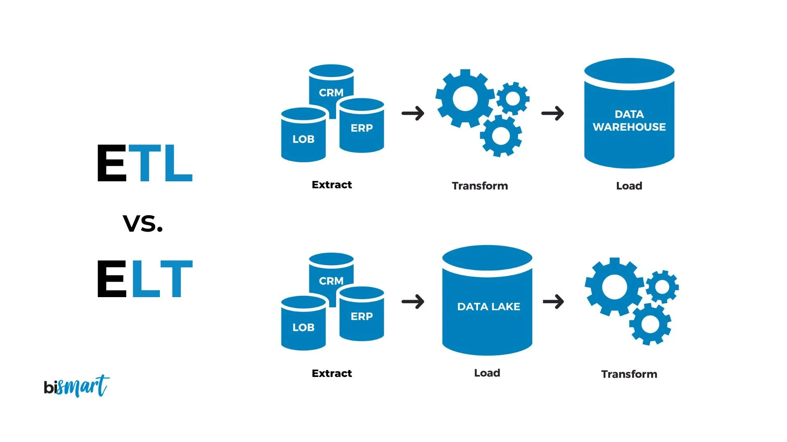

# Introduction à l'entrepôt de données

::: {.callout-tip title="Objectifs du chapitre"}
À la fin de ce chapitre, l'étudiant sera capable de :

- **Expliquer** pourquoi une organisation sépare souvent les systèmes opérationnels des données destinées à l'analyse ;
- **Distinguer** une base transactionnelle, un entrepôt de données, un lac de données et un datamart ;
- **Lire** un modèle en étoile composé d'une table de faits et de tables de dimensions, et le distinguer d'un modèle en flocon ;
- **Définir** le grain d'une table de faits et choisir des mesures adaptées (additives, semi-additives, non additives) ;
- **Décrire** les grandes étapes d'un flux ETL/ELT, de la source au tableau de bord ;
- **Situer** les grands principes de gouvernance des données et les tendances actuelles des architectures analytiques (cloud, lakehouse).
:::

Un tableau de bord fiable ne commence pas par un graphique. Il commence par des données organisées, documentées et mises à jour de façon régulière. L'**entrepôt de données** (*data warehouse*) fournit cette base pour l'analyse — c'est la fondation sur laquelle reposeront les rapports Power BI et les applications Taipy présentés au chapitre suivant.

## 1. Pourquoi un entrepôt de données ?

### 1.1. Les systèmes opérationnels

Une application de vente, une caisse ou un site web utilise une base **opérationnelle** (on parle aussi de système **OLTP**, *Online Transaction Processing*) pour enregistrer les événements du quotidien : créer une commande, modifier une adresse, enregistrer un paiement. Ces systèmes doivent répondre vite à de petites opérations, éviter les incohérences, et supportent souvent un grand nombre d'utilisateurs simultanés qui écrivent en permanence.

Une base opérationnelle est souvent organisée pour limiter la répétition des informations — une démarche appelée **normalisation**. Une commande peut être répartie entre `clients`, `commandes` et `lignes_commande`, reliées par des identifiants, plutôt que de répéter le nom et l'adresse du client sur chaque ligne de commande.

Cette organisation est adaptée à l'écriture rapide et fiable, mais une question analytique comme « Quel est le chiffre d'affaires mensuel par région et par catégorie depuis trois ans ? » peut nécessiter de nombreuses jointures entre plusieurs tables, sur plusieurs sources différentes. Exécuter ce type de requête directement sur la base de production peut ralentir l'application pour tous ses utilisateurs — un risque qu'aucune organisation ne peut se permettre sur son système de vente en direct.

### 1.2. La base analytique

Un **entrepôt de données** est un espace centralisé, organisé pour analyser l'historique de l'organisation. Il rassemble des données provenant de plusieurs sources, conserve leur contexte dans le temps et les transforme dans un format plus simple à interroger — quitte à répéter volontairement certaines informations (**dénormalisation**) pour accélérer la lecture.

| Système | Sigle | But principal | Exemple de question | Fréquence d'écriture |
|:---|:---|:---|:---|:---|
| Base opérationnelle | **OLTP** | Enregistrer les événements courants | « Quel est le statut de la commande 1524 ? » | Continue, en temps réel |
| Entrepôt analytique | **OLAP** | Comparer, agréger et suivre l'historique | « Comment les ventes ont-elles évolué par région ? » | Périodique (souvent quotidienne ou horaire) |

: OLTP et OLAP, deux logiques complémentaires {#tbl-oltp-olap}

{#fig-oltp-olap}

Les deux systèmes sont complémentaires, jamais concurrents. L'entrepôt n'a pas pour objectif de remplacer l'application métier : il en est le prolongement analytique, alimenté à intervalles réguliers plutôt qu'en continu.

### 1.3. Entrepôt, lac et datamart

Trois notions sont souvent confondues, alors qu'elles répondent à des besoins différents :

- Un **data warehouse** (entrepôt de données) contient des données **structurées**, préparées et gouvernées pour l'analyse. Les tables suivent un schéma défini à l'avance (*schema-on-write*) : on sait, avant même d'écrire une ligne, à quoi ressemblera la table.
- Un **data lake** (lac de données) peut stocker des données brutes de formats variés (fichiers CSV, JSON, images, journaux d'événements) avant leur usage, sans schéma imposé à l'écriture (*schema-on-read* : le schéma n'est défini qu'au moment de la lecture). Il offre une grande flexibilité, mais demande des règles claires — un catalogue de données, des conventions de nommage — pour ne pas devenir un « marécage de données » (*data swamp*) où plus personne ne sait ce que contient chaque fichier.
- Un **datamart** est une partie de l'entrepôt orientée vers un besoin ou un service précis, par exemple un datamart des ventes ou un datamart des ressources humaines. Il est généralement plus petit, plus rapide à interroger et plus simple à comprendre pour l'équipe qui l'utilise au quotidien.

| Composant | Type de données | Schéma | Utilisateur typique |
|:---|:---|:---|:---|
| Data lake | Brutes, tous formats | *Schema-on-read* | Data engineer, data scientist |
| Data warehouse | Structurées, nettoyées | *Schema-on-write* | Data analyst, BI developer |
| Datamart | Structurées, ciblées sur un domaine | *Schema-on-write* | Équipe métier (ventes, RH, finance) |

: Trois niveaux de granularité pour organiser les données de l'entreprise {#tbl-lake-warehouse-datamart}

::: {.callout-warning title="Un entrepôt ne corrige pas une mauvaise question"}
Centraliser beaucoup de données ne suffit pas. Il faut définir le vocabulaire métier, les unités, la fréquence de mise à jour et les indicateurs attendus. Sinon, on obtient plusieurs chiffres différents pour un même « chiffre d'affaires » — un problème de gouvernance, pas un problème technique, que nous retrouverons en section 5.
:::

## 2. Le modèle en étoile

Le modèle en étoile (*star schema*) est une organisation pédagogique et professionnelle très fréquente pour les données analytiques. Il place une **table de faits** au centre et des **tables de dimensions** autour, reliées directement à la table de faits.

### 2.1. La table de faits

Une table de faits contient les événements mesurables : ventes, livraisons, appels ou visites. Elle comprend généralement :

- des **clés étrangères** vers les dimensions (`client_id`, `produit_id`, `date_id`, `magasin_id`) ;
- des **mesures numériques** (`quantite`, `montant`, `remise`) ;
- une ligne par événement, selon un niveau de détail défini.

::: {.callout-tip}
## Le grain d'une table de faits

Le **grain** est la phrase qui précise ce que représente exactement une ligne de la table de faits. Par exemple : « une ligne représente un produit d'une commande, dans un magasin, à une date donnée ». Le grain doit être défini **avant** de choisir les mesures et les dimensions : toutes les mesures de la table doivent être cohérentes avec ce niveau de détail.
:::

Un grain mal défini — ou changé en cours de route — est l'une des erreurs les plus fréquentes et les plus coûteuses dans la conception d'un entrepôt : elle oblige souvent à reconstruire les mesures et les rapports qui en dépendent.

### 2.2. Les tables de dimensions

Une dimension décrit le **contexte** d'un fait — le qui, le quoi, le où et le quand :

- `dim_date` : jour, mois, trimestre, année, jour ouvré ou non ;
- `dim_produit` : produit, catégorie, sous-catégorie, marque ;
- `dim_client` : ville, région, segment, ancienneté ;
- `dim_magasin` : magasin, ville, zone commerciale.

Les dimensions contiennent les attributs utilisés pour filtrer, regrouper et expliquer les mesures. Elles sont souvent volontairement dénormalisées (une seule table plate plutôt que plusieurs tables reliées) pour rendre l'exploration plus simple pour un analyste ou un outil de BI.

{#fig-modele-etoile}

### 2.3. Exemple de modèle de ventes

```text
fact_ventes
-----------
date_id
produit_id
client_id
magasin_id
quantite
prix_unitaire
remise
montant_net

dim_produit
-----------
produit_id
libelle
categorie
marque

dim_date
--------
date_id
date_complete
mois
trimestre
annee
```

Le montant net peut être calculé par :

$$
\text{montant\_net}
=\text{quantité}\times\text{prix unitaire}-\text{remise}.
$$

Un modèle en étoile ne dicte pas un seul outil : il peut être utilisé dans une base SQL, un fichier analytique (Parquet, vu au chapitre 1) ou directement dans le modèle sémantique d'un outil comme Power BI, présenté au chapitre suivant.

::: {.callout-note title="Le rôle de la dimension Date"}
Même si la source contient déjà une date, une dimension Date facilite les regroupements par mois, trimestre, semaine ou jour ouvré, et permet de définir clairement les périodes comparées (par exemple « le même mois l'an dernier »). Elle est presque toujours présente dans un modèle en étoile, même minimal.
:::

### 2.4. Modèle en étoile ou en flocon ?

Lorsqu'une dimension est elle-même normalisée en plusieurs tables reliées entre elles (par exemple `dim_produit` reliée à une table séparée `dim_categorie`, elle-même reliée à `dim_departement`), on parle de **modèle en flocon** (*snowflake schema*) plutôt que de modèle en étoile.

| Critère | Modèle en étoile | Modèle en flocon |
|:---|:---|:---|
| Nombre de tables de dimensions | Plus petit, dimensions dénormalisées | Plus grand, dimensions normalisées |
| Simplicité pour l'analyste | Plus simple à comprendre et à interroger | Plus de jointures à connaître |
| Espace de stockage | Légèrement plus élevé (répétition de données) | Réduit (moins de répétition) |
| Usage recommandé | Par défaut pour la plupart des projets de BI | Dimensions très volumineuses ou très hiérarchisées |

: Modèle en étoile et modèle en flocon {#tbl-etoile-flocon}

::: {.callout-note title="Priorité pour débuter"}
Pour la grande majorité des projets, notamment ceux présentés dans ce cours, le modèle en étoile — plus simple à lire et à interroger — est le point de départ recommandé. Le modèle en flocon reste une option pour des dimensions très volumineuses (des millions de produits, par exemple).
:::

### 2.5. Un mot sur l'historisation des dimensions

Que se passe-t-il lorsqu'un client déménage, ou qu'un produit change de catégorie ? Ce problème classique, appelé **dimension à évolution lente** (*Slowly Changing Dimension*, ou SCD), admet plusieurs réponses :

- **Type 1** : on écrase l'ancienne valeur par la nouvelle — on perd l'historique, mais le modèle reste simple.
- **Type 2** : on ajoute une nouvelle ligne dans la dimension, avec des dates de validité — on conserve l'historique complet, au prix d'un modèle un peu plus complexe.

Ce sujet est approfondi dans des cours dédiés à la modélisation ; il est mentionné ici pour que le concept de dimension ne soit pas perçu comme figé dans le temps.

## 3. Les mesures et les indicateurs

Une **mesure additive** peut être additionnée sur toutes les dimensions, comme le nombre d'articles ou le montant des ventes. Une mesure **semi-additive**, comme un stock de fin de journée, peut être additionnée par produit mais pas dans le temps (additionner le stock du lundi et du mardi n'a pas de sens ; on préfère en général le dernier stock connu, ou une moyenne). Une mesure **non additive**, comme un taux ou une moyenne, doit être recalculée à partir de ses éléments plutôt que sommée directement.

| Type de mesure | Peut-on l'additionner… | … dans le temps ? | … entre produits ? | Exemple |
|:---|:---|:---|:---|:---|
| **Additive** | Oui | Oui | Oui | Montant des ventes, quantité vendue |
| **Semi-additive** | Parfois | Non | Oui | Stock de fin de journée |
| **Non additive** | Non | Non | Non | Taux de conversion, marge en % |

: Trois familles de mesures {#tbl-types-mesures}

::: {.callout-warning title="Exemple : ne jamais faire la moyenne d'une moyenne"}
Si une région a 10 commandes et une autre 2 commandes, la moyenne globale ne doit pas être calculée comme la moyenne des deux moyennes régionales si les effectifs sont différents. Il faut utiliser :

$$
\text{moyenne globale} =
\frac{\text{total des montants}}{\text{nombre total de commandes}}.
$$

Cette règle, déjà rencontrée au chapitre 2, redevient centrale dans un entrepôt de données : c'est précisément ce type d'erreur que les mesures DAX de Power BI, vues au chapitre suivant, permettent d'éviter — à condition d'être écrites correctement.
:::

Les noms des indicateurs doivent préciser leur définition. « Ventes » peut signifier chiffre d'affaires brut, chiffre d'affaires net, commandes payées ou unités vendues. Dans un **dictionnaire métier** (ou *data dictionary*), on documente pour chaque indicateur sa formule, son unité, sa période de référence et ses filtres :

| Indicateur | Formule | Unité | Période | Filtre appliqué |
|:---|:---|:---|:---|:---|
| Chiffre d'affaires net | $\sum \text{montant\_net}$ | MAD | Mensuel | Statut = « Payée » |
| Panier moyen | CA net / commandes distinctes | MAD | Mensuel | Statut = « Payée » |
| Taux de livraison à temps | Livraisons à temps / livraisons terminées | % | Hebdomadaire | Toutes livraisons closes |

: Extrait d'un dictionnaire métier {#tbl-dictionnaire-metier}

## 4. Le flux ETL/ELT

Les données passent généralement par un flux en plusieurs étapes avant d'atteindre l'entrepôt :

1. **Extract (extraire)** : lire les sources opérationnelles, fichiers ou API — les mêmes sources de collecte que celles vues au chapitre 1 ;
2. **Transform (transformer)** : convertir les dates, harmoniser les unités, dédupliquer, contrôler les valeurs et calculer les champs dérivés — les techniques de nettoyage et de transformation du chapitre 1 ;
3. **Load (charger)** : déposer les données préparées dans les tables de l'entrepôt.

{#fig-flux-etl}

Dans une approche **ELT** (*Extract, Load, Transform*), on inverse les deux dernières étapes : on charge d'abord les données brutes dans une plateforme suffisamment puissante pour les traiter (un entrepôt cloud, par exemple), puis on réalise les transformations à l'intérieur même de cette plateforme, en SQL. Les deux approches poursuivent le même but — rendre les données fiables et exploitables — mais diffèrent par l'endroit où s'exécute la transformation.

| Approche | Où la transformation a-t-elle lieu ? | Avantage principal |
|:---|:---|:---|
| **ETL** | Sur un serveur de traitement dédié, avant le chargement | Contrôle fin, adapté aux volumes modérés |
| **ELT** | Dans l'entrepôt cible lui-même, après le chargement | Exploite la puissance de calcul du cloud, adapté aux gros volumes |

: ETL et ELT {#tbl-etl-elt}

### 4.1. Illustrer un contrôle de qualité au chargement

Même sans plateforme d'orchestration, un petit script Python illustre la logique d'un contrôle de qualité effectué à l'étape de transformation, dans l'esprit de `Great Expectations` déjà mentionné au chapitre 1 :

```python
import pandas as pd

brut = pd.read_csv("ventes_source.csv")
lignes_avant = len(brut)

# Règles de qualité simples
brut = brut.dropna(subset=["date_vente", "montant"])
brut = brut[brut["montant"] >= 0]
brut = brut.drop_duplicates(subset=["commande_id", "produit_id"])

lignes_apres = len(brut)
rejets = lignes_avant - lignes_apres

print(f"Lignes lues : {lignes_avant}")
print(f"Lignes conservées : {lignes_apres}")
print(f"Lignes rejetées : {rejets}")
```

Un chargement quotidien doit pouvoir répondre à quatre questions simples : quelles sources ont été lues ? combien de lignes ont été reçues ? combien ont été rejetées ? quand le chargement s'est-il terminé ?

::: {.callout-important title="Zoom sur les tendances : l'orchestration automatisée"}
Sur un projet réel, ce type de flux ne s'exécute pas manuellement chaque jour : un **orchestrateur** planifie et surveille son exécution. Les outils les plus utilisés actuellement sont **Apache Airflow**, **Dagster** et **Prefect**, qui permettent de définir un flux comme une succession d'étapes (un *graphe orienté acyclique*, ou DAG), de relancer automatiquement une étape échouée, et d'alerter une équipe en cas d'anomalie. Ce sujet est approfondi dans les modules d'ingénierie des données ; il est mentionné ici car il complète directement le rôle du Data Analyst.
:::

::: {.callout-important title="Qualité et traçabilité"}
Conservez les données sources ou un journal de chargement, le nombre de lignes avant et après transformation, les erreurs détectées et la date de mise à jour. Ces informations permettent de comprendre pourquoi un indicateur a changé d'un jour à l'autre — une question que tout analyste finit par recevoir.
:::

## 5. Gouvernance et sécurité, sans complexité inutile

La **gouvernance des données** désigne les règles qui rendent les données compréhensibles, accessibles aux bonnes personnes et utilisées de manière responsable. Pour commencer, un projet peut mettre en place :

- un **dictionnaire des tables et des indicateurs**, comme celui de la @tbl-dictionnaire-metier ;
- un **responsable** (*data owner*) pour chaque donnée importante ;
- des **règles de qualité** (unicité d'un identifiant, prix positif, date obligatoire), dans l'esprit du script de la section 4.1 ;
- des **droits d'accès** adaptés, notamment pour les données personnelles, en cohérence avec le cadre réglementaire déjà évoqué au chapitre 1 (RGPD, loi marocaine 09-08) ;
- une **fréquence de mise à jour** annoncée et respectée.

Un tableau de bord ne devrait pas exposer inutilement des noms, numéros de téléphone ou adresses. On peut agréger les résultats, masquer les colonnes sensibles et limiter les accès selon le rôle de l'utilisateur — un mécanisme appelé **sécurité au niveau des lignes** (*Row-Level Security*, RLS), que nous retrouverons concrètement dans Power BI au chapitre suivant.

### 5.1. Vers le cloud et le lakehouse

::: {.callout-important title="Zoom sur les tendances : les entrepôts analytiques dans le cloud"}
Les entrepôts de données historiques étaient hébergés sur des serveurs internes à l'organisation. Aujourd'hui, la majorité des nouveaux projets s'appuient sur des plateformes analytiques **cloud**, qui séparent le stockage et le calcul et permettent de payer à l'usage : **Snowflake**, **Google BigQuery**, **Amazon Redshift** ou **Microsoft Fabric** (qui intègre directement Power BI). Une tendance plus récente, le **lakehouse** (popularisé notamment par Databricks), cherche à combiner la flexibilité d'un data lake avec les garanties de qualité et de structure d'un data warehouse, en s'appuyant sur des formats de table ouverts (comme Delta Lake ou Apache Iceberg). Ces plateformes ne changent pas les principes présentés dans ce chapitre — grain, dimensions, mesures, gouvernance — mais modifient l'endroit et la façon dont ils sont mis en œuvre.
:::

::: {.content-visible when-profile="teacher"}
::: {.callout-note title="Auto-évaluation" collapse="true"}
Avant de passer au chapitre suivant, assurez-vous de pouvoir répondre « oui » aux questions suivantes :

- [ ] Je sais expliquer la différence entre OLTP et OLAP.
- [ ] Je peux définir le grain d'une table de faits.
- [ ] Je peux reconnaître une dimension et une mesure dans un exemple.
- [ ] Je sais distinguer un modèle en étoile d'un modèle en flocon.
- [ ] Je sais distinguer ETL et ELT.
- [ ] Je comprends pourquoi les indicateurs doivent être documentés dans un dictionnaire métier.
:::
:::

## Exercices

::: {.callout-note title="Consigne"}
Les exercices vérifient la compréhension et peuvent être résolus sans ordinateur. Les calculs sont volontairement courts.
:::

::: {#exr-dwh-1}
### OLTP ou OLAP ?

Indiquez si la question relève plutôt d'un système opérationnel ou analytique :

a. Modifier l'adresse d'un client.
b. Comparer les ventes des quatre derniers trimestres par région.
c. Vérifier si une commande est payée.
d. Calculer la médiane des délais de livraison de l'année.
:::

::: {.content-visible when-profile="teacher"}
::: {.callout-tip collapse="true" title="Solution de l'exercice @exr-dwh-1"}
a. **OLTP** ; b. **OLAP** ; c. **OLTP** ; d. **OLAP**.
:::
:::

::: {#exr-dwh-2}
### Identifier le grain

Une table `fact_ventes` contient une ligne par produit présent dans une commande. Formulez le grain avec une phrase et expliquez pourquoi une commande de trois produits peut produire trois lignes.
:::

::: {.content-visible when-profile="teacher"}
::: {.callout-tip collapse="true" title="Solution de l'exercice @exr-dwh-2"}
Le grain est : **une ligne représente un produit d'une commande**. Une commande contenant trois produits possède donc trois lignes de détail, même si elle n'a qu'un seul numéro de commande.
:::
:::

::: {#exr-dwh-3}
### Faits ou dimensions

Classez les éléments suivants : `montant_net`, `categorie`, `annee`, `quantite`, `ville_client`, `prix_unitaire`.
:::

::: {.content-visible when-profile="teacher"}
::: {.callout-tip collapse="true" title="Solution de l'exercice @exr-dwh-3"}
Faits ou mesures : `montant_net`, `quantite`, `prix_unitaire`. Dimensions ou attributs de dimensions : `categorie`, `annee`, `ville_client`.
:::
:::

::: {#exr-dwh-4}
### Calculer une mesure

Une ligne indique 3 articles à 120 MAD chacun et une remise de 40 MAD. Calculez le montant net. Une deuxième ligne indique 2 articles à 80 MAD sans remise. Quel est le montant total des deux lignes ?
:::

::: {.content-visible when-profile="teacher"}
::: {.callout-tip collapse="true" title="Solution de l'exercice @exr-dwh-4"}
Première ligne : $3\times120-40=\textbf{320}$ MAD. Deuxième ligne : $2\times80=\textbf{160}$ MAD. Total : $320+160=\textbf{480}$ MAD.
:::
:::

::: {#exr-dwh-5}
### Mesure additive ou non ?

Indiquez si l'on peut additionner directement la mesure sur les périodes suivantes :

a. Le montant de ventes.
b. Le stock disponible à la fin de chaque jour.
c. Un taux de conversion en pourcentage.
:::

::: {.content-visible when-profile="teacher"}
::: {.callout-tip collapse="true" title="Solution de l'exercice @exr-dwh-5"}
a. Le montant de ventes est **additif**.
b. Le stock de fin de journée est **semi-additif** : on peut comparer ou prendre le dernier stock, mais le sommer sur les jours n'a généralement pas de sens.
c. Un taux est **non additif** : il faut recalculer le taux à partir des numérateurs et dénominateurs.
:::
:::

::: {#exr-dwh-6}
### Comprendre ETL

Remettez dans l'ordre : charger les données préparées, extraire un fichier CSV, convertir les dates et contrôler les prix négatifs.
:::

::: {.content-visible when-profile="teacher"}
::: {.callout-tip collapse="true" title="Solution de l'exercice @exr-dwh-6"}
1. Extraire le fichier CSV.
2. Convertir les dates et contrôler les prix négatifs.
3. Charger les données préparées.
:::
:::

::: {#exr-dwh-7}
### Moyenne globale

La région A compte 10 commandes de 100 MAD en moyenne. La région B compte 2 commandes de 300 MAD en moyenne.

a. Quel est le total estimé de chaque région ?
b. Calculez la moyenne globale.
c. Pourquoi la moyenne des deux moyennes, 200 MAD, est-elle incorrecte ?
:::

::: {.content-visible when-profile="teacher"}
::: {.callout-tip collapse="true" title="Solution de l'exercice @exr-dwh-7"}
a. A : $10\times100=\textbf{1\,000}$ MAD ; B : $2\times300=\textbf{600}$ MAD.
b. Moyenne globale : $(1000+600)/(10+2)=1600/12=\textbf{133,33}$ MAD environ.
c. Les régions n'ont pas le même nombre de commandes ; la moyenne de 200 MAD donne le même poids aux deux groupes.
:::
:::

::: {#exr-dwh-8}
### Qualité et sécurité

Proposez une règle de qualité et une mesure de protection pour chacune des situations :

a. La colonne `prix` contient parfois des valeurs négatives.
b. Un tableau de bord doit être partagé avec des responsables régionaux.
:::

::: {.content-visible when-profile="teacher"}
::: {.callout-tip collapse="true" title="Solution de l'exercice @exr-dwh-8"}
a. Règle : `prix >= 0`, avec rejet ou examen des exceptions.
b. Protection : filtrer les données selon la région de l'utilisateur et ne partager que les colonnes nécessaires ; les noms ou coordonnées personnelles peuvent être masqués.
:::
:::

::: {#exr-dwh-9}
### Étoile ou flocon ?

Une équipe hésite entre deux organisations pour la dimension `dim_produit` : une seule table dénormalisée, ou trois tables reliées (`dim_produit`, `dim_categorie`, `dim_departement`).

a. Quel modèle correspond à chaque option (@tbl-etoile-flocon) ?
b. Dans quel cas le modèle en flocon devient-il particulièrement pertinent ?
:::

::: {.content-visible when-profile="teacher"}
::: {.callout-tip collapse="true" title="Solution de l'exercice @exr-dwh-9"}
a. Une seule table dénormalisée correspond au **modèle en étoile** ; les trois tables reliées correspondent au **modèle en flocon**.
b. Le modèle en flocon devient pertinent lorsque la dimension est très volumineuse ou très hiérarchisée, car il évite de répéter de nombreuses fois les mêmes informations de catégorie ou de département.
:::
:::

::: {#exr-dwh-10}
### ETL ou ELT ?

Une organisation dispose d'une plateforme cloud très puissante pour exécuter des requêtes SQL sur de gros volumes, et souhaite limiter le nombre de serveurs de traitement intermédiaires à maintenir.

a. Quelle approche (ETL ou ELT, @tbl-etl-elt) est la plus cohérente avec ce contexte ?
b. Quel principe reste identique, quelle que soit l'approche choisie ?
:::

::: {.content-visible when-profile="teacher"}
::: {.callout-tip collapse="true" title="Solution de l'exercice @exr-dwh-10"}
a. L'**ELT** : les données sont chargées brutes puis transformées directement dans la plateforme cloud, qui dispose de la puissance de calcul nécessaire.
b. Le but reste identique : rendre les données fiables et exploitables, avec une transformation contrôlée et traçable.
:::
:::
