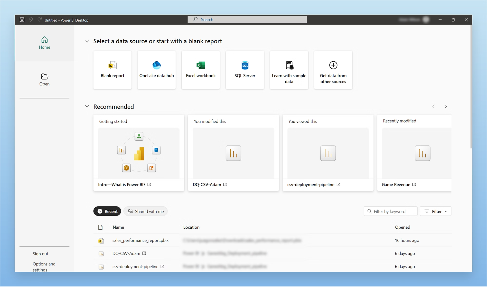
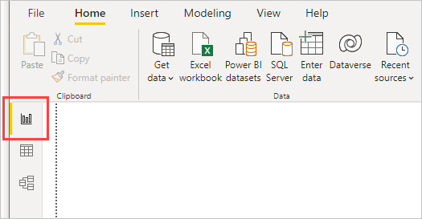
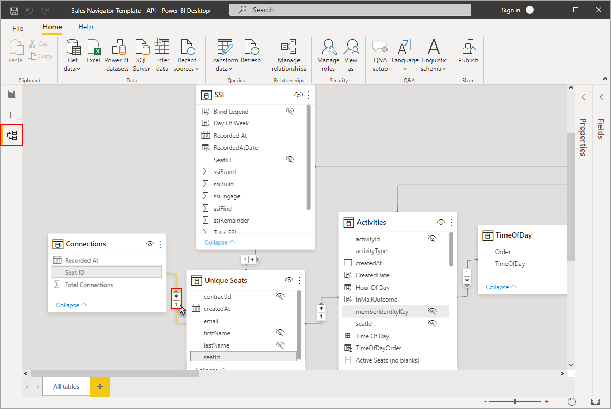
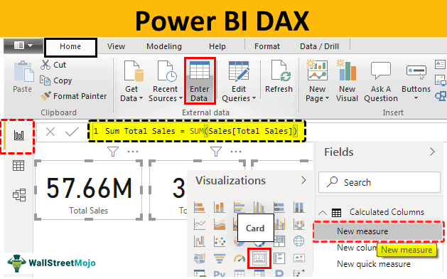
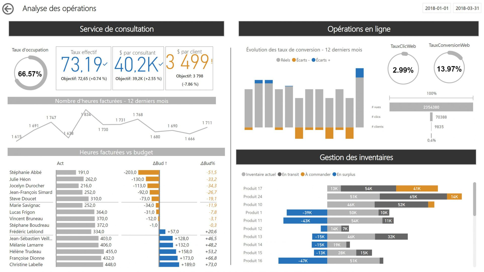

# Business Intelligence avec Power BI et Taipy

::: {.callout-tip title="Objectifs du chapitre"}
À la fin de ce chapitre, l'étudiant sera capable de :

- **Définir** la Business Intelligence et distinguer un indicateur, un rapport et un tableau de bord ;
- **Construire** mentalement le parcours d'une donnée depuis la source jusqu'à une décision ;
- **Importer et préparer** des données dans Power BI avec Power Query ;
- **Comprendre** un modèle en étoile dans Power BI et créer des mesures en DAX, y compris des comparaisons dans le temps ;
- **Choisir** entre Power BI et une application Python avec Taipy selon le besoin ;
- **Construire** une application Taipy fonctionnelle intégrant une visualisation Python soignée ;
- **Expliquer** les principes d'un tableau de bord lisible : objectif, public, filtres, contexte et action.
:::

La **Business Intelligence (BI)** transforme des données préparées — celles de l'entrepôt du chapitre précédent — en informations régulièrement consultées pour piloter une activité. Elle ne consiste pas à accumuler des graphiques : un bon tableau de bord aide une personne précise à répondre à des questions précises et à décider.

## 1. Comprendre la BI

### 1.1. Du besoin à l'indicateur

Un **indicateur** est une mesure définie par une formule, une période et une population. Un **KPI** (*Key Performance Indicator*) est un indicateur considéré comme essentiel pour suivre un objectif.

Exemple pour un site de livraison :

| Élément | Exemple |
|:---|:---|
| Objectif | Livrer les commandes à temps |
| KPI | Taux de livraison à temps |
| Formule | livraisons à temps / livraisons terminées |
| Période | semaine ou mois |
| Cible | au moins 95 % |
| Action possible | examiner les villes sous la cible |

: De l'objectif métier au KPI {#tbl-objectif-kpi}

Un **rapport** peut contenir plusieurs pages et des analyses détaillées, destinées à être explorées. Un **tableau de bord** est généralement plus synthétique : il met en évidence les quelques indicateurs et alertes nécessaires au suivi régulier d'une activité, souvent en une seule page consultée chaque jour ou chaque semaine.

| Livrable | Fréquence de consultation | Profondeur | Exemple |
|:---|:---|:---|:---|
| **Tableau de bord** | Quotidienne ou hebdomadaire | Quelques KPI clés | Suivi des ventes du jour |
| **Rapport** | Ponctuelle ou mensuelle | Plusieurs pages, détail | Bilan trimestriel des ventes |
| **Analyse ad hoc** | Une seule fois | Ciblée sur une question précise | Pourquoi les ventes ont-elles chuté en mars ? |

: Trois livrables BI, trois usages différents {#tbl-livrables-bi}

### 1.2. Le parcours d'une solution BI

```text
Sources → préparation → modèle sémantique → mesures → visuels
                                      ↓
                             rapport / tableau de bord
                                      ↓
                              décision et action
```

Ce parcours reprend directement les briques des deux chapitres précédents : les **sources** (chapitre 1), le **modèle sémantique** qui s'appuie sur le modèle en étoile (chapitre 4), et les **visuels** qui suivent les principes de choix de graphique du chapitre 3.

Le modèle **sémantique** donne un sens commun aux tables, aux relations et aux mesures. Deux personnes doivent obtenir le même chiffre lorsqu'elles utilisent le même KPI — c'est tout l'enjeu du dictionnaire métier présenté au chapitre précédent.

### 1.3. Règles d'un tableau de bord débutant

Un tableau de bord lisible :

1. commence par le public et la décision attendue ;
2. affiche une période et une unité ;
3. présente quelques KPI importants avant les détails ;
4. utilise une couleur pour signaler une information, pas pour décorer chaque objet — voir les principes d'accessibilité du chapitre 3 ;
5. permet d'explorer sans cacher la définition des indicateurs ;
6. indique la date de dernière actualisation.

## 2. Power BI : une démarche structurée

Power BI est une plateforme de Business Intelligence qui permet de connecter des sources, de les transformer, de créer un modèle de données, de calculer des mesures et de construire des rapports interactifs. Le parcours présenté ici commence dans **Power BI Desktop** (application gratuite pour Windows) ; le partage dépend ensuite de l'environnement et des droits de l'organisation, via le **Power BI Service**.

### 2.1. Étape 1 — Importer les sources

Le bouton **Obtenir les données** (*Get Data*) de Power BI Desktop donne accès à une longue liste de connecteurs : fichiers (CSV, Excel, Parquet, JSON), bases de données (SQL Server, PostgreSQL, MySQL), services cloud, API web, et bien d'autres — les mêmes familles de sources que celles présentées au chapitre 1.

{#fig-powerbi-connecteurs}

À l'import, il faut vérifier :

- les noms de colonnes et leurs types ;
- le séparateur et l'encodage d'un CSV ;
- le type date, nombre ou texte ;
- le nombre de lignes et la période couverte ;
- la présence de doublons et de valeurs manquantes.

Importer n'est pas encore analyser : il faut comprendre ce qui a été chargé, exactement comme lors de la première lecture d'un jeu de données présentée au chapitre 1.

::: {.callout-important title="Zoom sur les tendances : mode Import ou DirectQuery ?"}
Power BI propose deux modes de connexion. En mode **Import** (le plus courant, et celui utilisé dans ce chapitre), les données sont copiées et stockées dans le fichier Power BI, ce qui offre les meilleures performances mais nécessite une actualisation régulière. En mode **DirectQuery**, Power BI interroge la source à chaque affichage, sans copier les données : les résultats sont toujours à jour, au prix de performances qui dépendent directement de la source interrogée. Un mode hybride, appelé **composite**, permet de mélanger les deux selon les tables.
:::

### 2.2. Étape 2 — Transformer avec Power Query

**Power Query** sert à préparer les données avant leur utilisation dans le modèle — c'est l'équivalent visuel des étapes de nettoyage et de transformation vues au chapitre 1 (valeurs manquantes, doublons, encodage, types). On peut supprimer des colonnes inutiles, renommer un champ, convertir un type, filtrer des lignes, remplacer une valeur, fusionner des tables ou ajouter une colonne calculée.

{#fig-powerbi-power-query}

Une transformation doit rester explicable et reproductible. Power Query conserve les étapes appliquées dans un panneau dédié (« Étapes appliquées ») ; il vaut mieux créer plusieurs étapes nommées et simples qu'une modification manuelle impossible à refaire. En coulisses, chaque étape est écrite dans le langage **M**, que l'on peut lire et modifier directement pour les transformations les plus avancées.

Exemples de contrôles à effectuer avant de quitter Power Query :

- `Montant` est numérique et positif ;
- `DateCommande` est bien de type date ;
- `ProduitID` et `DateID` sont présents ;
- la catégorie vide est traitée explicitement ;
- le nombre de lignes final est comparé au nombre attendu.

::: {.callout-tip title="Bonne pratique"}
Nommez vos étapes Power Query de façon explicite (« Filtrer lignes annulées » plutôt que « Étape 7 »). Un collègue — ou vous-même dans six mois — doit pouvoir comprendre le raisonnement sans exécuter le fichier.
:::

### 2.3. Étape 3 — Construire le modèle

Pour un modèle de ventes, on privilégie un schéma en étoile — exactement celui présenté au chapitre 4 :

```text
dim_Date       dim_Produit       dim_Client
      \             |             /
             fact_Ventes
                   |
              dim_Magasin
```

{#fig-powerbi-modele}

La table de faits contient les lignes de vente et les dimensions permettent de filtrer par date, produit, client ou magasin. Les relations doivent être vérifiées : une dimension possède généralement une ligne par identifiant (**cardinalité un**), et plusieurs lignes de faits peuvent lui être liées (**cardinalité plusieurs**) — on parle de relation **« un-à-plusieurs »** (1:*). Le sens du filtre (*cross-filter direction*) détermine si un filtre appliqué sur la dimension se répercute sur la table de faits (le cas normal), ou aussi dans l'autre sens.

::: {.callout-warning title="Le piège des relations ambiguës"}
Si une dimension contient plusieurs lignes pour le même identifiant, ou si deux tables sont reliées de manière inattendue, les totaux peuvent être multipliés. Vérifiez toujours le grain, les clés et un total connu avant de publier un rapport — la même précaution que pour l'exercice de vérification du chapitre 4.
:::

### 2.4. Étape 4 — Créer des mesures en DAX

**DAX** (*Data Analysis Expressions*) est le langage de formules utilisé dans les modèles Power BI. Une **mesure** est recalculée dynamiquement selon le **contexte de filtre** du visuel, de la page ou de l'utilisateur — c'est ce qui la distingue fondamentalement d'une **colonne calculée**, qui est évaluée une seule fois, ligne par ligne, au chargement des données.

```DAX
ChiffreAffaires = SUM(fact_Ventes[MontantNet])

NombreCommandes = DISTINCTCOUNT(fact_Ventes[CommandeID])

PanierMoyen = DIVIDE([ChiffreAffaires], [NombreCommandes])
```

`DIVIDE` évite une erreur lorsque le dénominateur est nul — une bonne pratique systématique, préférable à l'opérateur `/` brut.

{#fig-powerbi-dax}

::: {.callout-tip title="Mesure ou colonne calculée ?"}
| | Mesure | Colonne calculée |
|:---|:---|:---|
| Quand est-elle calculée ? | À chaque interaction, selon le contexte de filtre | Une seule fois, au chargement des données |
| Où apparaît-elle ? | Dans les visuels (cartes, graphiques) | Comme une colonne normale de la table |
| Exemple | `ChiffreAffaires = SUM(...)` | `MargeUnitaire = fact_Ventes[Prix] - fact_Ventes[Cout]` |

: Différence entre mesure et colonne calculée {#tbl-mesure-colonne}
:::

#### Aller plus loin : `CALCULATE` et l'intelligence temporelle

La fonction `CALCULATE` modifie le contexte de filtre d'une mesure, ce qui permet des comparaisons dans le temps très fréquentes dans un tableau de bord :

```DAX
VentesAnneeDerniere =
CALCULATE(
    [ChiffreAffaires],
    SAMEPERIODLASTYEAR(dim_Date[DateComplete])
)

EvolutionAnnuelle =
DIVIDE([ChiffreAffaires] - [VentesAnneeDerniere], [VentesAnneeDerniere])
```

Ce type de comparaison — utile pour répondre à « comment se comportent nos ventes par rapport à l'an dernier ? » — nécessite une **dimension Date complète et marquée comme table de dates** dans le modèle, condition indispensable au bon fonctionnement des fonctions d'intelligence temporelle.

| Fonction DAX | Rôle |
|:---|:---|
| `SUM`, `AVERAGE`, `COUNT` | Agrégations de base |
| `DISTINCTCOUNT` | Compte les valeurs distinctes (ex. commandes uniques) |
| `DIVIDE` | Division sécurisée (gère le zéro) |
| `CALCULATE` | Modifie le contexte de filtre d'une mesure |
| `SAMEPERIODLASTYEAR`, `DATEADD` | Comparaisons dans le temps |
| `FILTER` | Filtre une table selon une condition |

: Quelques fonctions DAX fréquemment utilisées {#tbl-fonctions-dax}

Pour débuter, il faut surtout retenir la distinction entre mesure et colonne calculée, et le rôle protecteur de `DIVIDE`. Dans un premier tableau de bord, trois ou quatre mesures bien définies valent mieux que de nombreuses formules difficiles à expliquer.

### 2.5. Étape 5 — Construire les visuels

Pour une page de suivi des ventes, une composition simple peut suivre les principes du chapitre 3 :

- une ligne de **cartes KPI** : chiffre d'affaires, commandes, panier moyen, taux de livraison à temps ;
- une **courbe** du chiffre d'affaires par mois (évolution, chapitre 3 §4.5) ;
- un **graphique en barres** par région ou catégorie (comparaison, §4.2) ;
- un **tableau ou une matrice** détaillé et filtrable ;
- des **segments** (*slicers*) pour l'année, la région et la catégorie.

{#fig-powerbi-rapport}

Chaque visuel doit répondre à une question. Un graphique avec trop de séries ou trop de couleurs devient difficile à lire — le même principe de sobriété que celui du *data storytelling* présenté au chapitre 3.

::: {.callout-important title="Zoom sur les tendances : l'IA dans Power BI"}
Les versions récentes de Power BI intègrent des fonctionnalités d'intelligence artificielle : le module **Q&A** permet d'interroger les données en langage naturel (« quel est le chiffre d'affaires de mars à Casablanca ? »), les **visuels de décomposition** (*decomposition tree*) explorent automatiquement quelles catégories expliquent le plus une variation, et **Copilot pour Power BI** peut générer une première ébauche de rapport ou résumer les tendances observées. Ces outils accélèrent l'exploration, mais ne dispensent jamais de vérifier la définition exacte des mesures affichées.
:::

### 2.6. Étape 6 — Vérifier et partager

Avant tout partage, vérifiez les totaux sur un petit exemple connu, la date d'actualisation, les filtres, les titres et les droits d'accès.

Le partage s'effectue en publiant le rapport dans un **espace de travail** (*workspace*) du **Power BI Service**, où il peut être organisé en **application**, actualisé automatiquement selon une planification, et consulté depuis un navigateur ou l'application mobile. Pour restreindre l'accès aux données selon le profil de l'utilisateur (par exemple, un directeur régional ne voit que sa région), Power BI propose la **sécurité au niveau des lignes** (*Row-Level Security*, RLS), déjà annoncée comme principe de gouvernance au chapitre 4.

Un rapport partagé avec des données personnelles doit respecter les règles de l'organisation et le principe du moindre accès.

## 3. Taipy : créer une application BI en Python

Taipy permet de construire des applications Python interactives avec des contrôles, des graphiques, des tableaux et des filtres. Il est particulièrement intéressant quand l'équipe veut intégrer l'analyse dans une application métier ou conserver une logique Python personnalisée, en s'appuyant sur les bibliothèques de visualisation déjà vues au chapitre 3.

### 3.1. Quand choisir Taipy ?

Taipy peut être pertinent lorsque :

- les traitements sont déjà écrits en Python ;
- l'application doit combiner un tableau de bord avec une logique métier ;
- l'on veut contrôler l'interface et le déploiement comme un projet logiciel ;
- l'utilisateur doit modifier un paramètre et observer immédiatement un résultat.

Power BI peut être plus adapté lorsqu'une organisation veut une solution de BI prête à l'emploi, un catalogue de rapports, des connexions gérées et des usages majoritairement orientés vers l'exploration métier.

Ce ne sont pas des outils absolument opposés. Une équipe peut préparer les données avec Python, les exposer dans Power BI, ou intégrer un indicateur Power BI dans un parcours applicatif selon son architecture.

### 3.2. Anatomie d'une application Taipy

Taipy s'organise autour de deux briques complémentaires :

| Brique | Rôle |
|:---|:---|
| **Taipy GUI** | Construit l'interface : pages, contrôles (sélecteurs, tableaux, graphiques), mise en page |
| **Taipy Core** | Orchestre les traitements : données, tâches, scénarios reproductibles — utile pour des pipelines plus complexes |

: Les deux briques de Taipy {#tbl-taipy-briques}

Pour un tableau de bord simple comme celui de ce chapitre, **Taipy GUI** suffit largement ; **Taipy Core** devient utile lorsque l'application doit orchestrer plusieurs traitements enchaînés (par exemple, un pipeline de préparation suivi d'un calcul de prévision).

### 3.3. Préparer les données et calculer les indicateurs

Contrairement au reste de ce chapitre, les cellules de code qui suivent sont **réellement exécutées** lors de la génération de ce livre : les données, les indicateurs et le graphique que vous voyez ci-dessous sont calculés en direct par Python, exactement comme le ferait l'application Taipy finale.

```{python}
import pandas as pd

ventes = pd.DataFrame({
    "mois": ["Janvier", "Janvier", "Janvier",
             "Février", "Février", "Février",
             "Mars", "Mars", "Mars"],
    "magasin": ["Casablanca", "Rabat", "Tanger"] * 3,
    "chiffre_affaires": [15200, 9800, 7100,
                          16100, 10450, 7600,
                          17800, 9950, 8200],
})

indicateurs = {
    "chiffre_affaires_total": ventes["chiffre_affaires"].sum(),
    "meilleur_mois": ventes.groupby("mois")["chiffre_affaires"].sum().idxmax(),
    "magasin_principal": ventes.groupby("magasin")["chiffre_affaires"].sum().idxmax(),
}

indicateurs
```

Cette table `ventes`, volontairement compacte, joue ici le rôle de la table de faits déjà préparée par l'entrepôt de données du chapitre 4. Dans une application réelle, elle proviendrait d'un fichier, d'une base de données ou d'une API, préparée avec les techniques du chapitre 1.

### 3.4. Construire une visualisation sophistiquée avec Python

L'application Taipy affichera le graphique produit ici, construit en appliquant directement les bonnes pratiques du chapitre 3 : deux graphiques complémentaires (évolution et comparaison), une palette accessible, des titres-messages et une source.

```{python}
import matplotlib.pyplot as plt
import seaborn as sns

sns.set_theme(style="whitegrid")
sns.set_palette("colorblind")

fig, axes = plt.subplots(1, 2, figsize=(11, 4.5))

# Panneau 1 : évolution du chiffre d'affaires total par mois
evolution = ventes.groupby("mois", sort=False)["chiffre_affaires"].sum()
axes[0].plot(evolution.index, evolution.values, marker="o", linewidth=2.5)
axes[0].set_title("Le chiffre d'affaires progresse chaque mois")
axes[0].set_ylabel("Chiffre d'affaires (MAD)")
axes[0].set_xlabel("")

# Panneau 2 : comparaison par magasin, triée
par_magasin = ventes.groupby("magasin")["chiffre_affaires"].sum().sort_values()
axes[1].barh(par_magasin.index, par_magasin.values)
axes[1].set_title("Casablanca reste le magasin le plus performant")
axes[1].set_xlabel("Chiffre d'affaires cumulé (MAD)")

fig.text(0.01, -0.02, "Source : extrait pédagogique — janvier à mars", fontsize=8, color="gray")
plt.tight_layout()
plt.show()
```

::: {.callout-note title="Pourquoi cette cellule s'exécute-t-elle alors que le reste de ce chapitre ne s'exécute pas ?"}
Les extraits Power BI et DAX de ce chapitre décrivent une interface graphique et un langage propres à Power BI, qu'un livre Quarto ne peut pas exécuter. À l'inverse, la préparation des données et la construction du graphique ci-dessus sont écrites en Python : elles s'exécutent réellement au moment de la génération du livre (`execute: freeze: auto` dans `_quarto.yml`), exactement comme elles s'exécuteraient à l'intérieur d'une application Taipy.
:::

### 3.5. Assembler l'application Taipy

Le code suivant montre comment ce même graphique et ces mêmes indicateurs seraient intégrés dans une page Taipy interactive, avec un sélecteur de magasin. **Ce bloc n'est pas exécuté dans le livre** : `Gui(page).run()` démarre un serveur web local qui reste actif en attendant les interactions de l'utilisateur, ce qui bloquerait indéfiniment la génération de ce livre. Pour le voir fonctionner, copiez ce code dans un fichier `app.py` et exécutez-le vous-même avec `uv run app.py`.

```python
import pandas as pd
import matplotlib.pyplot as plt
from taipy.gui import Gui

ventes = pd.DataFrame({
    "mois": ["Janvier", "Février", "Mars"] * 3,
    "magasin": ["Casablanca"] * 3 + ["Rabat"] * 3 + ["Tanger"] * 3,
    "chiffre_affaires": [15200, 16100, 17800, 9800, 10450, 9950, 7100, 7600, 8200],
})

magasin_selectionne = "Tous"
liste_magasins = "Tous;Casablanca;Rabat;Tanger"


def filtrer(magasin):
    if magasin == "Tous":
        return ventes
    return ventes[ventes["magasin"] == magasin]


def construire_figure(state):
    df_filtre = filtrer(state.magasin_selectionne)
    evolution = df_filtre.groupby("mois", sort=False)["chiffre_affaires"].sum()
    fig, ax = plt.subplots(figsize=(6, 4))
    ax.plot(evolution.index, evolution.values, marker="o", linewidth=2.5)
    ax.set_title(f"Chiffre d'affaires — {state.magasin_selectionne}")
    ax.set_ylabel("MAD")
    state.figure = fig


page = """
# Suivi des ventes — Atlas Marchés

Magasin : <|{magasin_selectionne}|selector|lov={liste_magasins}|on_change=construire_figure|>

<|{figure}|chart|>

<|{ventes}|table|>
"""

Gui(page=page).run()
```

Dans cet exemple, `ventes` contient les données affichées, `page` décrit l'interface en langage Taipy Markdown, et le sélecteur déclenche `construire_figure` à chaque changement de magasin. Dans un vrai projet, on ajoute des indicateurs calculés (chiffre d'affaires, panier moyen) affichés sous forme de cartes, en réutilisant directement les fonctions de préparation vues en section 3.3. Les noms exacts de certains contrôles peuvent évoluer selon la version de Taipy : il faut vérifier la documentation de la version utilisée.

### 3.6. Organiser une petite application

Même une application pédagogique gagne à séparer les responsabilités, à l'image de la séparation ETL vue au chapitre 4 :

```text
projet/
├── data/              # données sources ou exemple
├── preparation.py     # lecture et nettoyage (chapitre 1)
├── indicateurs.py     # calculs métier (chapitre 2 et 4)
├── visualisations.py  # graphiques matplotlib/seaborn (chapitre 3)
├── app.py             # interface Taipy
└── README.md          # installation et utilisation
```

Cette séparation permet de tester les indicateurs indépendamment de l'interface. L'application ne doit pas recalculer silencieusement un indicateur avec une définition différente de celle du rapport Power BI — le dictionnaire métier du chapitre 4 doit rester la référence commune aux deux outils.

## 4. Comparaison synthétique

| Critère | Power BI | Taipy |
|:---|:---|:---|
| Profil | Plateforme BI avec interface graphique | Bibliothèque/applications Python |
| Préparation | Power Query et connexions | Python, pandas ou autres outils |
| Mesures | DAX et modèle sémantique | Fonctions et code Python |
| Visualisation | Visuels intégrés (cartes, courbes, barres...) | `matplotlib`/`seaborn`/`Plotly`, comme au chapitre 3 |
| Usage principal | Rapports, exploration et partage BI | Application interactive intégrée à un projet |
| Licence et coût | Gratuit pour Desktop ; licence pour le partage en Service | Open source (bibliothèque Python) |
| Courbe d'apprentissage | Interface visuelle, langage DAX à apprendre | Nécessite de savoir programmer en Python |
| Point d'attention | Relations, contexte des mesures, droits | Organisation du code, déploiement, versions |

: Power BI et Taipy, deux approches complémentaires de la BI {#tbl-powerbi-taipy}

Le choix doit partir du besoin, pas de la préférence pour un outil. Dans les deux cas, les mêmes bases restent indispensables : question métier, qualité des données (chapitre 1), modèle clair (chapitre 4), indicateurs documentés et visualisation lisible (chapitre 3).

::: {.content-visible when-profile="teacher"}
::: {.callout-note title="Auto-évaluation" collapse="true"}
Avant le cas pratique, assurez-vous de pouvoir répondre « oui » aux questions suivantes :

- [ ] Je peux distinguer un KPI, une mesure et un visuel.
- [ ] Je sais expliquer le rôle de Power Query.
- [ ] Je peux décrire la place de la table de faits dans un modèle Power BI.
- [ ] Je sais pourquoi une mesure DAX n'est pas toujours une colonne calculée.
- [ ] Je sais utiliser `CALCULATE` pour comparer une période à l'année précédente.
- [ ] Je peux citer une situation où Taipy est pertinent, et distinguer Taipy GUI de Taipy Core.
- [ ] Je sais vérifier un tableau de bord avant de le partager.
:::
:::

## Exercices

::: {.callout-note title="Consigne"}
Ces exercices sont conceptuels ou demandent seulement un calcul court. Aucun logiciel n'est nécessaire, sauf mention contraire.
:::

::: {#exr-bi-1}
### Indicateur ou action ?

Pour l'objectif « réduire les retards de livraison », proposez un KPI, sa formule et une action possible si sa valeur diminue.
:::

::: {.content-visible when-profile="teacher"}
::: {.callout-tip collapse="true" title="Solution de l'exercice @exr-bi-1"}
Exemple : KPI = **taux de livraison à temps** ; formule = livraisons à temps / livraisons terminées × 100 ; action = analyser les villes ou transporteurs dont le taux est le plus faible.
:::
:::

::: {#exr-bi-2}
### Lire un parcours BI

Associez chaque étape à son rôle : préparer, modéliser, visualiser, décider.

a. Relier les ventes à la dimension Date.
b. Convertir une colonne texte en date.
c. Afficher les ventes par mois.
d. Renforcer un transporteur après avoir constaté des retards.
:::

::: {.content-visible when-profile="teacher"}
::: {.callout-tip collapse="true" title="Solution de l'exercice @exr-bi-2"}
a. **Modéliser** ; b. **Préparer** ; c. **Visualiser** ; d. **Décider**.
:::
:::

::: {#exr-bi-3}
### Calculer un KPI

Sur 250 livraisons terminées, 225 ont été livrées à temps. Calculez le taux de livraison à temps et indiquez s'il atteint une cible de 95 %.
:::

::: {.content-visible when-profile="teacher"}
::: {.callout-tip collapse="true" title="Solution de l'exercice @exr-bi-3"}
$225/250\times100=90\%$. Le taux n'atteint pas la cible de 95 %.
:::
:::

::: {#exr-bi-4}
### Power Query ou DAX ?

Indiquez l'outil le plus adapté :

a. Corriger le type d'une colonne `Date`.
b. Calculer le chiffre d'affaires selon les filtres du rapport.
c. Supprimer une colonne inutilisée avant le modèle.
d. Comparer le chiffre d'affaires à celui de l'année précédente.
:::

::: {.content-visible when-profile="teacher"}
::: {.callout-tip collapse="true" title="Solution de l'exercice @exr-bi-4"}
a. **Power Query** ; b. **mesure DAX** ; c. **Power Query** ; d. **mesure DAX**, avec `CALCULATE` et `SAMEPERIODLASTYEAR`.
:::
:::

::: {#exr-bi-5}
### Vérifier une relation

Une dimension `Produit` contient deux lignes pour le même `ProduitID`. Quel risque cela crée-t-il lorsqu'on relie cette dimension à une table de ventes ? Quelle vérification simple proposeriez-vous ?
:::

::: {.content-visible when-profile="teacher"}
::: {.callout-tip collapse="true" title="Solution de l'exercice @exr-bi-5"}
Les ventes peuvent être comptées plusieurs fois lors d'un regroupement ou d'un filtre. Il faut vérifier l'unicité de `ProduitID` dans la dimension et retrouver la cause du doublon avant de publier.
:::
:::

::: {#exr-bi-6}
### Choisir un outil

Une équipe possède déjà plusieurs fonctions Python et veut intégrer un indicateur interactif dans une application interne. Une autre équipe veut surtout créer rapidement des rapports métiers partagés. Quel outil recommander à chacune, et pourquoi ?
:::

::: {.content-visible when-profile="teacher"}
::: {.callout-tip collapse="true" title="Solution de l'exercice @exr-bi-6"}
La première équipe peut choisir **Taipy**, pour réutiliser sa logique Python dans une application. La seconde peut choisir **Power BI**, orienté vers les modèles, rapports et usages BI partagés. Le contexte de sécurité et de déploiement doit aussi être vérifié.
:::
:::

::: {#exr-bi-7}
### Lire une mesure

Le chiffre d'affaires est de 48 000 MAD pour 300 commandes.

a. Calculez le panier moyen.
b. Pourquoi faut-il utiliser le nombre de commandes et non le nombre de lignes de produits si le KPI est défini par commande ?
:::

::: {.content-visible when-profile="teacher"}
::: {.callout-tip collapse="true" title="Solution de l'exercice @exr-bi-7"}
a. $48\,000/300=\textbf{160}$ MAD par commande.
b. Une commande peut contenir plusieurs lignes de produits ; compter les lignes gonflerait le dénominateur et changerait la définition du KPI.
:::
:::

::: {#exr-bi-8}
### Critiquer une page

Une page affiche 25 graphiques sans unité, sans date de mise à jour et avec une couleur différente pour chaque barre. Citez trois améliorations prioritaires et justifiez-les.
:::

::: {.content-visible when-profile="teacher"}
::: {.callout-tip collapse="true" title="Solution de l'exercice @exr-bi-8"}
Exemples : réduire le nombre de visuels pour mettre en avant les KPI ; ajouter titres, unités et période ; afficher la date d'actualisation ; réserver les couleurs aux catégories ou alertes utiles ; ajouter des filtres compréhensibles. Ces changements facilitent la lecture et évitent des interprétations différentes.
:::
:::

::: {#exr-bi-9}
### Mesure ou colonne calculée ?

Pour chacun des besoins suivants, indiquez s'il s'agit plutôt d'une mesure ou d'une colonne calculée (@tbl-mesure-colonne) :

a. Calculer, pour chaque ligne de vente, la marge unitaire (`Prix - Coût`).
b. Calculer le chiffre d'affaires total affiché sur une carte, qui doit changer selon le mois sélectionné.
:::

::: {.content-visible when-profile="teacher"}
::: {.callout-tip collapse="true" title="Solution de l'exercice @exr-bi-9"}
a. **Colonne calculée** : le résultat est fixe pour chaque ligne, indépendamment des filtres du rapport.
b. **Mesure** : le résultat doit se recalculer dynamiquement selon le contexte de filtre (ici, le mois sélectionné).
:::
:::

::: {#exr-bi-10}
### Choisir la visualisation Taipy

En reprenant les données de la section 3.3 (`ventes`, avec les colonnes `mois`, `magasin`, `chiffre_affaires`), quel type de graphique du chapitre 3 utiliseriez-vous pour répondre à chacune des questions suivantes, et pourquoi ?

a. Comment le chiffre d'affaires évolue-t-il entre janvier et mars ?
b. Quel magasin contribue le plus au chiffre d'affaires total ?
:::

::: {.content-visible when-profile="teacher"}
::: {.callout-tip collapse="true" title="Solution de l'exercice @exr-bi-10"}
a. Une **courbe** (chapitre 3, §4.5), car il s'agit d'une évolution dans le temps.
b. Un **diagramme en barres trié** (chapitre 3, §4.2), car il s'agit d'une comparaison entre catégories — exactement le choix fait dans le second panneau de la section 3.4.
:::
:::
