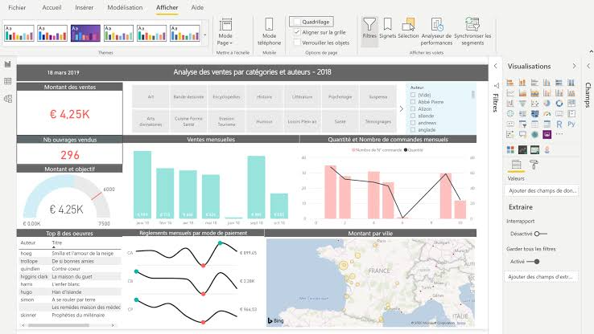

# Étude de cas : analyser les ventes d'une petite chaîne de magasins

::: {.callout-tip title="Objectifs du chapitre"}
À la fin de ce cas pratique, l'étudiant sera capable de :

- **Cadrer** une question d'analyse à partir d'un besoin métier et des parties prenantes concernées ;
- **Repérer** les problèmes de qualité dans un petit jeu de données ;
- **Calculer et interpréter** des indicateurs simples : chiffre d'affaires, quantité, panier moyen, médiane et taux ;
- **Choisir** un modèle en étoile adapté à une analyse de ventes et en dériver des mesures DAX ;
- **Proposer** une page Power BI et construire une véritable application Taipy cohérentes avec les questions ;
- **Rédiger** une conclusion prudente, fondée sur les données et accompagnée de limites.
:::

Ce chapitre suit un projet de bout en bout, en mobilisant tous les chapitres précédents : collecte et préparation (chapitre 1), exploration (chapitre 2), visualisation (chapitre 3), modélisation en entrepôt (chapitre 4) et restitution en BI (chapitre 5). L'entreprise fictive **Atlas Marchés** possède trois magasins à Casablanca, Rabat et Tanger. La direction souhaite comprendre les ventes du premier trimestre 2026 et décider où concentrer ses efforts commerciaux. Les données sont volontairement petites afin que les calculs puissent être vérifiés à la main — et, dans ce chapitre, également par une cellule Python réellement exécutée.

## 1. Le besoin métier

### 1.1. Les parties prenantes

Trois profils attendent des réponses différentes de cette analyse :

| Rôle | Question principale | Niveau de détail attendu |
|:---|:---|:---|
| Directrice générale | Où concentrer les efforts commerciaux du prochain trimestre ? | Synthétique, quelques KPI |
| Responsable de magasin | Comment mon magasin se compare-t-il aux deux autres ? | Intermédiaire, comparaisons |
| Analyste de gestion | D'où provient exactement le chiffre d'affaires ? | Détaillé, par produit et catégorie |

: Parties prenantes de l'analyse Atlas Marchés {#tbl-parties-prenantes}

Cette diversité de publics justifie, comme annoncé au chapitre 5 (§1.3), une page de synthèse et une page de détail plutôt qu'une seule page surchargée.

### 1.2. Les quatre questions posées

La direction pose quatre questions :

1. Quel est le chiffre d'affaires net par mois et par magasin ?
2. Quels produits ou catégories contribuent le plus aux ventes ?
3. Le panier moyen est-il différent selon les magasins ?
4. Quelles informations faudrait-il surveiller dans un tableau de bord mensuel ?

La question n'est pas « faire un graphique ». Le livrable attendu est une analyse descriptive, quelques explications prudentes et une proposition de suivi — exactement la distinction entre analyse descriptive et diagnostique posée dès l'introduction de ce cours.

### 1.3. Périmètre et définitions

Le périmètre est limité aux ventes **payées** enregistrées entre le 1er janvier et le 31 mars 2026. Une ligne du fichier correspond à une ligne de produit dans une commande. Le montant net est défini ainsi :

$$
\text{montant net}
=\text{quantité}\times\text{prix unitaire}-\text{remise}.
$$

Le **panier moyen** est :

$$
\text{panier moyen}
=\frac{\text{chiffre d'affaires net}}{\text{nombre de commandes distinctes}}.
$$

Ces définitions sont annoncées avant les calculs ; elles évitent de changer de formule au milieu de l'analyse, et constitueront le point de départ du dictionnaire métier de la section 5.

## 2. Le jeu de données

Voici un extrait pédagogique. Dans un vrai projet, le fichier complet pourrait contenir beaucoup plus de lignes, collectées comme décrit au chapitre 1 (export de caisse, base de données de vente, ou API).

| Ligne | Commande | Date | Magasin | Catégorie | Produit | Qté | Prix unitaire | Remise | Statut |
|---:|:---|:---|:---|:---|:---|---:|---:|---:|:---|
| 1 | C001 | 05/01/2026 | Casablanca | Épicerie | Huile | 2 | 75 | 0 | Payée |
| 2 | C001 | 05/01/2026 | Casablanca | Épicerie | Riz | 3 | 20 | 0 | Payée |
| 3 | C002 | 08/01/2026 | Rabat | Boissons | Jus | 4 | 18 | 5 | Payée |
| 4 | C003 | 15/01/2026 | Tanger | Hygiène | Savon | 5 | 12 | 0 | Payée |
| 5 | C004 | 03/02/2026 | Casablanca | Épicerie | Huile | 1 | 75 | 0 | Payée |
| 6 | C005 | 10/02/2026 | Rabat | Épicerie | Riz | 5 | 20 | 10 | Payée |
| 7 | C006 | 18/02/2026 | Tanger | Boissons | Jus | 2 | 18 | 0 | Annulée |
| 8 | C007 | 22/02/2026 | Casablanca | Hygiène | Savon | 6 | 12 | 0 | Payée |
| 9 | C008 | 06/03/2026 | Rabat | Boissons | Jus | 6 | 18 | 0 | Payée |
| 10 | C009 | 12/03/2026 | Tanger | Épicerie | Riz | 2 | 20 | 0 | Payée |
| 11 | C010 | 20/03/2026 | Casablanca | Boissons | Jus | 3 | 18 | 5 | Payée |
| 12 | C010 | 20/03/2026 | Casablanca | Hygiène | Savon | 2 | 12 | 0 | Payée |

### 2.1. Première lecture

Le grain est **une ligne de produit dans une commande**, au sens défini au chapitre 4. La commande C001 apparaît deux fois car elle contient deux produits. Pour compter les commandes, il faut compter les identifiants distincts, et non les lignes.

La ligne C006 est annulée. Si le chiffre d'affaires concerne les ventes payées, elle doit être exclue, mais cette décision doit être documentée. Elle ne doit pas être supprimée du fichier original : on conserve le statut pour pouvoir analyser les annulations — un exemple concret de la traçabilité demandée au chapitre 4 (§4.1).

## 3. Préparer les données

### 3.1. Dictionnaire minimal

| Colonne | Type attendu | Règle |
|:---|:---|:---|
| `Commande` | Texte | Identifiant non vide |
| `Date` | Date | Date comprise dans la période |
| `Magasin` | Catégorie | Casablanca, Rabat ou Tanger |
| `Qté` | Entier | Strictement positive pour une vente |
| `Prix unitaire` | Décimal | Positif, en MAD |
| `Remise` | Décimal | Supérieure ou égale à 0, en MAD |
| `Statut` | Catégorie | Payée ou Annulée |

Il faut également vérifier que la remise ne dépasse pas le montant brut de la ligne, que les dates ne sont pas inversées et que les identifiants ne comportent pas d'espaces cachés — les mêmes contrôles de qualité que ceux présentés au chapitre 1.

### 3.2. Transformation

Pour chaque ligne, on calcule :

```text
montant_brut = quantité × prix_unitaire
montant_net = montant_brut − remise
mois = mois(date)
```

Puis on filtre `Statut = Payée` pour les indicateurs de chiffre d'affaires. On conserve une copie de l'ensemble initial et on compte les lignes exclues.

Pour l'extrait, 11 lignes sur 12 sont payées. La ligne annulée représente 1 ligne sur 12, soit environ 8,3 % des lignes ; ce pourcentage ne doit pas être interprété comme un taux de commandes annulées, car une commande peut comporter plusieurs lignes.

## 4. Calculer les indicateurs

### 4.1. Montants ligne par ligne

Sur les lignes payées :

| Commande | Produit | Calcul | Montant net |
|:---|:---|:---|---:|
| C001 | Huile | $2\times75-0$ | 150 |
| C001 | Riz | $3\times20-0$ | 60 |
| C002 | Jus | $4\times18-5$ | 67 |
| C003 | Savon | $5\times12-0$ | 60 |
| C004 | Huile | $1\times75-0$ | 75 |
| C005 | Riz | $5\times20-10$ | 90 |
| C007 | Savon | $6\times12-0$ | 72 |
| C008 | Jus | $6\times18-0$ | 108 |
| C009 | Riz | $2\times20-0$ | 40 |
| C010 | Jus | $3\times18-5$ | 49 |
| C010 | Savon | $2\times12-0$ | 24 |

Le chiffre d'affaires net de l'extrait est donc :

$$
150+60+67+60+75+90+72+108+40+49+24
=\textbf{795 MAD}.
$$

### 4.2. Par mois

| Mois | Chiffre d'affaires net | Commandes distinctes | Panier moyen |
|:---|---:|---:|---:|
| Janvier | 337 | 3 | 112,33 |
| Février | 237 | 3 | 79,00 |
| Mars | 221 | 3 | 73,67 |
| **Total** | **795** | **9** | **88,33** |

Le panier moyen total est $795/9=88,33$ MAD. Il ne faut pas faire la moyenne simple des trois paniers mensuels sans vérifier les effectifs ; ici ils sont égaux, mais ce n'est pas toujours le cas.

### 4.3. Par magasin et par catégorie

En regroupant les lignes payées :

| Magasin | Chiffre d'affaires net | Commandes distinctes | Panier moyen |
|:---|---:|---:|---:|
| Casablanca | 430 | 4 | 107,50 |
| Rabat | 265 | 3 | 88,33 |
| Tanger | 100 | 2 | 50,00 |

| Catégorie | Chiffre d'affaires net |
|:---|---:|
| Épicerie | 415 |
| Boissons | 224 |
| Hygiène | 156 |

Casablanca contribue le plus au chiffre d'affaires et possède le panier moyen le plus élevé dans cet extrait. Cela ne suffit pas à conclure que le magasin est le plus performant : il faudrait connaître le nombre de visiteurs, les coûts, la taille des magasins et une période plus longue.

### 4.4. Moyenne et médiane des montants de lignes

Les montants des lignes payées sont :

$$60,\ 60,\ 67,\ 72,\ 75,\ 90,\ 108,\ 24,\ 40,\ 49,\ 150$$

Triés :

$$24,\ 40,\ 49,\ 60,\ 60,\ 67,\ 72,\ 75,\ 90,\ 108,\ 150.$$

La médiane est la sixième valeur, soit **67 MAD**. La moyenne est $795/11 \approx \textbf{72,27}$ MAD. La moyenne un peu supérieure à la médiane suggère que quelques lignes élevées, notamment 150 MAD, tirent la moyenne vers le haut — un rappel direct du chapitre 2 (§4.1).

::: {.callout-note title="Vérification"}
Tous les indicateurs de cette section sont recalculés, à partir des mêmes 12 lignes, par une véritable cellule Python exécutée en section 7 : les deux méthodes doivent converger vers les mêmes chiffres.
:::

## 5. Construire le modèle analytique

À partir de ce fichier, un modèle en étoile simple pourrait être :

```text
dim_date -----------\
dim_produit --------- fact_ventes
dim_magasin --------/
```

`fact_ventes` contient `Commande`, `DateID`, `ProduitID`, `MagasinID`, `Quantite`, `PrixUnitaire`, `Remise`, `MontantNet` et `Statut`. Les dimensions décrivent les dates, produits et magasins — exactement la structure présentée au chapitre 4.

Les mesures attendues, avant même d'être écrites dans un outil précis, sont :

```text
ChiffreAffaires = somme de MontantNet pour les lignes payées
Commandes = nombre d'identifiants Commande distincts pour les lignes payées
PanierMoyen = ChiffreAffaires / Commandes
Quantités = somme de Quantite pour les lignes payées
```

Traduites en DAX pour Power BI (chapitre 5, §2.4), ces mesures s'écrivent :

```DAX
ChiffreAffaires =
CALCULATE(
    SUM(fact_Ventes[MontantNet]),
    fact_Ventes[Statut] = "Payée"
)

Commandes =
CALCULATE(
    DISTINCTCOUNT(fact_Ventes[Commande]),
    fact_Ventes[Statut] = "Payée"
)

PanierMoyen = DIVIDE([ChiffreAffaires], [Commandes])

Quantites =
CALCULATE(
    SUM(fact_Ventes[Quantite]),
    fact_Ventes[Statut] = "Payée"
)
```

Le filtre `fact_Ventes[Statut] = "Payée"` est appliqué explicitement dans chaque mesure via `CALCULATE`, plutôt que d'être filtré une fois pour toutes en amont : cela permet de garder, dans le même modèle, la possibilité d'analyser aussi les commandes annulées si besoin, sans dupliquer la table.

Le tableau de bord ne doit pas calculer le panier moyen comme la moyenne des montants de lignes : une commande peut contenir plusieurs lignes. Le grain explique cette différence.

## 6. Concevoir la page Power BI

Une page « Vue générale » peut contenir, en suivant les principes de composition du chapitre 5 (§2.5) :

1. quatre cartes : chiffre d'affaires net, commandes, panier moyen et quantités vendues ;
2. une courbe du chiffre d'affaires par mois ;
3. des barres du chiffre d'affaires par magasin ;
4. des barres du chiffre d'affaires par catégorie ;
5. des segments pour le mois, le magasin et la catégorie ;
6. une note indiquant « données payées, période janvier–mars 2026, dernière actualisation ».

{#fig-powerbi-atlas}

Une deuxième page « Diagnostic » peut détailler les produits, les annulations et les différences entre magasins :

- un tableau détaillé par produit, avec quantité et chiffre d'affaires ;
- un graphique en barres du chiffre d'affaires par catégorie et par magasin (comparaison croisée) ;
- un indicateur du nombre et du montant des lignes annulées, pour suivre ce phénomène séparément du chiffre d'affaires payé.

La première page répond à « où en sommes-nous ? » (analyse descriptive), la seconde aide à explorer « où regarder ensuite ? » (analyse diagnostique) — la distinction posée dès l'introduction de ce cours.

Avant le partage, on compare les cartes aux totaux calculés manuellement : **795 MAD**, **9 commandes distinctes** et **88,33 MAD** de panier moyen.

## 7. Construire une vue Taipy

La même analyse peut être intégrée à une application Python. Contrairement aux sections précédentes, qui décrivent une interface Power BI que ce livre ne peut pas exécuter, le code Python qui suit est **réellement exécuté** lors de la génération de ce chapitre : les indicateurs et le graphique affichés ci-dessous sont calculés en direct, à partir des 12 lignes du jeu de données de la section 2.

### 7.1. Charger et préparer les données

```{python}
import pandas as pd

ventes = pd.DataFrame({
    "commande":  ["C001", "C001", "C002", "C003", "C004", "C005",
                  "C006", "C007", "C008", "C009", "C010", "C010"],
    "date":      ["2026-01-05", "2026-01-05", "2026-01-08", "2026-01-15",
                  "2026-02-03", "2026-02-10", "2026-02-18", "2026-02-22",
                  "2026-03-06", "2026-03-12", "2026-03-20", "2026-03-20"],
    "magasin":   ["Casablanca", "Casablanca", "Rabat", "Tanger",
                  "Casablanca", "Rabat", "Tanger", "Casablanca",
                  "Rabat", "Tanger", "Casablanca", "Casablanca"],
    "categorie": ["Épicerie", "Épicerie", "Boissons", "Hygiène",
                  "Épicerie", "Épicerie", "Boissons", "Hygiène",
                  "Boissons", "Épicerie", "Boissons", "Hygiène"],
    "produit":   ["Huile", "Riz", "Jus", "Savon", "Huile", "Riz",
                  "Jus", "Savon", "Jus", "Riz", "Jus", "Savon"],
    "qte":            [2, 3, 4, 5, 1, 5, 2, 6, 6, 2, 3, 2],
    "prix_unitaire":  [75, 20, 18, 12, 75, 20, 18, 12, 18, 20, 18, 12],
    "remise":         [0, 0, 5, 0, 0, 10, 0, 0, 0, 0, 5, 0],
    "statut":    ["Payée", "Payée", "Payée", "Payée", "Payée", "Payée",
                  "Annulée", "Payée", "Payée", "Payée", "Payée", "Payée"],
})

ventes["date"] = pd.to_datetime(ventes["date"])
ventes["montant_net"] = ventes["qte"] * ventes["prix_unitaire"] - ventes["remise"]
ventes["mois"] = ventes["date"].dt.strftime("%B")

payees = ventes[ventes["statut"] == "Payée"]
print(payees.head().to_string(index=False))
```

### 7.2. Calculer les indicateurs

```{python}
def indicateurs(df):
    payees = df[df["statut"] == "Payée"]
    chiffre_affaires = payees["montant_net"].sum()
    commandes = payees["commande"].nunique()
    panier_moyen = chiffre_affaires / commandes if commandes else 0
    quantites = payees["qte"].sum()
    return {
        "chiffre_affaires": chiffre_affaires,
        "commandes": commandes,
        "panier_moyen": round(panier_moyen, 2),
        "quantites": quantites,
    }

resultats = indicateurs(ventes)
resultats
```

Ces résultats doivent — et retrouvent effectivement — les valeurs calculées à la main en section 4 : un chiffre d'affaires net de 795 MAD, pour 9 commandes distinctes, et un panier moyen de 88,33 MAD.

### 7.3. Construire une visualisation sophistiquée

En reprenant les bonnes pratiques du chapitre 3 (titre-message, palette accessible, deux graphiques complémentaires plutôt qu'un seul graphique surchargé) :

```{python}
import matplotlib.pyplot as plt
import seaborn as sns

sns.set_theme(style="whitegrid")
sns.set_palette("colorblind")

fig, axes = plt.subplots(1, 2, figsize=(11, 4.5))

# Panneau 1 : chiffre d'affaires net par mois
par_mois = payees.groupby("mois", sort=False)["montant_net"].sum()
par_mois = par_mois.reindex(["January", "February", "March"])
axes[0].plot(["Janvier", "Février", "Mars"], par_mois.values, marker="o", linewidth=2.5)
axes[0].set_title("Le chiffre d'affaires ralentit sur le trimestre")
axes[0].set_ylabel("Chiffre d'affaires net (MAD)")

# Panneau 2 : chiffre d'affaires net par magasin, trié
par_magasin = payees.groupby("magasin")["montant_net"].sum().sort_values()
axes[1].barh(par_magasin.index, par_magasin.values)
axes[1].set_title("Casablanca porte l'essentiel des ventes")
axes[1].set_xlabel("Chiffre d'affaires net (MAD)")

fig.text(0.01, -0.02, "Source : Atlas Marchés — ventes payées, janvier à mars 2026", fontsize=8, color="gray")
plt.tight_layout()
plt.show()
```

Ce graphique répond directement à la première question de la direction (§1.2) : il montre, en un coup d'œil, que le chiffre d'affaires ralentit d'un mois à l'autre et que Casablanca domine largement les deux autres magasins.

### 7.4. Assembler l'application Taipy

Comme au chapitre 5, l'assemblage final dans une interface Taipy interactive n'est **pas exécuté** dans ce livre : `Gui(page).run()` démarrerait un serveur bloquant. Le code suivant montre comment les résultats des sections 7.1 à 7.3 s'intègrent dans une page filtrable par magasin.

```python
import pandas as pd
import matplotlib.pyplot as plt
from taipy.gui import Gui

# ventes, indicateurs() et le graphique reprennent le code des sections 7.1 à 7.3

magasin_selectionne = "Tous"
liste_magasins = "Tous;Casablanca;Rabat;Tanger"


def filtrer_et_recalculer(state):
    if state.magasin_selectionne == "Tous":
        sous_ensemble = ventes
    else:
        sous_ensemble = ventes[ventes["magasin"] == state.magasin_selectionne]

    resultats = indicateurs(sous_ensemble)
    state.chiffre_affaires = resultats["chiffre_affaires"]
    state.commandes = resultats["commandes"]
    state.panier_moyen = resultats["panier_moyen"]


page = """
# Atlas Marchés — Suivi des ventes T1 2026

Magasin : <|{magasin_selectionne}|selector|lov={liste_magasins}|on_change=filtrer_et_recalculer|>

<|layout|columns=1 1 1|
<|{chiffre_affaires}|text|format=%d MAD|class_name=kpi-card|>
<|{commandes}|text|format=%d commandes|class_name=kpi-card|>
<|{panier_moyen}|text|format=%.2f MAD|class_name=kpi-card|>
|>

<|{ventes}|table|>
"""

Gui(page=page).run()
```

Cette page reprend fidèlement le dictionnaire métier de la section 1.3 : les mêmes formules, qu'il s'agisse de la version Power BI (DAX, section 5) ou de la version Taipy (Python, ci-dessus), doivent produire les mêmes résultats. C'est précisément ce que la cellule exécutée en section 7.2 permet de vérifier.

## 8. Interpréter et communiquer

Une conclusion raisonnable pour l'extrait serait :

> Sur les ventes payées de l'extrait, le chiffre d'affaires net atteint 795 MAD pour 9 commandes, avec un panier moyen de 88,33 MAD. Casablanca représente 430 MAD et le panier moyen y est supérieur à celui de Rabat et Tanger. Les lignes de vente ont une médiane de 67 MAD et une moyenne de 72,27 MAD, ce qui signale une légère influence de quelques montants élevés. Ces résultats sont exploratoires : l'échantillon est très petit, ne couvre que trois mois et ne permet pas d'expliquer les causes ni de mesurer la rentabilité.

La conclusion sépare les **faits calculés**, les **interprétations prudentes** et les **limites**. Elle ne transforme pas une différence observée en causalité — le même principe de prudence que celui rappelé au chapitre 2 à propos de la corrélation.

::: {.callout-note title="Aller plus loin"}
Sur un jeu de données réel, cette même démarche se prolongerait naturellement : automatiser le chargement et le contrôle de qualité avec un flux ETL/ELT planifié (chapitre 4, §4), historiser les ventes pour comparer un trimestre à l'année précédente avec `CALCULATE` et `SAMEPERIODLASTYEAR` (chapitre 5, §2.4), et enrichir le modèle avec de nouvelles dimensions — un profil client, une équipe commerciale — pour affiner le diagnostic au-delà du simple magasin.
:::

::: {.content-visible when-profile="teacher"}
::: {.callout-note title="Auto-évaluation" collapse="true"}
Avant de considérer le cas comme terminé, assurez-vous de pouvoir répondre « oui » aux questions suivantes :

- [ ] Je peux formuler le grain du fichier.
- [ ] Je sais pourquoi la ligne annulée est filtrée pour le chiffre d'affaires.
- [ ] Je peux recalculer le total de 795 MAD, à la main et en Python.
- [ ] Je distingue lignes de produits et commandes distinctes.
- [ ] Je peux expliquer la différence entre moyenne et médiane dans ce cas.
- [ ] Je peux traduire les mesures du dictionnaire métier en DAX et en Python.
- [ ] Je peux proposer une page de tableau de bord sans surcharger l'utilisateur.
:::
:::

## Exercices

::: {.callout-note title="Consigne"}
Répondez sans ordinateur pour les exercices 1 à 8 ; les données de l'énoncé suffisent et les calculs sont courts. Les exercices 9 et 10 portent sur les choix d'outillage et peuvent s'appuyer sur le code des sections 5 à 7.
:::

::: {#exr-cas-1}
### Définir le grain

Quelle phrase décrit le grain du fichier ? Pourquoi la commande C001 occupe-t-elle deux lignes ?
:::

::: {.content-visible when-profile="teacher"}
::: {.callout-tip collapse="true" title="Solution de l'exercice @exr-cas-1"}
Une ligne représente **un produit dans une commande**. C001 contient de l'huile et du riz : elle possède donc deux lignes de produits.
:::
:::

::: {#exr-cas-2}
### Exclure une annulation

Pourquoi la ligne C006 n'est-elle pas incluse dans le chiffre d'affaires payé ? Peut-on la supprimer du fichier original ?
:::

::: {.content-visible when-profile="teacher"}
::: {.callout-tip collapse="true" title="Solution de l'exercice @exr-cas-2"}
Elle est marquée **Annulée**, donc elle ne représente pas une vente payée selon la définition du périmètre. Il faut la conserver dans la source afin de pouvoir suivre les annulations et documenter le filtre.
:::
:::

::: {#exr-cas-3}
### Calculer une ligne

Calculez le montant net de 4 jus à 18 MAD avec une remise de 5 MAD, puis celui de 5 savons à 12 MAD sans remise.
:::

::: {.content-visible when-profile="teacher"}
::: {.callout-tip collapse="true" title="Solution de l'exercice @exr-cas-3"}
Jus : $4\times18-5=\textbf{67}$ MAD. Savons : $5\times12=\textbf{60}$ MAD.
:::
:::

::: {#exr-cas-4}
### Vérifier le total

Le chiffre d'affaires net est de 795 MAD et le magasin de Casablanca réalise 430 MAD.

a. Quelle part du chiffre d'affaires total représente Casablanca ?
b. Quel montant reste pour Rabat et Tanger ensemble ?
:::

::: {.content-visible when-profile="teacher"}
::: {.callout-tip collapse="true" title="Solution de l'exercice @exr-cas-4"}
a. $430/795\times100 \approx 54,1\%$.
b. $795-430=\textbf{365}$ MAD.
:::
:::

::: {#exr-cas-5}
### Commandes et lignes

Il y a 11 lignes payées mais seulement 9 commandes distinctes.

a. Pourquoi ces deux nombres sont-ils différents ?
b. Quel nombre utiliser pour calculer le panier moyen ?
:::

::: {.content-visible when-profile="teacher"}
::: {.callout-tip collapse="true" title="Solution de l'exercice @exr-cas-5"}
a. Certaines commandes contiennent plusieurs produits et donc plusieurs lignes ; C001 et C010 en sont des exemples.
b. Il faut utiliser **9 commandes distinctes**, car le panier moyen est défini par commande.
:::
:::

::: {#exr-cas-6}
### Comparer moyenne et médiane

La moyenne des montants de lignes est 72,27 MAD et la médiane est 67 MAD. Que suggère cette différence ? Quelle valeur de la liste contribue particulièrement à tirer la moyenne vers le haut ?
:::

::: {.content-visible when-profile="teacher"}
::: {.callout-tip collapse="true" title="Solution de l'exercice @exr-cas-6"}
La moyenne supérieure à la médiane suggère une légère asymétrie à droite : quelques montants élevés influencent la moyenne. La ligne à 150 MAD y contribue particulièrement.
:::
:::

::: {#exr-cas-7}
### Choisir les indicateurs du tableau de bord

Parmi les éléments suivants, lesquels doivent apparaître en priorité sur la page générale : chiffre d'affaires net, identifiant de chaque client, commandes distinctes, panier moyen, une liste de 25 couleurs, date d'actualisation ? Justifiez les choix.
:::

::: {.content-visible when-profile="teacher"}
::: {.callout-tip collapse="true" title="Solution de l'exercice @exr-cas-7"}
Les priorités sont le **chiffre d'affaires net**, les **commandes distinctes**, le **panier moyen** et la **date d'actualisation**. Un identifiant individuel n'est pas nécessaire pour la vue générale et peut poser un problème de confidentialité ; 25 couleurs nuisent à la lecture.
:::
:::

::: {#exr-cas-8}
### Limites et décisions

La direction demande : « Casablanca est-elle le meilleur magasin ? »

a. Donnez une conclusion que les données permettent de soutenir.
b. Citez deux informations manquantes avant de conclure sur la performance globale.
:::

::: {.content-visible when-profile="teacher"}
::: {.callout-tip collapse="true" title="Solution de l'exercice @exr-cas-8"}
a. On peut dire que Casablanca a le chiffre d'affaires net et le panier moyen les plus élevés dans **cet extrait de ventes payées**.
b. Il manque par exemple les coûts et la marge, le nombre de visiteurs, la taille des magasins, le stock disponible, une période plus longue et les objectifs de chaque magasin. Le chiffre d'affaires seul ne suffit pas à définir la performance globale.
:::
:::

::: {#exr-cas-9}
### Power BI ou Taipy pour Atlas Marchés ?

La direction d'Atlas Marchés veut un tableau de bord consultable par les trois responsables de magasin, actualisé chaque semaine, sans écrire de code. L'équipe technique veut, séparément, intégrer les mêmes indicateurs dans l'application de caisse déjà développée en Python.

En vous appuyant sur la @tbl-powerbi-taipy du chapitre 5, quel outil recommanderiez-vous à chacun des deux besoins, et pourquoi ?
:::

::: {.content-visible when-profile="teacher"}
::: {.callout-tip collapse="true" title="Solution de l'exercice @exr-cas-9"}
Pour la direction et les responsables de magasin, **Power BI** est le plus adapté : interface graphique, partage géré, pas besoin de programmer. Pour l'intégration dans l'application de caisse déjà écrite en Python, **Taipy** est plus cohérent : il réutilise directement le code existant (comme les fonctions `indicateurs()` de la section 7.2) sans changer de langage ni d'architecture.
:::
:::

::: {#exr-cas-10}
### Vérifier la cohérence entre les deux outils

La mesure DAX `ChiffreAffaires` de la section 5 et la fonction Python `indicateurs()` de la section 7.2 doivent produire le même résultat pour la même question.

a. Quelle valeur commune les deux doivent-elles retrouver pour le chiffre d'affaires net total ?
b. Que faudrait-il vérifier si, sur un vrai projet, les deux outils affichaient des chiffres différents ?
:::

::: {.content-visible when-profile="teacher"}
::: {.callout-tip collapse="true" title="Solution de l'exercice @exr-cas-10"}
a. Les deux doivent retrouver **795 MAD**, comme le confirme la cellule exécutée en section 7.2.
b. Il faudrait vérifier que les deux définitions appliquent exactement le même filtre (`Statut = "Payée"`), la même période, et qu'aucune des deux sources de données n'a été mise à jour plus récemment que l'autre — un rappel direct du rôle du dictionnaire métier (chapitre 4, §3).
:::
:::
